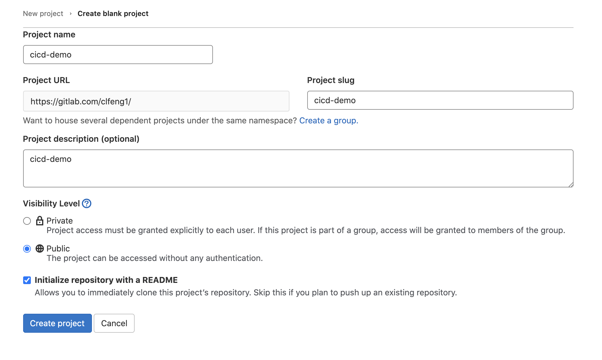
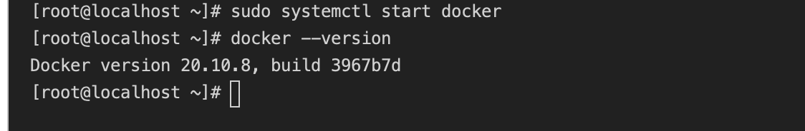
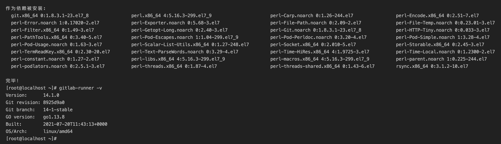
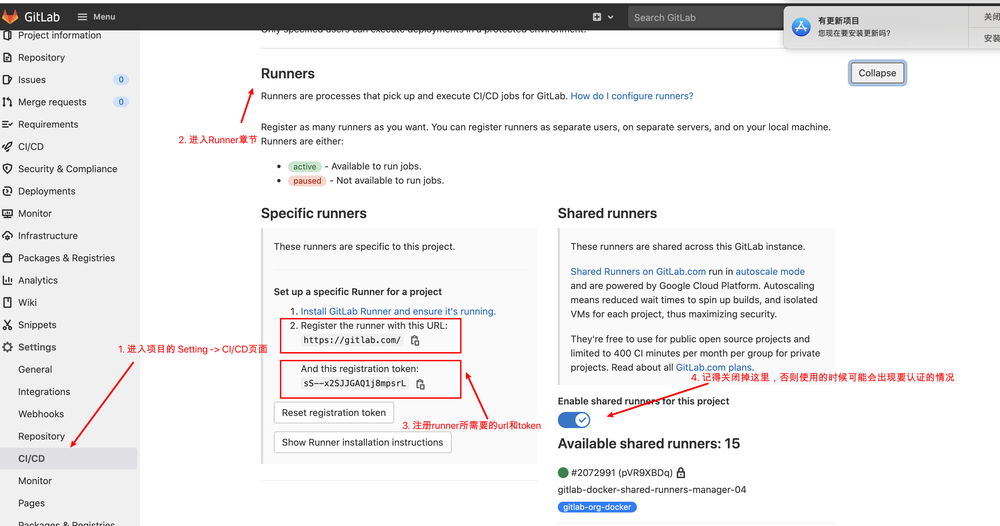
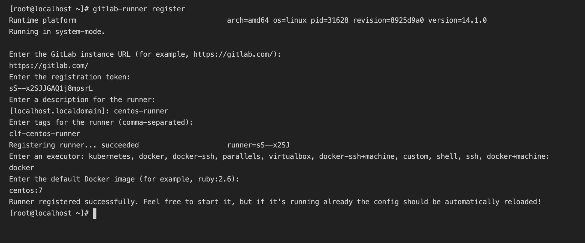
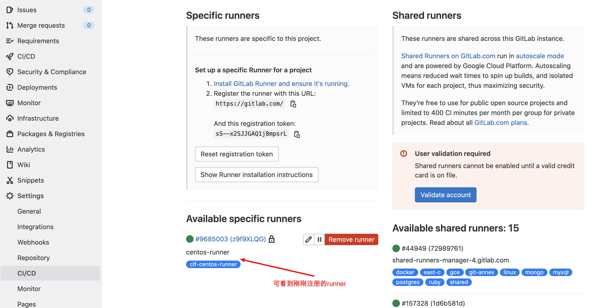
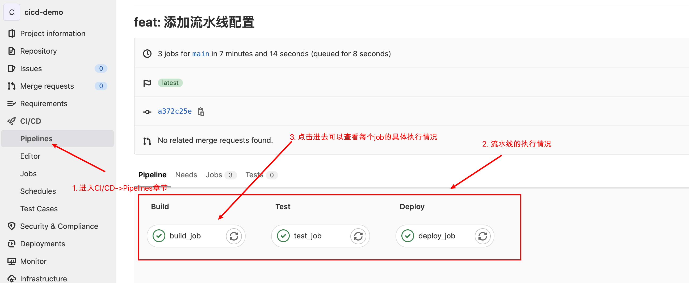
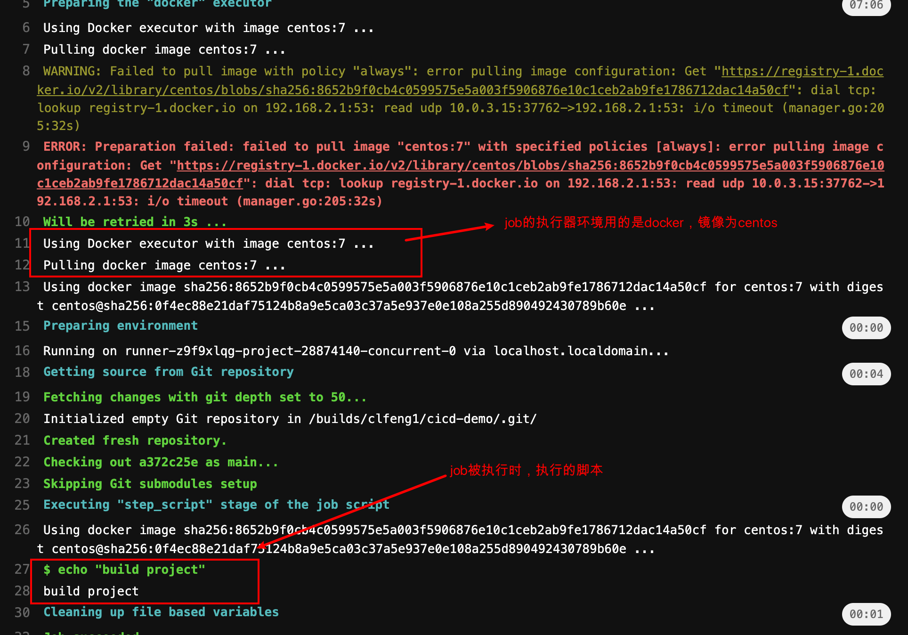

# CI/CD 半桶水

文章的主体逻辑结构

- 环境准备
- 编写一个基本的流水线
- 理解基本概念
- 详细的 CI/CD 内容


## 创建GitLab项目



## 环境安装

*注：在企业基本都是使用 linux 环境作为 CI/CD 的 runner ，因此一下的环境安装使用的环境为 linux ；*

操作系统信息:

```shell
Linux version 3.10.0-1160.el7.x86_64 (mockbuild@kbuilder.bsys.centos.org) (gcc version 4.8.5 20150623 (Red Hat 4.8.5-44) (GCC) ) #1 SMP Mon Oct 19 16:18:59 UTC 2020

```

*注：笔者的 linux 环境为在本地的 macOS 上通过虚拟机安装的 centos:7 系统*

*读者无需特意去买服务器，使用本地的主机通过虚拟机安装 linux 系统或者是将本地的 macOS 或者 window 作为 runner 都行，但不建议用 windows ，毕竟在写 CI 配置文件的时候会有很多的符号要注意*

### 安装 docker

后续我们使用的 runner 会以 docker 作为执行器（executor），因此我们先在系统上安装一下 docker 吧。

docker 的安装可按照官网教程进行安装 https://docs.docker.com/engine/install/ 

安装的基本流程：

#### 1. 移除旧版本的 docker

```shell
sudo yum remove docker \
                docker-client \
                docker-client-latest \
                docker-common \
                docker-latest \
                docker-latest-logrotate \
                docker-logrotate \
                docker-engine
```

#### 2. 开始安装 docker

```shell
sudo yum install -y yum-utils
sudo yum-config-manager \
    --add-repo \
    https://download.docker.com/linux/centos/docker-ce.repo

# 安装docker引擎
sudo yum install docker-ce docker-ce-cli containerd.io
```

#### 3. 启动 docker

```
sudo systemctl start docker
```

#### 4. 安装成功




### 安装 runner

https://docs.gitlab.com/runner/install/

#### 1. 执行一下脚本进行 gitlab-runner 的安装

```shell
# 1. 添加官方的GitLab仓库
curl -L "https://packages.gitlab.com/install/repositories/runner/gitlab-runner/script.rpm.sh" | sudo bash

# 2. 安装gitlab-runner
sudo yum install gitlab-runner
```

#### 2. 安装成功




### 注册 runner

##### 进入项目仓库 CI/CD 页面查看相应的 url 与 token 




##### 执行 `gitlab-runner register` 命令并根据提示注册 runner



##### 注册成功之后，查看可用 runner




到此我们便准备好学习 CI/CD 的基本环境啦～

接着我们尝试写一个简单流水线

*注：暂时不用去理解 .gitlab-ci.yml 的内容，后续会逐步讲解*


## 第一个流水线

### 添加流水线配置文件

在项目根目录下，添加 .gitlab-ci.yml 文件，并推送到远程分支，文件内容如下：

```yaml
# .gitlab-ci.yml
stages:
  - build
  - test
  - deploy

build_job:
  stage: build # 指定job所属stage
  image: centos:7 # 指定执行job的所使用docker镜像
  tags: 
    - clf-centos-runner # 指定执行job的runner（即机器）
  script: # job执行时运行的脚本
    - echo "build project"

test_job:
  stage: test
  image: centos:7
  tags: 
    - clf-centos-runner
  script:
    - echo "test project"

deploy_job:
  stage: deploy
  image: centos:7
  tags: 
    - clf-centos-runner
  script:
    - echo "deploy project"
```


### 查看流水线执行情况







## 理解基本概念

在《第一个流水线》章节，我们新增了 .gitlab-ci.yml 并且写了一堆的配置。然后提交文件推送到 GitLab 上之后便可看到有流水线在执行了。那么我们前面在 .gitlab-ci.yml 文件中写的的配置是什么意思？流水线的配置又该怎么写？

为了能写出一个基本的流水线配置，我们需要来学习一下下面的内容：


- yaml 语法
- 什么是 CI/CD
- CI/CD 的关键概念
  - pipeline
  - stage
  - job

### yaml 语法

CI/CD 流水线的配置文件使用的便是 yaml 语法写的，因此需要先理解一下相关的语法。这里推荐通过阮一峰老师的文章进行学习：

https://www.ruanyifeng.com/blog/2016/07/yaml.html

### 什么是 CI/CD

CI/CD 可拆解为 CI 和 CD，其中 CI 为持续集成，CD 为持续交付与持续部署。CI/CD 是一种通过在应用开发阶段引入[自动化 ](https://www.redhat.com/zh/topics/automation/whats-it-automation)来频繁向客户交付应用的方法。

- Continuous Integration (CI) 【持续集成】
- Continuous Delivery (CD) 【持续交付】
- Continuous Deployment (CD)【持续部署】

当然这么介绍可能还是简单了点，所以摘录了以下更为详细的介绍，感兴趣的可以稍微看看

------------------

#### 持续集成

[现代应用开发](https://www.redhat.com/zh/solutions/cloud-native-development)的目标是让多位开发人员同时处理同一应用的不同功能。但是，如果企业安排在一天内将所有分支源代码合并在一起（称为“[合并日](https://thedailywtf.com/articles/Happy_Merge_Day!)”），最终可能造成工作繁琐、耗时，而且需要手动完成。这是因为当一位独立工作的开发人员对应用进行更改时，有可能会与其他开发人员同时进行的更改发生冲突。如果每个开发人员都自定义自己的本地[集成开发环境（IDE）](https://www.redhat.com/zh/topics/middleware/what-is-ide)，而不是让团队就一个基于云的 IDE 达成一致，那么就会让问题更加雪上加霜。

持续集成（CI）可以帮助开发人员更加频繁地（有时甚至每天）将代码更改合并到共享分支或“主干”中。一旦开发人员对应用所做的更改被合并，系统就会通过自动构建应用并运行不同级别的自动化测试（通常是单元测试和集成测试）来验证这些更改，确保这些更改没有对应用造成破坏。这意味着测试内容涵盖了从类和函数到构成整个应用的不同模块。如果自动化测试发现新代码和现有代码之间存在冲突，CI 可以更加轻松地快速修复这些错误。


#### 持续交付

完成 CI 中构建及单元测试和集成测试的自动化流程后，持续交付可自动将已验证的代码发布到存储库。为了实现高效的持续交付流程，务必要确保 CI 已内置于开发管道。持续交付的目标是拥有一个可随时部署到生产环境的代码库。

在持续交付中，每个阶段（从代码更改的合并，到生产就绪型构建版本的交付）都涉及测试自动化和代码发布自动化。在流程结束时，运维团队可以快速、轻松地将应用部署到生产环境中。


#### 持续部署

对于一个成熟的 CI/CD 管道来说，最后的阶段是持续部署。作为持续交付——自动将生产就绪型构建版本发布到代码存储库——的延伸，持续部署可以自动将应用发布到生产环境。由于在生产之前的管道阶段没有手动门控，因此持续部署在很大程度上都得依赖精心设计的测试自动化。

实际上，持续部署意味着开发人员对应用的更改在编写后的几分钟内就能生效（假设它通过了自动化测试）。这更加便于持续接收和整合用户反馈。总而言之，所有这些 CI/CD 的关联步骤都有助于降低应用的部署风险，因此更便于以小件的方式（而非一次性）发布对应用的更改。不过，由于还需要编写自动化测试以适应 CI/CD 管道中的各种测试和发布阶段，因此前期投资还是会很大。


**个人小结：**

持续集成: 高频率的将代码合入主干，在合入之前触发单测和集成测试等去验证代码的改动，确保改动不会对应用造成破坏

持续交付：将代码合入到代码仓库。其目标是拥有一个可随时部署到生产环境的代码库

持续部署：在流程结束时，运维团队可以快速、轻松地将应用部署到生产环境中

----


### CI/CD 的关键概念

来自官网的解释：

Pipelines are the top-level component of continuous integration, delivery, and deployment.

- Jobs, which define *what* to do. For example, jobs that compile or test code.
- Stages, which define *when* to run the jobs. For example, stages that run tests after stages that compile the code.

In general, pipelines are executed automatically and require no intervention once created. However, there are also times when you can manually interact with a pipeline.

译文：

Pipelines 是持续集成、交付和部署的顶级组件。

- Job ，定义*做什么*。 例如，编译或测试代码的作业。
- Stages ，定义*何时*运行作业。 例如，在编译代码的阶段之后运行测试的阶段。

一般来说，管道是自动执行的，一旦创建就不需要干预。 但是，有时您也可以手动与管道进行交互。


**理解**

Pipelines 是 CI/CD 的顶级组件，一个 pipeline 创建之后便会自动执行一系列的任务，**无需人工干预**。而在 pipeline 组件的下面又会有几个子组件 job 和 stages ；其中 stages 定义的是整个 pipeline 有的多少个阶段（环节），这些阶段（环节）的执行顺序是怎样的。而 job 则是每个环节中的具体任务【一个阶段（环节）中可以多个任务】，在定义任务的时候，我们要描述清楚这个任务什么情况下执行以及做什么事情。

接下来我们来理解下《第一个流水线》中的配置：

```yaml
stages:
  - build
  - test
  - deploy

build_job:
  stage: build # 指定job所属stage
  image: centos:7 # 指定执行job的所使用docker镜像
  tags: 
    - clf-centos-runner # 指定执行job的runner（即机器）
  script: # job执行时运行的脚本
    - echo "build project"

test_job:
  stage: test
  image: centos:7
  tags: 
    - clf-centos-runner
  script:
    - echo "test project"

deploy_job:
  stage: deploy
  image: centos:7
  tags: 
    - clf-centos-runner
  script:
    - echo "deploy project"
```

以上的配置便是一个完整 pipeline 的配置，那么 pipeline 的 stages 和 job 在这份配置中是如何体现的呢？

首先我们定义一个 pipeline 需要考虑这个 pipeline 有多少个阶段以及阶段的顺序是怎样的？以《第一个流水线》这个 pipeline 为例：

一共是三个阶段：build、test、deploy；这三个阶段合在一起描述了代码上库之后的需要进行的处理，分别是代码构建、测试、部署。

体现在配置上便是：

```yaml
stages:
  - build
  - test
  - deploy
```

顺序则是数组每项的顺序：build（构建）=> test（测试）=> deploy（部署）。

在定义了每个阶段之后我们便需要进一步为每个阶段定义相应的 job（任务），以 build 阶段为例：

```yaml
stages:
  - build

build_job: # 这是job的名称
  stage: build # 指定job所属stage
  image: centos:7 # 指定执行job的所使用docker镜像
  tags: 
    - clf-centos-runner # 指定执行job的runner（即机器）
  script: # job 做什么
    - echo "build project"
```

前面提到我们需要给每个阶段定义相应的 job（任务）。那么job 怎么对应到对应的阶段呢？通过 stage 关键字来对应的：

```yaml
stages:
  - build

build_job: # 这是job的名称
  stage: build # 指定job所属stage
```

stage 的值 build 这和我们前面定义的在 stages 数组下的其中一个值 build 对应，这便说明了 build_job 是 build 阶段的一个任务。

我们还提到了 job 是用来定义做什么的，那么 build_job 这个 job 做了什么呢？看看 script 关键字：

```yaml
stages:
  - build

build_job: # 这是job的名称
  stage: build # 指定job所属stage
  script: # job 做什么
    - echo "build project"
```

emmm，就简单了输入了下 “build project”。

在前面的配置中还出现了几个其他的配置，我们也顺便来看看其相应的的作用

tags：该字段指定执行该 job 使用的 runner（机器），我们指定的是前面注册的 runner，名称是 clf-centos-runner

image：我们的 job 的执行器（executor）使用的是 docker，这个字段指定的是 docker 所使用的镜像

到这里相信我们已经可以大致理解《第一个流水线》的配置了；**整体如下：**

整个 pipeline 共有三个阶段build => test => deploy；我们为每个阶段都定义了一个任务。每个任务都指定了执行任务所使用的机器（runner），并指定了执行器（executor）所使用的镜像 centos:7。目前每个 job 的执行任务都非常简单就是输出对应的文本。

稍微等等，似乎还少了点什么东西。为什么我们刚编写完 .gitlab-ci.yml 文件提交并推送之后便可以看到流水线呢？gitlab 是怎么知道这个时候要执行流水线的？是不是只有改 .gitlab-ci.yml 文件才会触发流水线？那我现在已经写好了以后不会再去修改 .gitlab-ci 文件了，流水线还能触发吗？

这便涉及到了流水线的触发机制，一般来说只要有代码推送都会触发流水线。当代码推送到远程的 GibLab 仓库时，GibLab 会看有没有流水线的配置文件 .gitlab-ci.yml，如果有的话便会触发流水线（当然我们可能在配置进行了特定的配置使得流水线不创建）。除了代码推送，我们还有其他的方式可以触发流水线。如：定时任务、手动触发、通过调用 GibLab 的 api 的方式触发等


## 导学

通过前面的内容我们已经创建了测试用的项目，安装好了相应的环境，并写了自己的第一个流水线也理解了 CI/CD 的基本概念。接下来便让我们正式进入 CI/CD 相关内容的学习吧。

后续的章节主要是对官网相关知识的整理和小结，基本的目录结构也是根据官网来的。不过这里先列出以下笔者认为最为关键的内容

- pipeline 架构
- Cache and artifacts
- only 关键字
- except 关键字
- rules 关键字

pipeline 架构有利于我们编写更加合理的流水线，这能大大的提升整个流水线的执行效率。

job 在执行的过程中，往往要去下载一些项目的依赖包（每次流水线或者job都通过网络去下载项目的依赖包是非常耗时的）以及将构建的结果文件传到下一个 job 去使用，这个时候使用 Cache and artifacts 可以帮我们提升整体的效率以及实现相应的需求。具体内容在 《Cache and artifacts》章节以及 《.gitlab-ci.yml reference》章节下的 cache和 artifacts 关键字

only、except、rules 等关键字让我们可以控制 pipline 以及 job 执行时机，是我们提升流水线效率、控制整个流水线过程的法宝，而这介个关键字的介绍在 **Jobs** 小结。


## Pipeline

### Pipeline 触发方式

- 代码推送
- 定时任务
- 手动触发
- api

### Pipeline 架构

- [Basic](https://docs.gitlab.com/ee/ci/pipelines/pipeline_architectures.html#basic-pipelines): 适用于所有配置都集中在一个容易找到的地方的简单项目。
- [Directed Acyclic Graph](https://docs.gitlab.com/ee/ci/pipelines/pipeline_architectures.html#directed-acyclic-graph-pipelines): 适用于需要高效执行的大型复杂项目。
- [Child/Parent Pipelines](https://docs.gitlab.com/ee/ci/pipelines/pipeline_architectures.html#child--parent-pipelines): 适用于具有大量独立定义组件的 monorepos 和项目。

#### Basic 模型


在 basic 模型下，必须等待 build stage 中的所有任务都完成之后才能转入到 test 阶段

```yaml
stages:
  - build
  - test
  - deploy

build_a:
  stage: build
  script: 
    - echo "build a"
  tags: 
    - clf-cicd-runner

build_b:
  stage: build
  script: 
    - echo "build b"
  tags: 
    - clf-cicd-runner

test_a:
  stage: test
  script: 
    - echo "test a"
  tags: 
    - clf-cicd-runner

test_b:
  stage: test
  script: 
    - echo "test b"
  tags: 
    - clf-cicd-runner

deploy_a:
  stage: deploy
  script: 
    - echo "deploy a"
  tags: 
    - clf-cicd-runner

deploy_b:
  stage: deploy
  script: 
    - echo "deploy b"
  tags: 
    - clf-cicd-runner
```


#### DAG 模型


当通过 needs 关键字声明依赖关系之后，便可根据依赖关系使得下一个 stage 的 job 提前执行；

如上示例中：

deploy_a 依赖 test_a，test_a 依赖 build_a；

deploy_b 依赖 test_b，test_a 依赖 build_b；

其中 build_a 和 build_b 都属于build stage；test_a 和 test_b 都属于 test stage；deploy_a 和 deploy_b 都属于 build stage；

整个 pipeline 的执行过程如下: 

build_a、build_b 同时开始执行，同时我们假设 build_a 任务执行完成所需要的时间更短一些；当 build_a 执行完成但是 build_b 还没执行完成，这个时候 test_a 不用去等待 build_b 执行完成，便可开始执行

```yaml
stages:
  - build
  - test
  - deploy

build_a:
  stage: build
  script: 
    - echo "build a"
  tags: 
    - clf-cicd-runner

build_b:
  stage: build
  script: 
    - echo "build b"
  tags: 
    - clf-cicd-runner

test_a:
  stage: test
  needs: [build_a]
  script: 
    - echo "test a"
  tags: 
    - clf-cicd-runner

test_b:
  stage: test
  needs: [build_b]
  script: 
    - echo "test b"
  tags: 
    - clf-cicd-runner

deploy_a:
  stage: deploy
  needs: [test_a]
  script: 
    - echo "deploy a"
  tags: 
    - clf-cicd-runner

deploy_b:
  stage: deploy
  needs: [test_b]
  script: 
    - echo "deploy b"
  tags: 
    - clf-cicd-runner
```


#### Child/Parent 模型


```yaml
stages:
  - triggers

trigger_a:
  stage: triggers
  trigger:
    include: a/.gitlab-ci.yml
  rules:
    - changes:
        - a/*

trigger_b:
  stage: triggers
  trigger:
    include: b/.gitlab-ci.yml
  rules:
    - changes:
        - b/*
```

```yaml
# a/.gitlab-ci.yml
stages:
  - build
  - deploy
  
build:
  stage: build
  script:
    - echo "This job is a build."
  tags: 
    - clf-cicd-runner
deploy:
  stage: deploy
  script:
    - echo "This job is a deploy."
  tags: 
    - clf-cicd-runner

```

```yaml
# b/.gitlab-ci.yml
stages:
  - build
  - deploy
  
build:
  stage: build
  script:
    - echo "This job is b build."
  tags: 
    - clf-cicd-runner
deploy:
  stage: deploy
  script:
    - echo "This job is b deploy."
  tags: 
    - clf-cicd-runner


```

##### 多项目

多项目的组织方式和 parent/child 非常像，只是这种方式指定的子 pipeline 是其他项目

```yaml
# upstream yml
# 当test阶段成功执行之后，进入staging阶段，该阶段会触发下游项目my/deployment的pipeline
rspec:
  stage: test
  script: bundle exec rspec

staging:
  variables:
    ENVIRONMENT: staging
  stage: deploy
  trigger: my/deployment
```

```yaml
# upstream yml
# 上游项目通过trigger:strategy关键字，将下游的项目pipeline的执行状态给映射过来
trigger_job:
  trigger:
    project: my/project
    strategy: depend
```

```yaml
# downstream yml
# 下游项目通过needs:pipeline关键字将上游项目的pipeline映射过来
upstream_bridge:
  stage: test
  needs:
    pipeline: other/project
```


### Pipeline 性能优化

- 将容易失败的任务放到前面
- 避免无必要的任务执行
- 优化 docker 镜像，让镜像的体积更小


docker镜像优化：

- 使用小型基础镜像，例如`debian-slim`。
- 如果不是严格需要，不要安装像 vim、curl 等便利工具。
- 创建专属镜像
- 禁用由软件包安装的手册页和文档以节省空间。
- 减少`RUN`层并结合软件安装步骤。
- 使用 [multi-stage builds](https://blog.alexellis.io/mutli-stage-docker-builds/) 将多个使用构建器模式的 Dockerfile 合并为一个 Dockerfile，可以减少镜像大小。
- 如果使用 `apt`，添加 `--no-install-recommends` 以避免不必要的包。
- 清理最后不再需要的缓存和文件。 例如`rm -rf /var/lib/apt/lists/*`适用于Debian和Ubuntu，或`yum clean all`适用于RHEL和CentOS。
- 使用 [dive](https://github.com/wagoodman/dive) 或 [DockerSlim](https://github.com/docker-slim/docker-slim) 等工具来分析和缩小镜像。


### Pipeline for merge requests

为合并请求定义pipeline

```yaml
build:
  stage: build
  script: ./build
  only:
    - main

test:
  stage: test
  script: ./test
  only:
    - merge_requests

deploy:
  stage: deploy
  script: ./deploy
  only:
    - main
```

## Jobs

相关关键字

- rules
- only
- except

### rules

```yaml
# 基本示例
job:
  script: echo "Hello, Rules!"
  rules:
    - if: '$CI_PIPELINE_SOURCE == "merge_request_event"'
      when: manual
      allow_failure: true
    - if: '$CI_PIPELINE_SOURCE == "schedule"'
```

rules相关子属性

- if
- when
- allow_failure
- changes

如果定义 if 关键字后未定义其他的关键字，则采用以下的默认值配置

```
when: on_success
allow_failure: false
```

```yaml
# if 在少数特定情况下排除 job，但是在其他情况下添加 job
job:
  script: echo "Hello, Rules!"
  rules:
    - if: '$CI_PIPELINE_SOURCE == "merge_request_event"'
      when: never
    - if: '$CI_PIPELINE_SOURCE == "schedule"'
      when: never
    - when: on_success
```

**rules 如何判断 job 是否添加：当 when、if、changes、exits 的求值结果都为 true 时则添加 job；**

**if 关键字相关表达式语法**

是否相等： `==`

是否不等：`!=` 

此外一般字符串需要通过`""`进行包裹；

判断变量是否为定义：

```
if: $VARIABLE == null
if: $VARIABLE != null
```

判断变量是否定义了但是为空

```
if: $VARIABLE == ""
if: $VARIABLE != ""
```

判断变量是否存在

```
# 变量不能为空
if: $VARIABLE 
```

通过正则表达式进行比较

```
# 变量的值和正则表达式能匹配结果为true
$VARIABLE =~ /^content.*/

# 变量的值和正则表达式不能匹配结果为true
$VARIABLE_1 !~ /^content.*/
```

通过 `&&` 和 `||`关键字将多个比较逻辑联合起来

```
$VARIABLE1 =~ /^content.*/ && $VARIABLE2 == "something"
$VARIABLE1 =~ /^content.*/ && $VARIABLE2 =~ /thing$/ && $VARIABLE3
$VARIABLE1 =~ /^content.*/ || $VARIABLE2 =~ /thing$/ && $VARIABLE3
```

可通过括号对表达式进行分组

```
($VARIABLE1 =~ /^content.*/ || $VARIABLE2) && ($VARIABLE3 =~ /thing$/ || $VARIABLE4)
($VARIABLE1 =~ /^content.*/ || $VARIABLE2 =~ /thing$/) && $VARIABLE3
$CI_COMMIT_BRANCH == "my-branch" || (($VARIABLE1 == "thing" || $VARIABLE2 == "thing") && $VARIABLE3)
```

### only

```yaml
test:
  script: npm run test
  only:
    refs:
      - main
      - schedules
    variables:
      - $CI_COMMIT_MESSAGE =~ /run-end-to-end-tests/
    kubernetes: active
```

如何判断是否将 job 添加到 pipeline ： 

（refs 任一条件为 true） && （variables 任一条件为 true） && （change s任一条件为 true） && （任何选择的 Kubernetes 状态匹配）

*官网原文：`(any listed refs are true) AND (any listed variables are true) AND (any listed changes are true) AND (any chosen Kubernetes status matches)`*

### except

```yaml
test:
  script: npm run test
  except:
    refs:
      - main
    changes:
      - "README.md"
```

如何判断是否将job排除：

（refs 任一条件为 true） || （variables 任一条件为 true） || （changes 任一条件为 true） || （任何选择的 Kubernetes 状态匹配）

*官网原文：`(any listed refs are true) OR (any listed variables are true) OR (any listed changes are true) OR (a chosen Kubernetes status matches)`*


### scripts 语法

- before_scripts
- script
- after_scripts

**before_script 和 script 使用统一个 shell ；after_script 使用新的 shell **

```yaml
job:
  before_script:
    - echo "run before script"
  script:
    - echo "run script 1"
    - echo "run script 2"
  after_script:
    - echo "run after script"
```

#### 异常场景

多行命令存在的问题

```yaml
stages:
  -  test

.job_template: &job_configuration
  stage: test
  image: centos:7
  tags: 
    - clf-cicd-runner
    
job9:
  <<: *job_configuration
  script:
    - false && true
    - echo $? # 输出结果为0
```

如何解决

```yaml
stages:
  -  test

.job_template: &job_configuration
  stage: test
  image: centos:7
  tags: 
    - clf-cicd-runner

job:
  <<: *job_configuration
  script:
    - |
      false && true
      echo $? # 输出结果为1
```

#### 拆分长命令（Split long commands）

```yaml
stages:
  -  test

.job_template: &job_configuration
  stage: test
  image: centos:7
  tags: 
    - clf-cicd-runner

job_1:
  <<: *job_configuration
  script:
    - echo "run script 1" # 输出日志
    - echo "run script 2" # 输出日志

job_one_line_1:
  <<: *job_configuration
  script:
    - |
      echo "First command line."
      echo "Second command line."
      echo "Third command line."

job_one_line_2:
  <<: *job_configuration
  script:
    - >
      echo "First command line."

      echo "Second command line."

      echo "Third command line."

job_one_line_3:
  <<: *job_configuration
  script:
      echo "First command line."
      
      echo "Second command line."

      echo "Third command line."

# 第一行的输出会换行
job_multi_line_1:
  <<: *job_configuration
  script: 
    - |
      echo "First command line
      is split over two lines."
      echo "Second command line."

job_multi_line_2:
  <<: *job_configuration
  script: 
    - >
      echo "First command line
      is split over two lines."

      echo "Second command line."

job_multi_line_3:
  <<: *job_configuration
  script:
    - echo "First command line
      is split over two lines."

      echo "Second command line."

job_multi_line_4:
  <<: *job_configuration
  script:
    echo "First command line
    is split over two lines."

    echo "Second command line."
```

#### 使用颜色代码（use color codes）

https://misc.flogisoft.com/bash/tip_colors_and_formatting

```yaml
job:
  script:
    - echo -e "\e[31mThis text is red,\e[0m but this text isn't\e[31m however this text is red again."
```

```yaml
# 通过定义变量的形式进行使用
job:
  before_script:
    - TXT_RED="\e[31m" && TXT_CLEAR="\e[0m"
  script:
    - echo -e "${TXT_RED}This text is red,${TXT_CLEAR} but this part isn't${TXT_RED} however this part is again."
    - echo "This text is not colored"
```


## Variables

### 变量的来源

- 预设变量（predefined variable）
- 自定义变量（custome variable）
  - 项目
    - 通过.gitlab-ci.yml
    - 项目设置
    - API
  - 群组
  - gitlab实例

*注:  给项目添加的变量只有项目能访问，给群组添加的变量群组中的实例都可以访问，给 GitLab 实例添加的变量整个 GitLab 中的项目都可以访问*

#### 创建自定义变量

```yaml
variables:
  TEST_VAR: "All jobs can use this variable's value"

job1:
  variables:
    TEST_VAR_JOB: "Only job1 can use this variable's value"
  script:
    - echo "$TEST_VAR" and "$TEST_VAR_JOB"
```


### 变量的类型

- variable：传统的 key value 类型
- File： key为变量名，value 为路径指向值存储的文件

*注： .gitlab-ci.yml中定义的变量只能是 variable 类型，而项目、项目组、GitLab 实例中定义的变量则可以是 variable 类型或者 file 类型*


### 设置变量特性

#### Mask 变量

mask 变量后，变量的值不会出现在 job 的日志中

#### Protect 变量

protect 变量后，该变量只会在传递到受保护的分支和 tag 中


### Job 间传递变量

```yaml
build:
  stage: build
  script:
    - echo "BUILD_VERSION=hello" >> build.env
  artifacts:
    reports:
      dotenv: build.env

deploy:
  stage: deploy
  script:
    - echo "$BUILD_VERSION"  # Output is: 'hello'
  dependencies:
    - build

```

```yaml
build:
  stage: build
  script:
    - echo "BUILD_VERSION=hello" >> build.env
  artifacts:
    reports:
      dotenv: build.env

deploy:
  stage: deploy
  script:
    - echo "$BUILD_VERSION"  # Output is: 'hello'
  needs:
    - job: build
      artifacts: true
```


### 变量的优先级

1. Trigger variables, scheduled pipeline variables, and manual pipeline run variables（触发变量、计划 pipeline 变量和手动 pipeline 运行变量）
2. Project variables （项目变量）
3. Group variables（群组变量）
4. Instance variables（实例变量）
5. Inherited variables（继承变量）
6. **Variables defined in jobs in the .gitlab-ci.yml file（.gitlab-ci.yml 文件中 jobs 定义的变量）**
7. **Variables defined outside of jobs (globally) in the .gitlab-ci.yml file（ 在 .gitlab-ci.yml 文件中的 jobs 之外（全局）定义的变量）**
8. Deployment variables（部署变量）.
9. Predefined variables（预定义变量）.

```yaml
variables:
  API_TOKEN: "default"

job1:
  variables:
    API_TOKEN: "secure"
  script:
    - echo "The variable value is $API_TOKEN"
```


## Cache and artifacts

### 区别

cache 用来缓存依赖包，缓存的内容存在 gitlab-runner 中

artifacts 用来传递不同 stage 构建的中间结果，缓存的内容存在在 GitLab 上且可以进行下载

### Cache

原文：

- Define cache per job by using the `cache:` keyword. Otherwise it is disabled.
- Subsequent pipelines can use the cache.
- Subsequent jobs in the same pipeline can use the cache, if the dependencies are identical.
- Different projects cannot share the cache.


翻译：

- 使用 cache : 关键字定义每个 job 的缓存。 否则它被禁用。
- 后续 pipeline 可以使用缓存
- 如果依赖项相同，同一 pipeline 中的后续 job 可以使用缓存。
- 不同的项目不能共享缓存。


#### 注意事项

1. 缓存是一种优化，但不能保证总是有效。 您可能需要在需要它们的每个作业中重新生成缓存文件。

   cache 是否可用取决于

   - runner执行器的类型
   - 是否使用不同的执行器在job之间传递缓存。

2. cache 的存储
   - 一个 job 中定义的所有 cache 会被归档到一个 cache.zip 文件当中去。该文件会存储在 gitlab-runner 安装的机器上；
   - cache 的缓存方式是以键值对的方式进行存储的，缓存对象以 job 中定义的 cache:key 为键，cache.zip 为值进行储存
   - 基于上一点描述的存储方式，在特定的情况下可能出现cache不可用的情况
     - 不同 job 因为 key 相同，都进行了 cache 的上传，从而出现覆盖的情况
     - cache 在解压的时候都是解压在工作目录的，并且 runner 也不会去关注不同 job 解压的文件出现覆盖的情况

**以上的内容总结来说就是runner 并不会去验证 cache，cache 的使用是不可信的**

```yaml
# 基本示例
stages:
  - build
  - test

before_script:
  - echo "Hello"

job A:
  stage: build
  script:
    - mkdir vendor/
    - echo "build" > vendor/hello.txt
  cache:
    key: build-cache
    paths:
      - vendor/
  after_script:
    - echo "World"

job B:
  stage: test
  script:
    - cat vendor/hello.txt
  cache:
    key: build-cache
    paths:
      - vendor/
```

### Artifacts

原文：

- Define artifacts per job.
- Subsequent jobs in later stages of the same pipeline can use artifacts.
- Different projects cannot share artifacts.

Artifacts expire after 30 days unless you define an [expiration time](https://docs.gitlab.com/ee/ci/yaml/index.html#artifactsexpire_in). Use [dependencies](https://docs.gitlab.com/ee/ci/yaml/index.html#dependencies) to control which jobs fetch the artifacts.


翻译：

- 定义每个 job 的 artifacts
- 同一 pipeline 的后续 stage 的 job 可以使用 artifacts
- 不同项目无法共享 artifacts

未设定过期时间的情况下，30 天后会过期；


## .gitlab-ci.yml reference

### 默认配置

#### default

定义 pipeline 中所有 job 的默人配置，可定义的相关配置项：

- after_script
- artifacts
- before_script
- cache
- image
- interruptible
- retry
- services
- tags
- timeout


### 全局配置

#### stages

定义 pipeline 各个 stage 的名称以及执行顺序


#### workflow

控制整个 pipeline 的运行

```yaml
workflow:
  rules:
    - if: '$CI_PIPELINE_SOURCE == "schedule"'
      when: never
    - if: '$CI_PIPELINE_SOURCE == "push"'
      when: never
    - when: always
```


```yaml
variables:
  DEPLOY_VARIABLE: "default-deploy"

workflow:
  rules:
    - if: $CI_COMMIT_REF_NAME == $CI_DEFAULT_BRANCH
      variables:
        DEPLOY_VARIABLE: "deploy-production"  # Override globally-defined DEPLOY_VARIABLE
    - if: $CI_COMMIT_REF_NAME =~ /feature/
      variables:
        IS_A_FEATURE: "true"                  # Define a new variable.
    - when: always                            # Run the pipeline in other cases

job1:
  variables:
    DEPLOY_VARIABLE: "job1-default-deploy"
  rules:
    - if: $CI_COMMIT_REF_NAME == $CI_DEFAULT_BRANCH
      variables:                                   # Override DEPLOY_VARIABLE defined
        DEPLOY_VARIABLE: "job1-deploy-production"  # at the job level.
    - when: on_success                             # Run the job in other cases
  script:
    - echo "Run script with $DEPLOY_VARIABLE as an argument"
    - echo "Run another script if $IS_A_FEATURE exists"

job2:
  script:
    - echo "Run script with $DEPLOY_VARIABLE as an argument"
    - echo "Run another script if $IS_A_FEATURE exists"
```


#### include

可以通过 include 关键字来对 yml 中的内容进行拆分，增强配置文件的可读性

| Keyword                                                      | Method                                                       |
| :----------------------------------------------------------- | :----------------------------------------------------------- |
| [`local`](https://docs.gitlab.com/ee/ci/yaml/#includelocal)  | Include a file from the local project repository.            |
| [`file`](https://docs.gitlab.com/ee/ci/yaml/#includefile)    | Include a file from a different project repository.          |
| [`remote`](https://docs.gitlab.com/ee/ci/yaml/#includeremote) | Include a file from a remote URL. Must be publicly accessible. |
| [`template`](https://docs.gitlab.com/ee/ci/yaml/#includetemplate) | Include templates that are provided by GitLab.               |

##### include:local

```yaml
include:
  - local: '/templates/.gitlab-ci-template.yml'
  
# 简写
include: '.gitlab-ci-production.yml'

# 使用通配符
include: 'configs/*.yml'
```

##### include:file

```yaml
include:
  - project: 'my-group/my-project'
    ref: main
    file: '/templates/.gitlab-ci-template.yml'

  - project: 'my-group/my-project'
    ref: v1.0.0
    file: '/templates/.gitlab-ci-template.yml'

  - project: 'my-group/my-project'
    ref: 787123b47f14b552955ca2786bc9542ae66fee5b  # Git SHA
    file:
      - '/templates/.builds.yml'
      - '/templates/.tests.yml'
```

##### include:remote

```yaml
include:
  - remote: 'https://gitlab.com/example-project/-/raw/main/.gitlab-ci.yml'

```

##### include:template

```yaml
include:
  - template: Android-Fastlane.gitlab-ci.yml
  - template: Auto-DevOps.gitlab-ci.yml
  
```


### 普通配置

#### image

指定运行 job 的 docker 镜像

image

 - name  # 镜像的名称
	- entrypoint # docker 镜像的 ENTRYPOINT


#### services

​	指定 docker service 镜像

services

	- name
	- alias
	- entrypoint
	- comand


#### before_script

在 job 的 script 相关命令执行前执行的命令，一般用于安装依赖预设环境变量的；**其和 script 共用一个 shell**


#### script

定义 job 被 runner 执行时所需要执行的命令


#### after_script

在job执行完之后执行的命令，**其和 script 使用的不是一个 shell**


#### stage

指定 job 所属阶段


#### extends

用于复用配置片段


```yaml
.only-important:
  variables:
    URL: "http://my-url.internal"
    IMPORTANT_VAR: "the details"
  rules:
    - if: $CI_COMMIT_BRANCH == $CI_DEFAULT_BRANCH
    - if: $CI_COMMIT_BRANCH == "stable"
  tags:
    - production
  script:
    - echo "Hello world!"

.in-docker:
  variables:
    URL: "http://docker-url.internal"
  tags:
    - docker
  image: alpine

rspec:
  variables:
    GITLAB: "is-awesome"
  extends:
    - .only-important
    - .in-docker
  script:
    - rake rspec
```

以上配置 `rspec` job 的求值结果为：

```yaml
rspec:
  variables:
    URL: "http://docker-url.internal"
    IMPORTANT_VAR: "the details"
    GITLAB: "is-awesome"
  rules:
    - if: $CI_COMMIT_BRANCH == $CI_DEFAULT_BRANCH
    - if: $CI_COMMIT_BRANCH == "stable"
  tags:
    - docker
  image: alpine
  script:
    - rake rspec
```


#### incluce

使用 include 在 CI/CD 配置中包含外部 YAML 文件。 您可以将一个很长的 gitlab-ci.yml 文件分解为多个文件以提高可读性，或减少同一配置在多个地方的重复。

```yaml
# included.yml
.template:
  script:
    - echo Hello!
```

```yaml
# .gitlab-ci.yml
include: included.yml

useTemplate:
  image: alpine
  extends: .template
```


#### rules

使用 rules 在 pipelines 中包含或排除 job。

*注：不可和 only/except 一起使用*

rules

	- if
	- exists
	- allow_failure
	- variables
	- when

相关的内容参见**jobs**章节


#### only/except

您可以使用 only 和 except 来控制何时向pipelines添加job。

*注：only/except 已经不在重点进行迭代开发了，推荐使用 rules*

相关的内容参见 **jobs**章节


#### tags

使用 tags 从项目中所有可用的 runner 中选择特定的 runner

```yaml
variables:
  KUBERNETES_RUNNER: kubernetes

  job:
    tags:
      - docker
      # 这里比较有意思，我们可以通过设定变量来动态选用runner
      - $KUBERNETES_RUNNER
    script:
      - echo "Hello runner selector feature"
```


#### allow_failure

可以通过allow_failure想让job失败不会影响后续ci的


##### allow_failure:exit_codes

通过 allow_failure:exit_codes 可以配置哪些退出码不被视为失败

```yaml
test_job_1:
  script:
    - echo "Run a script that results in exit code 1. This job fails."
    - exit 1
  allow_failure:
    exit_codes: 137

test_job_2:
  script:
    - echo "Run a script that results in exit code 137. This job is allowed to fail."
    - exit 137
  allow_failure:
    exit_codes:
      - 137
      - 255
```


#### when

- on_success: 当前面各个 stages 都成功之后，执行当前job
- on_failure: 当前面的 stage 中至少有一个 job 失败之后，执行当前 job
- always: 无论前面 stages 的状态如何，都执行 job
- manual:  手动直接 job
- delayed: 在指定时间后延迟执行 job
- never: 
  - 配合 rules 关键字，不执行 job
  - 配合 workflow:rules 关键字，不执行 pipeline

```yaml
# when: delayed 示例
timed rollout 10%:
  stage: deploy
  script: echo 'Rolling out 10% ...'
  when: delayed
  start_in: 30 minutes
# start_in 合法值
# '5'
# 5 seconds
# 30 minutes
# 1 day
# 1 week

```


#### environment

environment相关属性

- name: 设置一个环境的名称
- url: 部署环境的 url
- on_stop: 执行完部署环境的 job 之后可单独设置清理环境的 job
- auto_stop_in: 指定环境多久过期
- action

  - start
  - prepare
  - stop
- kubernetes: 配置将项目部署到 kubernetes 集群


```yaml
default:
  image: centos:7
  tags: 
    - clf-cicd-runner

stages:
  -  deploy

deploy_prod:
  stage: deploy
  script:
    - echo "Deploy to production server"
  environment:
    name: develop
    url: https://dev.com
```


#### cache

cache的相关关键字

- paths: 指定缓存的文件或者目录
- key: 缓存的唯一标识
  - files: 当指定的文件中，某个文件改变了，会生成一个新的key
  - prefix: 添加前缀到到 `cache:key:files` 计算的hash前
- untracked: 使用 untracked: true 缓存 Git 存储库中所有未跟踪的文件
- when: 定义什么条件下缓存cache，可选值：on_success、on_failure、always
- policy: 定义缓存上传和下载的策略，可选值：pull、push、pull-push

```yaml
prepare-dependencies-job:
  stage: build
  cache:
    key: gems
    paths:
      - vendor/bundle
    policy: push
  script:
    - echo "This job only downloads dependencies and builds the cache."
    - echo "Downloading dependencies..."

faster-test-job:
  stage: test
  cache:
    key: gems
    paths:
      - vendor/bundle
    policy: pull
  script:
    - echo "This job script uses the cache, but does not update it."
    - echo "Running tests..."
```


**cache:key**

使用 cache:key 关键字为每个缓存提供唯一的标识键。 使用相同缓存键的所有job都使用相同的缓存，包括在不同的 pipelines 中。

*注：根据以上的释义，一个 key 对应这一份缓存文件，这份缓存文件可以在在同一 pipeline 不同的 job 进行复用，也可以在不同的 pipelines 中进行复用*


#### artifacts

artifacts相关关键字

- name: 定义 artifacts 的名称
- paths: artifacts 缓存文件的路径
- dependencies: 定义当前 job 下载前面 stages 的那些 job 的 artifacts
- exclude: 排除缓存的文件
- expire_in: 使用 expire_in 指定 job artifacts 在到期和删除之前存储多长时间
- expose_as: 使用 expose_as 关键字在合并请求 UI 中公开 job artifacts
- public: 设定 artifacts 是否公开可用，如果是公开可用意味着在 public pipeline 中匿名用户和访客都可以下载
- untracked: 将所有 Git 未跟踪文件添加为 artifacts（以及 artifacts:paths 中定义的路径）
- when: 定义上传 artifacts 的条件
- reports
  - api_fuzzing
  - cobertura
  - ...[其他的查看官网吧]


Use `artifacts` to specify a list of files and directories that are attached to the job when it [succeeds, fails, or always](https://docs.gitlab.com/ee/ci/yaml/#artifactswhen).

使用 artifacts 指定在作业成功、失败或始终时附加到作业的文件和目录列表。


The artifacts are sent to GitLab after the job finishes. They are available for download in the GitLab UI if the size is not larger than the maximum artifact size.

job 完成后，artifacts 将发送到 GitLab。 如果大小不大于最大 artifacts 大小，它们可以在 GitLab UI 中下载。


By default, jobs in later stages automatically download all the artifacts created by jobs in earlier stages. You can control artifact download behavior in jobs with dependencies.

默认情况下，后期的 jobs 会自动下载早期 job 创建的所有 artifacts。 您可以通过 dependencies 关键字控制 jobs 中 artifact 的下载行为。


When using the needs keyword, jobs can only download artifacts from the jobs defined in the needs configuration.

使用 needs 关键字时，jobs 只能从需求配置中定义的 jobs 下载 artifacts。


Job artifacts are only collected for successful jobs by default, and artifacts are restored after caches.

默认情况下，仅为成功的 job 收集 job artifacts，并在 caches 后恢复 artifacts。


**重点小结：**

- 储存位置在GitLab【cache存储在runner】
- 前期 job 创建的 artifacts 在后期 job 中是自动下载的，可以直接用
- 可以通过 dependencies 关键字进行控制 artifacts 的下载行为
- 如果 job 中有 needs 关键字，那么只会下载 needs 关键字指定的 job 的 artifacts


##### artifacts:dependencies

默认情况下，job 会下载前面 stage 中所有 job 的 artifacts；我们可以通过 dependencies 去指定要下载哪些 job 的 artifacts（指定的job 只能是当前 job 的前面的 stage 的 job）


```yaml
build:osx:
  stage: build
  script: make build:osx
  artifacts:
    paths:
      - binaries/

build:linux:
  stage: build
  script: make build:linux
  artifacts:
    paths:
      - binaries/

test:osx:
  stage: test
  script: make test:osx
  dependencies: # 指定只下载 build:osx 生成的 artifacts
    - build:osx

test:linux:
  stage: test
  script: make test:linux
  dependencies: # 指定只下载 build:linux 生成的 artifacts
    - build:linux

# deploy job没有制定具体的，因此按照默认的，回去下载前面所有的 job 生成的 artifacts
deploy:
  stage: deploy
  script: make deploy
```


##### artifacts:exclude

exclude 可以防止将文件添加到 artifacts

```yaml
artifacts:
  paths:
    - binaries/
  exclude:
    - binaries/**/*.o
```


##### artifacts:expire_in

使用 expire_in 指定作业 artifacts 在到期和删除之前存储多长时间

```yaml
job:
  artifacts:
    expire_in: 1 week

    # 其他可以指定的值的类型
    # expire_in: '42'
    # expire_in: 42 seconds
    # expire_in: 3 mins 4 sec
    # expire_in: 2 hrs 20 min
    # expire_in: 2h20min
    # expire_in: 6 mos 1 day
    # expire_in: 47 yrs 6 mos and 4d
    # expire_in: 3 weeks and 2 days
    # expire_in: never
```


##### artifacts:expose_as

```yaml
test:
  script: ["echo 'test' > file.txt"]
  artifacts:
    expose_as: 'artifact 2'
    paths: ['file.txt']
```

效果如下图：


##### artifacts:paths

定义缓存文件或目录的的路径。路径相对于项目目录，不能直接链接到项目目录之外。


##### artifacts:untracked

使用 artifacts:untracked 将所有 Git 未跟踪文件添加为 artifacts（以及 artifacts:paths 中定义的路径）。 artifacts:untracked 忽略存储库的 .gitignore 文件中的配置。

```yaml
artifacts:
  untracked: true
  paths:
    - binaries/
```


##### artifacts:when

定义上传 artifacts 的条件

可选值：

- on_success (default): 当job执行成功时上传 artifacts
- on_failure: 当job执行失败时上传 artifacts
- always: 总是上传 artifacts


#### retry

使用 retry 配置在失败的情况下重试 job 的次数

相关属性

- max: 最大重试次数
- when: 要重试的失败情况

```yaml
test:
  script: rspec
  retry: 2
```

```yaml
test:
  script: rspec
  retry:
    max: 2
    when: runner_system_failure
```


#### timeout

使用 timeout 为特定作业配置超时

```yaml
build:
  script: build.sh
  timeout: 3 hours 30 minutes

test:
  script: rspec
  timeout: 3h 30m
```


#### parallel

使用 parallel 配置要并行运行的 job 实例数


#### dast_configuration

使用 dast_configuration 关键字指定要在 CI/CD 配置中使用的站点配置文件和扫描程序配置文件。


#### coverage

配置如何从job的输出日志中提取覆盖率

```yaml
job1:
  script: rspec
  coverage: '/Code coverage: \d+\.\d+/'
```


#### trigger

Use trigger to define a downstream pipeline trigger. When GitLab starts a trigger job, a downstream pipeline is created.
使用 trigger 定义下游 pipeline 触发器。 当 GitLab 启动触发器 job 时，会创建一个下游管道。

**参见 pipeline 的 Child/Parent 架构**

```yaml
# Basic trigger syntax for multi-project pipeline
rspec:
  stage: test
  script: bundle exec rspec

staging:
  stage: deploy
  trigger: my/deployment # 指向其他项目完整路径
  
  # trigger:
  #   project: my/deployment
  #   branch: stable # 可以指向具体的分支
```

```yaml
# trigger syntax for child pipeline
trigger_job:
  trigger:
    include: path/to/child-pipeline.yml
```

```yaml
trigger_job:
  trigger:
    include:
      - local: path/to/child-pipeline.yml
    strategy: depend # 通过strategy: depend将子pipeline的状态映射到上游pipeline
```

```yaml
# dynamically generated configuration file:
generate-config:
  stage: build
  script: generate-ci-config > generated-config.yml
  artifacts:
    paths:
      - generated-config.yml

child-pipeline:
  stage: test
  trigger:
    include:
      - artifact: generated-config.yml
        job: generate-config
```


#### interruptible

使用 interruptible 来指示如果运行的 job 因较新的 pipelines 运行而变得多余，则应取消该 job。

*注：默认情况下如果同一分支，有新的 pipeline 运行，那么原先老的 pipeline 中的未运行的 job 会被取消，而正在运行的 job 则不会取消，通过 interruptible 可以让正在运行的 job 取消*


#### resource_group

有时，在一个环境中同时运行多个 job 或 pipeline 可能会导致部署过程中出现错误。为避免这些错误，请使用 resource_group 属性确保运行程序不会同时运行某些 job。

当在 .gitlab-ci.yml 文件中为 job 定义了 resource_group 关键字时，job 执行在同一项目的不同 pipeline 中是互斥的。 如果属于同一资源组的多个 job 同时入队，则运行程序只会选择其中一个 job。 其他 job 一直等到 resource_group 空闲。

```yaml
deploy-to-production:
  script: deploy
  resource_group: production
```

*注：resource_group 和 trigger 一起使用的时候，需要配置 trigger:strategy:depend 以确保在 child pipeline 在执行完之前不会释放锁*


#### inherit

使用 inherit:  控制全局定义的默认值和变量的继承。

```yaml
default: # 定义的全局默认配置
  image: 'ruby:2.4'
  before_script:
    - echo Hello World

variables: # 定义的全局变量
  DOMAIN: example.com
  WEBHOOK_URL: https://my-webhook.example.com

rubocop:
  inherit:
    default: false # 不继承默认配置
    variables: false # 不继承全局的变量
  script: bundle exec rubocop

rspec:
  inherit:
    default: [image] # 继承全局默认配置的image字段
    variables: [WEBHOOK_URL] # 继承全局变量的WEBHOOK_URL变量
  script: bundle exec rspec

capybara:
  inherit: # 继承默认配置，但是不继承全局的变量
    variables: false
  script: bundle exec capybara

karma:
  inherit:
    default: true
    variables: [DOMAIN]
  script: karma
```


### YAML-specific features

可使用`&`、`*`、`<<`等 yaml 特性来简化 .gitlab-ci.yml 的代码

```yaml
# Hidden yaml configuration that defines an anchor named 'job_configuration'
# 如何理解上面的注释？
# 如果我们要隐藏一个job，除了将job相关的配置注释掉这种方式外还有一种方式，就是在job名前加 . ;这样job就不会执行
# 这样是否可以理解为什么上面的注释说的Hidden yaml configuration了吗？更近一步，可以配合下一个实例去理解
.job_template: &job_configuration  
  image: ruby:2.6
  services:
    - postgres
    - redis

test1:
  <<: *job_configuration           # Merge the contents of the 'job_configuration' alias
  script:
    - test1 project

test2:
  <<: *job_configuration           # Merge the contents of the 'job_configuration' alias
  script:
    - test2 project
```

```yaml
default:
  image: centos:7
  tags: 
    - clf-cicd-runner

stages:
  -  test

test_job1: &job_configuration
  stage: test
  before_script:
    - echo "run test job 1 before script"
  script: 
    - echo "run test job 1"

test_job2: 
  <<: *job_configuration
  stage: test
  script: 
    - echo "run test job 2"
# test_job2会有两句话输出：
# run test job 1 before script
# run test job 2
```


```yaml
.job_template: &job_configuration
  script:
    - test project
  tags:
    - dev

.postgres_services:
  services: &postgres_configuration
    - postgres
    - ruby

.mysql_services:
  services: &mysql_configuration
    - mysql
    - ruby

test:postgres:
  <<: *job_configuration
  services: *postgres_configuration
  tags:
    - postgres

test:mysql:
  <<: *job_configuration
  services: *mysql_configuration
  
  
#  -----------------------------------------------------------------------------
#  The expanded version is:
.job_template:
  script:
    - test project
  tags:
    - dev

.postgres_services:
  services:
    - postgres
    - ruby

.mysql_services:
  services:
    - mysql
    - ruby

test:postgres:
  script:
    - test project
  services:
    - postgres
    - ruby
  tags:
    - postgres

test:mysql:
  script:
    - test project
  services:
    - mysql
    - ruby
  tags:
    - dev
```


#### 脚本的 YAML 锚点

```yaml
.some-script-before: &some-script-before
  - echo "Execute this script first"

.some-script: &some-script
  - echo "Execute this script second"
  - echo "Execute this script too"

.some-script-after: &some-script-after
  - echo "Execute this script last"

job1:
  before_script:
    - *some-script-before
  script:
    - *some-script
    - echo "Execute something, for this job only"
  after_script:
    - *some-script-after

job2:
  script:
    - *some-script-before
    - *some-script
    - echo "Execute something else, for this job only"
    - *some-script-after
    
```


#### 变量的 YAML 锚点

```yaml
# global variables
variables: &global-variables
  SAMPLE_VARIABLE: sample_variable_value
  ANOTHER_SAMPLE_VARIABLE: another_sample_variable_value

# a job that must set the GIT_STRATEGY variable, yet depend on global variables
job_no_git_strategy:
  stage: cleanup
  variables:
    <<: *global-variables
    GIT_STRATEGY: none
  script: echo $SAMPLE_VARIABLE
```


#### 隐藏 jobs

当 job 的名称以 . 开头的时，job 不会被 cicd 所处理，其效果和注释掉代码类似

```yaml
.hidden_job:
  script:
    - run test
```


#### !reference tags

使用 !reference 自定义 YAML 标记从其他 job 部分选择关键字配置，并在当前部分中重用它。 与 YAML 锚点不同，您也可以使用 !reference 标签来重用包含的配置文件中的配置。

```yaml
# setup.yml
.setup:
  script:
    - echo creating environment
```

```yaml
# .gitlab-ci.yml
include:
  - local: setup.yml

.teardown:
  after_script:
    - echo deleting environment

test:
  script:
    - !reference [.setup, script]
    - echo running my own command
  after_script:
    - !reference [.teardown, after_script]
```

**小结：**通过这一章节的学习，我们了解了很多 YAML 特有的功能，通过这些功能特性，我们可以很好的维护我们的配置文件。


## 结语：

学习到这里，相信我们已经具备了解决 CI/CD 绝大多数问题的能力了，同时也基本可根据自己的需求编写自己的流水线了。当然 GitLab CI/CD 的相关的内容还有很多，而笔者目前工作中也暂时未涉及到那些更深层次的内容。后续若是有机会实践更深入的内容再进行相应的内容补充吧。


## 参考链接

https://docs.gitlab.com/ee/ci/index.html

https://www.redhat.com/zh/topics/devops/what-is-ci-cd

https://www.ruanyifeng.com/blog/2016/07/yaml.html


