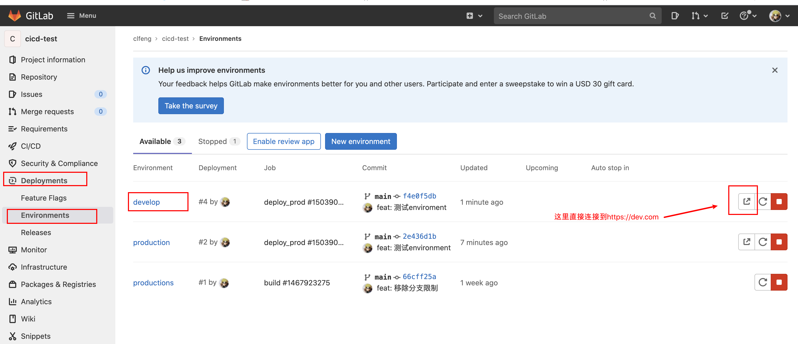
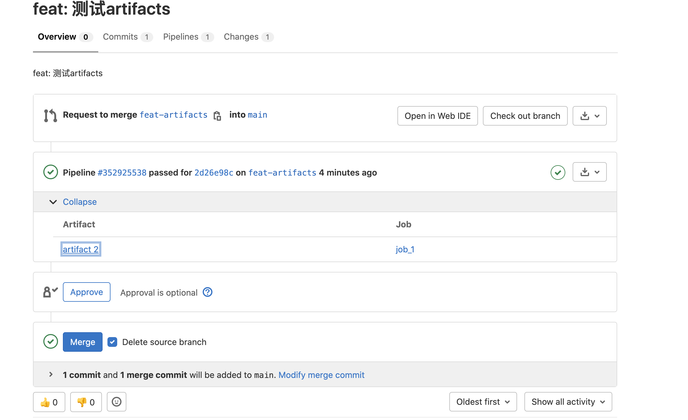

# CI/CD 半桶水（三）

导学：通过前两章的内容，我们有了自己的 CI/CD 环境也掌握了 CI/CD 最核心的相关概念。这一章我们将进一步了解 CI/CD 的各种关键字及其作用。

_注：这一章节看起来更像是一个查配置的章节，内容长且枯燥。笔者写这章的目的关键也还是为了整体知识的完整性。同时笔者也认为虽然对于一块知识点的学习应该是越完整越好，尽可能知道其所有的内容，即使看完之后细节都不记得了。但是知道有那么一个东西存在，那么当问题出现时我们更有可能分析出问题出现的原因以及得到更合理的解决方案_

## .gitlab-ci.yml reference

### 默认配置

#### default

定义 pipeline 中所有 job 的默人配置，可定义的相关配置项：

- after_script
- artifacts
- before_script
- cache
- image
- interruptible
- retry
- services
- tags
- timeout

### 全局配置

#### stages

定义 pipeline 各个 stage 的名称以及执行顺序

#### workflow

控制整个 pipeline 的运行

```yaml
workflow:
  rules:
    - if: '$CI_PIPELINE_SOURCE == "schedule"'
      when: never
    - if: '$CI_PIPELINE_SOURCE == "push"'
      when: never
    - when: always
```

```yaml
variables:
  DEPLOY_VARIABLE: "default-deploy"

workflow:
  rules:
    - if: $CI_COMMIT_REF_NAME == $CI_DEFAULT_BRANCH
      variables:
        DEPLOY_VARIABLE: "deploy-production" # Override globally-defined DEPLOY_VARIABLE
    - if: $CI_COMMIT_REF_NAME =~ /feature/
      variables:
        IS_A_FEATURE: "true" # Define a new variable.
    - when: always # Run the pipeline in other cases

job1:
  variables:
    DEPLOY_VARIABLE: "job1-default-deploy"
  rules:
    - if: $CI_COMMIT_REF_NAME == $CI_DEFAULT_BRANCH
      variables: # Override DEPLOY_VARIABLE defined
        DEPLOY_VARIABLE: "job1-deploy-production" # at the job level.
    - when: on_success # Run the job in other cases
  script:
    - echo "Run script with $DEPLOY_VARIABLE as an argument"
    - echo "Run another script if $IS_A_FEATURE exists"

job2:
  script:
    - echo "Run script with $DEPLOY_VARIABLE as an argument"
    - echo "Run another script if $IS_A_FEATURE exists"
```

#### include

可以通过 include 关键字来对 yml 中的内容进行拆分，增强配置文件的可读性

| Keyword                                                           | Method                                                         |
| :---------------------------------------------------------------- | :------------------------------------------------------------- |
| [`local`](https://docs.gitlab.com/ee/ci/yaml/#includelocal)       | Include a file from the local project repository.              |
| [`file`](https://docs.gitlab.com/ee/ci/yaml/#includefile)         | Include a file from a different project repository.            |
| [`remote`](https://docs.gitlab.com/ee/ci/yaml/#includeremote)     | Include a file from a remote URL. Must be publicly accessible. |
| [`template`](https://docs.gitlab.com/ee/ci/yaml/#includetemplate) | Include templates that are provided by GitLab.                 |

##### include:local

```yaml
include:
  - local: '/templates/.gitlab-ci-template.yml'

# 简写
include: '.gitlab-ci-production.yml'

# 使用通配符
include: 'configs/*.yml'
```

##### include:file

```yaml
include:
  - project: "my-group/my-project"
    ref: main
    file: "/templates/.gitlab-ci-template.yml"

  - project: "my-group/my-project"
    ref: v1.0.0
    file: "/templates/.gitlab-ci-template.yml"

  - project: "my-group/my-project"
    ref: 787123b47f14b552955ca2786bc9542ae66fee5b # Git SHA
    file:
      - "/templates/.builds.yml"
      - "/templates/.tests.yml"
```

##### include:remote

```yaml
include:
  - remote: "https://gitlab.com/example-project/-/raw/main/.gitlab-ci.yml"
```

##### include:template

```yaml
include:
  - template: Android-Fastlane.gitlab-ci.yml
  - template: Auto-DevOps.gitlab-ci.yml
```

### 普通配置

#### image

指定运行 job 的 docker 镜像

image

- name # 镜像的名称
  - entrypoint # docker 镜像的 ENTRYPOINT

#### services

 指定 docker service 镜像

services - name - alias - entrypoint - comand

#### before_script

在 job 的 script 相关命令执行前执行的命令，一般用于安装依赖预设环境变量的；**其和 script 共用一个 shell**

#### script

定义 job 被 runner 执行时所需要执行的命令

#### after_script

在 job 执行完之后执行的命令，**其和 script 使用的不是一个 shell**

#### stage

指定 job 所属阶段

#### extends

用于复用配置片段

```yaml
.only-important:
  variables:
    URL: "http://my-url.internal"
    IMPORTANT_VAR: "the details"
  rules:
    - if: $CI_COMMIT_BRANCH == $CI_DEFAULT_BRANCH
    - if: $CI_COMMIT_BRANCH == "stable"
  tags:
    - production
  script:
    - echo "Hello world!"

.in-docker:
  variables:
    URL: "http://docker-url.internal"
  tags:
    - docker
  image: alpine

rspec:
  variables:
    GITLAB: "is-awesome"
  extends:
    - .only-important
    - .in-docker
  script:
    - rake rspec
```

以上配置 `rspec` job 的求值结果为：

```yaml
rspec:
  variables:
    URL: "http://docker-url.internal"
    IMPORTANT_VAR: "the details"
    GITLAB: "is-awesome"
  rules:
    - if: $CI_COMMIT_BRANCH == $CI_DEFAULT_BRANCH
    - if: $CI_COMMIT_BRANCH == "stable"
  tags:
    - docker
  image: alpine
  script:
    - rake rspec
```

#### incluce

使用 include 在 CI/CD 配置中包含外部 YAML 文件。 您可以将一个很长的 gitlab-ci.yml 文件分解为多个文件以提高可读性，或减少同一配置在多个地方的重复。

```yaml
# included.yml
.template:
  script:
    - echo Hello!
```

```yaml
# .gitlab-ci.yml
include: included.yml

useTemplate:
  image: alpine
  extends: .template
```

#### rules

使用 rules 在 pipelines 中包含或排除 job。

_注：不可和 only/except 一起使用_

rules - if - exists - allow_failure - variables - when

_相关的内容参见 **CI/CD 半桶水（二）** jobs 章节_

#### only/except

您可以使用 only 和 except 来控制何时向 pipelines 添加 job。

_注：only/except 已经不在重点进行迭代开发了，推荐使用 rules_

_相关的内容参见 **CI/CD 半桶水（二）** jobs 章节_

#### tags

使用 tags 从项目中所有可用的 runner 中选择特定的 runner

```yaml
variables:
  KUBERNETES_RUNNER: kubernetes

  job:
    tags:
      - docker
      # 这里比较有意思，我们可以通过设定变量来动态选用runner
      - $KUBERNETES_RUNNER
    script:
      - echo "Hello runner selector feature"
```

#### allow_failure

可以通过 allow_failure 想让 job 失败不会影响后续 ci 的

##### allow_failure:exit_codes

通过 allow_failure:exit_codes 可以配置哪些退出码不被视为失败

```yaml
test_job_1:
  script:
    - echo "Run a script that results in exit code 1. This job fails."
    - exit 1
  allow_failure:
    exit_codes: 137

test_job_2:
  script:
    - echo "Run a script that results in exit code 137. This job is allowed to fail."
    - exit 137
  allow_failure:
    exit_codes:
      - 137
      - 255
```

#### when

- on_success: 当前面各个 stages 都成功之后，执行当前 job
- on_failure: 当前面的 stage 中至少有一个 job 失败之后，执行当前 job
- always: 无论前面 stages 的状态如何，都执行 job
- manual: 手动直接 job
- delayed: 在指定时间后延迟执行 job
- never:
  - 配合 rules 关键字，不执行 job
  - 配合 workflow:rules 关键字，不执行 pipeline

```yaml
# when: delayed 示例
timed rollout 10%:
  stage: deploy
  script: echo 'Rolling out 10% ...'
  when: delayed
  start_in: 30 minutes
# start_in 合法值
# '5'
# 5 seconds
# 30 minutes
# 1 day
# 1 week
```

#### environment

environment 相关属性

- name: 设置一个环境的名称
- url: 部署环境的 url
- on_stop: 执行完部署环境的 job 之后可单独设置清理环境的 job
- auto_stop_in: 指定环境多久过期
- action

  - start
  - prepare
  - stop

- kubernetes: 配置将项目部署到 kubernetes 集群

```yaml
default:
  image: centos:7
  tags:
    - clf-cicd-runner

stages:
  - deploy

deploy_prod:
  stage: deploy
  script:
    - echo "Deploy to production server"
  environment:
    name: develop
    url: https://dev.com
```



#### cache

_已经学习了 **《CI/CD 半桶水（二）》** 可跳过_

相关关键字

- paths: 指定缓存的文件或者目录
- key: 缓存的唯一标识
  - files: 当指定的文件中，某个文件改变了，会生成一个新的 key
  - prefix: 添加前缀到到 `cache:key:files` 计算的 hash 前
- untracked: 使用 untracked: true 缓存 Git 存储库中所有未跟踪的文件
- when: 定义什么条件下缓存 cache，可选值：on_success、on_failure、always
- policy: 定义缓存上传和下载的策略，可选值：pull、push、pull-push

```yaml
prepare-dependencies-job:
  stage: build
  cache:
    key: gems
    paths:
      - vendor/bundle
    policy: push
  script:
    - echo "This job only downloads dependencies and builds the cache."
    - echo "Downloading dependencies..."

faster-test-job:
  stage: test
  cache:
    key: gems
    paths:
      - vendor/bundle
    policy: pull
  script:
    - echo "This job script uses the cache, but does not update it."
    - echo "Running tests..."
```

**cache:key**

使用 cache:key 关键字为每个缓存提供唯一的标识键。 使用相同缓存键的所有 job 都使用相同的缓存，包括在不同的 pipelines 中。

_注：根据以上的释义，一个 key 对应这一份缓存文件，这份缓存文件可以在在同一 pipeline 不同的 job 进行复用，也可以在不同的 pipelines 中进行复用_

#### artifacts

_已经学习了 **《CI/CD 半桶水（二）》** 可跳过_

artifacts 相关关键字

- name: 定义 artifacts 的名称
- paths: artifacts 缓存文件的路径
- dependencies: 定义当前 job 下载前面 stages 的那些 job 的 artifacts
- exclude: 排除缓存的文件
- expire_in: 使用 expire_in 指定 job artifacts 在到期和删除之前存储多长时间
- expose_as: 使用 expose_as 关键字在合并请求 UI 中公开 job artifacts
- public: 设定 artifacts 是否公开可用，如果是公开可用意味着在 public pipeline 中匿名用户和访客都可以下载
- untracked: 将所有 Git 未跟踪文件添加为 artifacts（以及 artifacts:paths 中定义的路径）
- when: 定义上传 artifacts 的条件
- reports
  - api_fuzzing
  - cobertura
  - ...[其他的查看官网吧]

Use `artifacts` to specify a list of files and directories that are attached to the job when it [succeeds, fails, or always](https://docs.gitlab.com/ee/ci/yaml/#artifactswhen).

使用 artifacts 指定在作业成功、失败或始终时附加到作业的文件和目录列表。

The artifacts are sent to GitLab after the job finishes. They are available for download in the GitLab UI if the size is not larger than the maximum artifact size.

job 完成后，artifacts 将发送到 GitLab。 如果大小不大于最大 artifacts 大小，它们可以在 GitLab UI 中下载。

By default, jobs in later stages automatically download all the artifacts created by jobs in earlier stages. You can control artifact download behavior in jobs with dependencies.

默认情况下，后期的 jobs 会自动下载早期 job 创建的所有 artifacts。 您可以通过 dependencies 关键字控制 jobs 中 artifact 的下载行为。

When using the needs keyword, jobs can only download artifacts from the jobs defined in the needs configuration.

使用 needs 关键字时，jobs 只能从需求配置中定义的 jobs 下载 artifacts。

Job artifacts are only collected for successful jobs by default, and artifacts are restored after caches.

默认情况下，仅为成功的 job 收集 job artifacts，并在 caches 后恢复 artifacts。

**重点小结：**

- 储存位置在 GitLab【cache 存储在 runner】
- 前期 job 创建的 artifacts 在后期 job 中是自动下载的，可以直接用
- 可以通过 dependencies 关键字进行控制 artifacts 的下载行为
- 如果 job 中有 needs 关键字，那么只会下载 needs 关键字指定的 job 的 artifacts

##### artifacts:dependencies

默认情况下，job 会下载前面 stage 中所有 job 的 artifacts；我们可以通过 dependencies 去指定要下载哪些 job 的 artifacts（指定的 job 只能是当前 job 的前面的 stage 的 job）

```yaml
build:osx:
  stage: build
  script: make build:osx
  artifacts:
    paths:
      - binaries/

build:linux:
  stage: build
  script: make build:linux
  artifacts:
    paths:
      - binaries/

test:osx:
  stage: test
  script: make test:osx
  dependencies: # 指定只下载 build:osx 生成的 artifacts
    - build:osx

test:linux:
  stage: test
  script: make test:linux
  dependencies: # 指定只下载 build:linux 生成的 artifacts
    - build:linux

# deploy job没有制定具体的，因此按照默认的，回去下载前面所有的 job 生成的 artifacts
deploy:
  stage: deploy
  script: make deploy
```

##### artifacts:exclude

exclude 可以防止将文件添加到 artifacts

```yaml
artifacts:
  paths:
    - binaries/
  exclude:
    - binaries/**/*.o
```

##### artifacts:expire_in

使用 expire_in 指定作业 artifacts 在到期和删除之前存储多长时间

```yaml
job:
  artifacts:
    expire_in: 1 week

    # 其他可以指定的值的类型
    # expire_in: '42'
    # expire_in: 42 seconds
    # expire_in: 3 mins 4 sec
    # expire_in: 2 hrs 20 min
    # expire_in: 2h20min
    # expire_in: 6 mos 1 day
    # expire_in: 47 yrs 6 mos and 4d
    # expire_in: 3 weeks and 2 days
    # expire_in: never
```

##### artifacts:expose_as

```yaml
test:
  script: ["echo 'test' > file.txt"]
  artifacts:
    expose_as: "artifact 2"
    paths: ["file.txt"]
```

效果如下图：



##### artifacts:paths

定义缓存文件或目录的的路径。路径相对于项目目录，不能直接链接到项目目录之外。

##### artifacts:untracked

使用 artifacts:untracked 将所有 Git 未跟踪文件添加为 artifacts（以及 artifacts:paths 中定义的路径）。 artifacts:untracked 忽略存储库的 .gitignore 文件中的配置。

```yaml
artifacts:
  untracked: true
  paths:
    - binaries/
```

##### artifacts:when

定义上传 artifacts 的条件

可选值：

- on_success (default): 当 job 执行成功时上传 artifacts
- on_failure: 当 job 执行失败时上传 artifacts
- always: 总是上传 artifacts

#### retry

使用 retry 配置在失败的情况下重试 job 的次数

相关属性

- max: 最大重试次数
- when: 要重试的失败情况

```yaml
test:
  script: rspec
  retry: 2
```

```yaml
test:
  script: rspec
  retry:
    max: 2
    when: runner_system_failure
```

#### timeout

使用 timeout 为特定作业配置超时

```yaml
build:
  script: build.sh
  timeout: 3 hours 30 minutes

test:
  script: rspec
  timeout: 3h 30m
```

#### parallel

使用 parallel 配置要并行运行的 job 实例数

#### dast_configuration

使用 dast_configuration 关键字指定要在 CI/CD 配置中使用的站点配置文件和扫描程序配置文件。

#### coverage

配置如何从 job 的输出日志中提取覆盖率

```yaml
job1:
  script: rspec
  coverage: '/Code coverage: \d+\.\d+/'
```

#### trigger

Use trigger to define a downstream pipeline trigger. When GitLab starts a trigger job, a downstream pipeline is created.
使用 trigger 定义下游 pipeline 触发器。 当 GitLab 启动触发器 job 时，会创建一个下游管道。

**参见 pipeline 的 Child/Parent 架构**

```yaml
# Basic trigger syntax for multi-project pipeline
rspec:
  stage: test
  script: bundle exec rspec

staging:
  stage: deploy
  trigger: my/deployment # 指向其他项目完整路径


  # trigger:
  #   project: my/deployment
  #   branch: stable # 可以指向具体的分支
```

```yaml
# trigger syntax for child pipeline
trigger_job:
  trigger:
    include: path/to/child-pipeline.yml
```

```yaml
trigger_job:
  trigger:
    include:
      - local: path/to/child-pipeline.yml
    strategy: depend # 通过strategy: depend将子pipeline的状态映射到上游pipeline
```

```yaml
# dynamically generated configuration file:
generate-config:
  stage: build
  script: generate-ci-config > generated-config.yml
  artifacts:
    paths:
      - generated-config.yml

child-pipeline:
  stage: test
  trigger:
    include:
      - artifact: generated-config.yml
        job: generate-config
```

#### interruptible

使用 interruptible 来指示如果运行的 job 因较新的 pipelines 运行而变得多余，则应取消该 job。

_注：默认情况下如果同一分支，有新的 pipeline 运行，那么原先老的 pipeline 中的未运行的 job 会被取消，而正在运行的 job 则不会取消，通过 interruptible 可以让正在运行的 job 取消_

#### resource_group

有时，在一个环境中同时运行多个 job 或 pipeline 可能会导致部署过程中出现错误。为避免这些错误，请使用 resource_group 属性确保运行程序不会同时运行某些 job。

当在 .gitlab-ci.yml 文件中为 job 定义了 resource_group 关键字时，job 执行在同一项目的不同 pipeline 中是互斥的。 如果属于同一资源组的多个 job 同时入队，则运行程序只会选择其中一个 job。 其他 job 一直等到 resource_group 空闲。

```yaml
deploy-to-production:
  script: deploy
  resource_group: production
```

_注：resource_group 和 trigger 一起使用的时候，需要配置 trigger:strategy:depend 以确保在 child pipeline 在执行完之前不会释放锁_

#### inherit

使用 inherit: 控制全局定义的默认值和变量的继承。

```yaml
default: # 定义的全局默认配置
  image: "ruby:2.4"
  before_script:
    - echo Hello World

variables: # 定义的全局变量
  DOMAIN: example.com
  WEBHOOK_URL: https://my-webhook.example.com

rubocop:
  inherit:
    default: false # 不继承默认配置
    variables: false # 不继承全局的变量
  script: bundle exec rubocop

rspec:
  inherit:
    default: [image] # 继承全局默认配置的image字段
    variables: [WEBHOOK_URL] # 继承全局变量的WEBHOOK_URL变量
  script: bundle exec rspec

capybara:
  inherit: # 继承默认配置，但是不继承全局的变量
    variables: false
  script: bundle exec capybara

karma:
  inherit:
    default: true
    variables: [DOMAIN]
  script: karma
```

### YAML-specific features

可使用`&`、`*`、`<<`等 yaml 特性来简化 .gitlab-ci.yml 的代码

```yaml
# Hidden yaml configuration that defines an anchor named 'job_configuration'
# 如何理解上面的注释？
# 如果我们要隐藏一个job，除了将job相关的配置注释掉这种方式外还有一种方式，就是在job名前加 . ;这样job就不会执行
# 这样是否可以理解为什么上面的注释说的Hidden yaml configuration了吗？更近一步，可以配合下一个实例去理解
.job_template: &job_configuration
  image: ruby:2.6
  services:
    - postgres
    - redis

test1:
  <<: *job_configuration # Merge the contents of the 'job_configuration' alias
  script:
    - test1 project

test2:
  <<: *job_configuration # Merge the contents of the 'job_configuration' alias
  script:
    - test2 project
```

```yaml
default:
  image: centos:7
  tags:
    - clf-cicd-runner

stages:
  - test

test_job1: &job_configuration
  stage: test
  before_script:
    - echo "run test job 1 before script"
  script:
    - echo "run test job 1"

test_job2:
  <<: *job_configuration
  stage: test
  script:
    - echo "run test job 2"
# test_job2会有两句话输出：
# run test job 1 before script
# run test job 2
```

```yaml
.job_template: &job_configuration
  script:
    - test project
  tags:
    - dev

.postgres_services:
  services: &postgres_configuration
    - postgres
    - ruby

.mysql_services:
  services: &mysql_configuration
    - mysql
    - ruby

test:postgres:
  <<: *job_configuration
  services: *postgres_configuration
  tags:
    - postgres

test:mysql:
  <<: *job_configuration
  services: *mysql_configuration


#  -----------------------------------------------------------------------------
#  The expanded version is:
.job_template:
  script:
    - test project
  tags:
    - dev

.postgres_services:
  services:
    - postgres
    - ruby

.mysql_services:
  services:
    - mysql
    - ruby

test:postgres:
  script:
    - test project
  services:
    - postgres
    - ruby
  tags:
    - postgres

test:mysql:
  script:
    - test project
  services:
    - mysql
    - ruby
  tags:
    - dev
```

#### 脚本的 YAML 锚点

```yaml
.some-script-before: &some-script-before
  - echo "Execute this script first"

.some-script: &some-script
  - echo "Execute this script second"
  - echo "Execute this script too"

.some-script-after: &some-script-after
  - echo "Execute this script last"

job1:
  before_script:
    - *some-script-before
  script:
    - *some-script
    - echo "Execute something, for this job only"
  after_script:
    - *some-script-after

job2:
  script:
    - *some-script-before
    - *some-script
    - echo "Execute something else, for this job only"
    - *some-script-after
```

#### 变量的 YAML 锚点

```yaml
# global variables
variables: &global-variables
  SAMPLE_VARIABLE: sample_variable_value
  ANOTHER_SAMPLE_VARIABLE: another_sample_variable_value

# a job that must set the GIT_STRATEGY variable, yet depend on global variables
job_no_git_strategy:
  stage: cleanup
  variables:
    <<: *global-variables
    GIT_STRATEGY: none
  script: echo $SAMPLE_VARIABLE
```

#### 隐藏 jobs

当 job 的名称以 . 开头的时，job 不会被 cicd 所处理，其效果和注释掉代码类似

```yaml
.hidden_job:
  script:
    - run test
```

#### !reference tags

使用 !reference 自定义 YAML 标记从其他 job 部分选择关键字配置，并在当前部分中重用它。 与 YAML 锚点不同，您也可以使用 !reference 标签来重用包含的配置文件中的配置。

```yaml
# setup.yml
.setup:
  script:
    - echo creating environment
```

```yaml
# .gitlab-ci.yml
include:
  - local: setup.yml

.teardown:
  after_script:
    - echo deleting environment

test:
  script:
    - !reference [.setup, script]
    - echo running my own command
  after_script:
    - !reference [.teardown, after_script]
```

**小结：**通过这一章节的学习，我们了解了很多 YAML 特有的功能，通过这些功能特性，我们可以很好的维护我们的配置文件。


## 结语

看完下来是不是觉得这内容实在太多了，也可能不记得多少东西。其实没关系的，知道有这那么个东西存在就好，但问题出现的时候，您自然能回想起来，是不是有那么一个东西可以用，但是后在回来查便是了。到此为止，我们可能觉得自己无所不能了吧，哈哈哈哈～ 但其实还不够！！！下一章，我们将带大家了解一下 webhooks 以及 GitLab api 相关的内容。


## 参考链接

https://docs.gitlab.com/ee/ci/index.html
