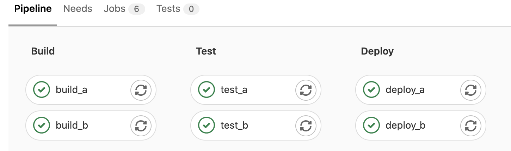
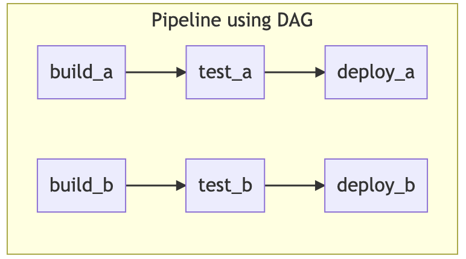
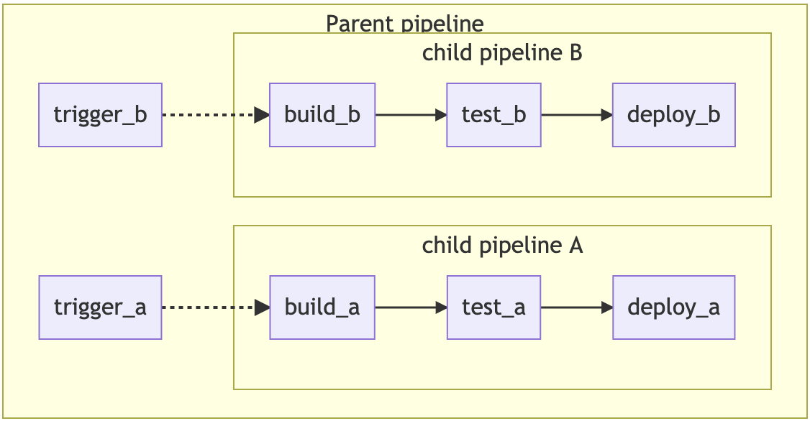
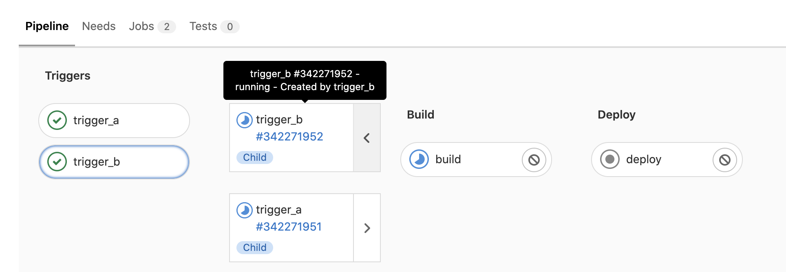

# CI/CD 半桶水（二）

导学：在《CI/CD 半桶水（一）》一章中，我们创建了自己的学习项目，并搭建好了 CI/CD 环境，还编写了自己的第一个流水线。在这一章节里，我们将进一步了解 CI/CD 的两个核心概念：Pipeline 和 Jobs 的相关内容。通过这两个相关概念的相关内容我们将进一步提升自己编写 CI/CD 流水线的能力。

## Pipelines

Pipelines 是 CI/CD 的顶级组件，一个 pipeline 创建之后便会自动执行一系列的任务，**无需人工干预**。对于 Piplines 的学习，笔者认为了解其相关的架构以及性能优化的方式是非常重要的，这部分的内容即使我们不知道可能也不会影响我们让项目中的流水线跑起来。但是了解了这部分的内容将有利于我们编写更加合理的流水线，提升整个流水线的执行效率。

### Pipeline 触发方式

- 代码推送
- 定时任务
- 手动触发
- api

### Pipeline 架构

- [Basic](https://docs.gitlab.com/ee/ci/pipelines/pipeline_architectures.html#basic-pipelines): 适用于所有配置都集中在一个容易找到的地方的简单项目。
- [Directed Acyclic Graph](https://docs.gitlab.com/ee/ci/pipelines/pipeline_architectures.html#directed-acyclic-graph-pipelines): 适用于需要高效执行的大型复杂项目。
- [Child/Parent Pipelines](https://docs.gitlab.com/ee/ci/pipelines/pipeline_architectures.html#child--parent-pipelines): 适用于具有大量独立定义组件的 monorepos 和项目。

#### Basic 模型




在 basic 模型下，必须等待 build stage 中的所有任务都完成之后才能转入到 test 阶段

```yaml
stages:
  - build
  - test
  - deploy

build_a:
  stage: build
  script: 
    - echo "build a"
  tags: 
    - clf-cicd-runner

build_b:
  stage: build
  script: 
    - echo "build b"
  tags: 
    - clf-cicd-runner

test_a:
  stage: test
  script: 
    - echo "test a"
  tags: 
    - clf-cicd-runner

test_b:
  stage: test
  script: 
    - echo "test b"
  tags: 
    - clf-cicd-runner

deploy_a:
  stage: deploy
  script: 
    - echo "deploy a"
  tags: 
    - clf-cicd-runner

deploy_b:
  stage: deploy
  script: 
    - echo "deploy b"
  tags: 
    - clf-cicd-runner
```


#### DAG 模型




当通过 needs 关键字声明依赖关系之后，便可根据依赖关系使得下一个 stage 的 job 提前执行；

如上示例中：

deploy_a 依赖 test_a，test_a 依赖 build_a；

deploy_b 依赖 test_b，test_a 依赖 build_b；

其中 build_a 和 build_b 都属于 build stage；test_a 和 test_b 都属于 test stage；deploy_a 和 deploy_b 都属于 build stage；

整个 pipeline 的执行过程如下: 

build_a、build_b 同时开始执行，同时我们假设 build_a 任务执行完成所需要的时间更短一些；当 build_a 执行完成但是 build_b 还没执行完成，这个时候 test_a 不用去等待 build_b 执行完成，便可开始执行

```yaml
stages:
  - build
  - test
  - deploy

build_a:
  stage: build
  script: 
    - echo "build a"
  tags: 
    - clf-cicd-runner

build_b:
  stage: build
  script: 
    - echo "build b"
  tags: 
    - clf-cicd-runner

test_a:
  stage: test
  needs: [build_a]
  script: 
    - echo "test a"
  tags: 
    - clf-cicd-runner

test_b:
  stage: test
  needs: [build_b]
  script: 
    - echo "test b"
  tags: 
    - clf-cicd-runner

deploy_a:
  stage: deploy
  needs: [test_a]
  script: 
    - echo "deploy a"
  tags: 
    - clf-cicd-runner

deploy_b:
  stage: deploy
  needs: [test_b]
  script: 
    - echo "deploy b"
  tags: 
    - clf-cicd-runner
```


#### Child/Parent 模型







```yaml
stages:
  - triggers

trigger_a:
  stage: triggers
  trigger:
    include: a/.gitlab-ci.yml
  rules:
    - changes:
        - a/*

trigger_b:
  stage: triggers
  trigger:
    include: b/.gitlab-ci.yml
  rules:
    - changes:
        - b/*
```

```yaml
# a/.gitlab-ci.yml
stages:
  - build
  - deploy
  
build:
  stage: build
  script:
    - echo "This job is a build."
  tags: 
    - clf-cicd-runner
deploy:
  stage: deploy
  script:
    - echo "This job is a deploy."
  tags: 
    - clf-cicd-runner

```

```yaml
# b/.gitlab-ci.yml
stages:
  - build
  - deploy
  
build:
  stage: build
  script:
    - echo "This job is b build."
  tags: 
    - clf-cicd-runner
deploy:
  stage: deploy
  script:
    - echo "This job is b deploy."
  tags: 
    - clf-cicd-runner


```

##### 多项目

多项目的组织方式和 parent/child 非常像，只是这种方式指定的子 pipeline 是其他项目

```yaml
# upstream yml
# 当test阶段成功执行之后，进入staging阶段，该阶段会触发下游项目my/deployment的pipeline
rspec:
  stage: test
  script: bundle exec rspec

staging:
  variables:
    ENVIRONMENT: staging
  stage: deploy
  trigger: my/deployment
```

```yaml
# upstream yml
# 上游项目通过trigger:strategy关键字，将下游的项目pipeline的执行状态给映射过来
trigger_job:
  trigger:
    project: my/project
    strategy: depend
```

```yaml
# downstream yml
# 下游项目通过needs:pipeline关键字将上游项目的pipeline映射过来
upstream_bridge:
  stage: test
  needs:
    pipeline: other/project
```


### Pipeline 性能优化

- 将容易失败的任务放到前面
- 避免无必要的任务执行
- 优化 docker 镜像，让镜像的体积更小


docker 镜像优化：

- 使用小型基础镜像，例如`debian-slim`。
- 如果不是严格需要，不要安装像 vim、curl 等便利工具。
- 创建专属镜像
- 禁用由软件包安装的手册页和文档以节省空间。
- 减少`RUN`层并结合软件安装步骤。
- 使用 [multi-stage builds](https://blog.alexellis.io/mutli-stage-docker-builds/) 将多个使用构建器模式的 Dockerfile 合并为一个 Dockerfile，可以减少镜像大小。
- 如果使用 `apt`，添加 `--no-install-recommends` 以避免不必要的包。
- 清理最后不再需要的缓存和文件。 例如`rm -rf /var/lib/apt/lists/*`适用于 Debian 和 Ubuntu，或`yum clean all`适用于 RHEL 和 CentOS。
- 使用 [dive](https://github.com/wagoodman/dive) 或 [DockerSlim](https://github.com/docker-slim/docker-slim) 等工具来分析和缩小镜像。


### Pipeline for merge requests

为合并请求定义 pipeline

```yaml
build:
  stage: build
  script: ./build
  only:
    - main

test:
  stage: test
  script: ./test
  only:
    - merge_requests

deploy:
  stage: deploy
  script: ./deploy
  only:
    - main
```

## Jobs

Jobs 帮我们指定 pipeline 每个阶段的具体工作内容。在实际的应用中，我们出了写明 job 执行时的具体工作内容之外，往往还需要根据具体的情况去控制 job 的执行时机。job 的相关关键字 rules、only、except 给我们提供这方面的能力

### rules

```yaml
# 基本示例
job:
  script: echo "Hello, Rules!"
  rules:
    - if: '$CI_PIPELINE_SOURCE == "merge_request_event"'
      when: manual
      allow_failure: true
    - if: '$CI_PIPELINE_SOURCE == "schedule"'
```

rules 相关子属性

- if
- when
- allow_failure
- changes

如果定义 if 关键字后未定义其他的关键字，则采用以下的默认值配置

```plain
when: on_success
allow_failure: false
```

```yaml
# if 在少数特定情况下排除 job，但是在其他情况下添加 job
job:
  script: echo "Hello, Rules!"
  rules:
    - if: '$CI_PIPELINE_SOURCE == "merge_request_event"'
      when: never
    - if: '$CI_PIPELINE_SOURCE == "schedule"'
      when: never
    - when: on_success
```

**rules 如何判断 job 是否添加：当 when、if、changes、exits 的求值结果都为 true 时则添加 job；**

**if 关键字相关表达式语法**

是否相等： `==`

是否不等：`!=` 

此外一般字符串需要通过`""`进行包裹；

判断变量是否为定义：

```plain
if: $VARIABLE == null
if: $VARIABLE != null
```

判断变量是否定义了但是为空

```plain
if: $VARIABLE == ""
if: $VARIABLE != ""
```

判断变量是否存在

```plain
# 变量不能为空
if: $VARIABLE 
```

通过正则表达式进行比较

```plain
# 变量的值和正则表达式能匹配结果为true
$VARIABLE =~ /^content.*/

# 变量的值和正则表达式不能匹配结果为true
$VARIABLE_1 !~ /^content.*/
```

通过 `&&` 和 `||`关键字将多个比较逻辑联合起来

```plain
$VARIABLE1 =~ /^content.*/ && $VARIABLE2 == "something"
$VARIABLE1 =~ /^content.*/ && $VARIABLE2 =~ /thing$/ && $VARIABLE3
$VARIABLE1 =~ /^content.*/ || $VARIABLE2 =~ /thing$/ && $VARIABLE3
```

可通过括号对表达式进行分组

```plain
($VARIABLE1 =~ /^content.*/ || $VARIABLE2) && ($VARIABLE3 =~ /thing$/ || $VARIABLE4)
($VARIABLE1 =~ /^content.*/ || $VARIABLE2 =~ /thing$/) && $VARIABLE3
$CI_COMMIT_BRANCH == "my-branch" || (($VARIABLE1 == "thing" || $VARIABLE2 == "thing") && $VARIABLE3)
```

### only

```yaml
test:
  script: npm run test
  only:
    refs:
      - main
      - schedules
    variables:
      - $CI_COMMIT_MESSAGE =~ /run-end-to-end-tests/
    kubernetes: active
```

如何判断是否将 job 添加到 pipeline ： 

（refs 任一条件为 true） && （variables 任一条件为 true） && （change s 任一条件为 true） && （任何选择的 Kubernetes 状态匹配）

*官网原文：`(any listed refs are true) AND (any listed variables are true) AND (any listed changes are true) AND (any chosen Kubernetes status matches)`*

### except

```yaml
test:
  script: npm run test
  except:
    refs:
      - main
    changes:
      - "README.md"
```

如何判断是否将 job 排除：

（refs 任一条件为 true） || （variables 任一条件为 true） || （changes 任一条件为 true） || （任何选择的 Kubernetes 状态匹配）

*官网原文：`(any listed refs are true) OR (any listed variables are true) OR (any listed changes are true) OR (a chosen Kubernetes status matches)`*


### scripts 语法

- before_scripts
- script
- after_scripts

**before_script 和 script 使用统一个 shell ；after_script 使用新的 shell**

```yaml
job:
  before_script:
    - echo "run before script"
  script:
    - echo "run script 1"
    - echo "run script 2"
  after_script:
    - echo "run after script"
```

#### 异常场景

多行命令存在的问题

```yaml
stages:
  -  test

.job_template: &job_configuration
  stage: test
  image: centos:7
  tags: 
    - clf-cicd-runner
    
job9:
  <<: *job_configuration
  script:
    - false && true
    - echo $? # 输出结果为0
```

如何解决

```yaml
stages:
  -  test

.job_template: &job_configuration
  stage: test
  image: centos:7
  tags: 
    - clf-cicd-runner

job:
  <<: *job_configuration
  script:
    - |
      false && true
      echo $? # 输出结果为1
```

#### 拆分长命令（Split long commands）

```yaml
stages:
  -  test

.job_template: &job_configuration
  stage: test
  image: centos:7
  tags: 
    - clf-cicd-runner

job_1:
  <<: *job_configuration
  script:
    - echo "run script 1" # 输出日志
    - echo "run script 2" # 输出日志

job_one_line_1:
  <<: *job_configuration
  script:
    - |
      echo "First command line."
      echo "Second command line."
      echo "Third command line."

job_one_line_2:
  <<: *job_configuration
  script:
    - >
      echo "First command line."

      echo "Second command line."

      echo "Third command line."

job_one_line_3:
  <<: *job_configuration
  script:
      echo "First command line."
      
      echo "Second command line."

      echo "Third command line."

# 第一行的输出会换行
job_multi_line_1:
  <<: *job_configuration
  script: 
    - |
      echo "First command line
      is split over two lines."
      echo "Second command line."

job_multi_line_2:
  <<: *job_configuration
  script: 
    - >
      echo "First command line
      is split over two lines."

      echo "Second command line."

job_multi_line_3:
  <<: *job_configuration
  script:
    - echo "First command line
      is split over two lines."

      echo "Second command line."

job_multi_line_4:
  <<: *job_configuration
  script:
    echo "First command line
    is split over two lines."

    echo "Second command line."
```

#### 使用颜色代码（use color codes）

https://misc.flogisoft.com/bash/tip_colors_and_formatting

```yaml
job:
  script:
    - echo -e "\e[31mThis text is red,\e[0m but this text isn't\e[31m however this text is red again."
```

```yaml
# 通过定义变量的形式进行使用
job:
  before_script:
    - TXT_RED="\e[31m" && TXT_CLEAR="\e[0m"
  script:
    - echo -e "${TXT_RED}This text is red,${TXT_CLEAR} but this part isn't${TXT_RED} however this part is again."
    - echo "This text is not colored"
```


## Variables

### 变量的来源

- 预设变量（predefined variable）
- 自定义变量（custome variable）
  - 项目
    - 通过.gitlab-ci.yml
    - 项目设置
    - API
  - 群组
  - gitlab 实例

*注:  给项目添加的变量只有项目能访问，给群组添加的变量群组中的实例都可以访问，给 GitLab 实例添加的变量整个 GitLab 中的项目都可以访问*

#### 创建自定义变量

```yaml
variables:
  TEST_VAR: "All jobs can use this variable's value"

job1:
  variables:
    TEST_VAR_JOB: "Only job1 can use this variable's value"
  script:
    - echo "$TEST_VAR" and "$TEST_VAR_JOB"
```


### 变量的类型

- variable：传统的 key value 类型
- File： key 为变量名，value 为路径指向值存储的文件

*注： .gitlab-ci.yml 中定义的变量只能是 variable 类型，而项目、项目组、GitLab 实例中定义的变量则可以是 variable 类型或者 file 类型*


### 设置变量特性

#### Mask 变量

mask 变量后，变量的值不会出现在 job 的日志中

#### Protect 变量

protect 变量后，该变量只会在传递到受保护的分支和 tag 中


### Job 间传递变量

```yaml
build:
  stage: build
  script:
    - echo "BUILD_VERSION=hello" >> build.env
  artifacts:
    reports:
      dotenv: build.env

deploy:
  stage: deploy
  script:
    - echo "$BUILD_VERSION"  # Output is: 'hello'
  dependencies:
    - build

```

```yaml
build:
  stage: build
  script:
    - echo "BUILD_VERSION=hello" >> build.env
  artifacts:
    reports:
      dotenv: build.env

deploy:
  stage: deploy
  script:
    - echo "$BUILD_VERSION"  # Output is: 'hello'
  needs:
    - job: build
      artifacts: true
```


### 变量的优先级

1. Trigger variables, scheduled pipeline variables, and manual pipeline run variables（触发变量、计划 pipeline 变量和手动 pipeline 运行变量）
2. Project variables （项目变量）
3. Group variables（群组变量）
4. Instance variables（实例变量）
5. Inherited variables（继承变量）
6. **Variables defined in jobs in the .gitlab-ci.yml file（.gitlab-ci.yml 文件中 jobs 定义的变量）**
7. **Variables defined outside of jobs (globally) in the .gitlab-ci.yml file（ 在 .gitlab-ci.yml 文件中的 jobs 之外（全局）定义的变量）**
8. Deployment variables（部署变量）.
9. Predefined variables（预定义变量）.

```yaml
variables:
  API_TOKEN: "default"

job1:
  variables:
    API_TOKEN: "secure"
  script:
    - echo "The variable value is $API_TOKEN"
```


## Cache and artifacts

job 在执行的过程中，往往要去下载一些项目的依赖包（每次流水线或者 job 都通过网络去下载项目的依赖包是非常耗时的）以及将构建的结果文件传到下一个 job 去使用，这个问题该怎么解决？ cache 和 artifacts 关键字将很好的帮助我们解决这些问题。


### 区别

cache 用来缓存依赖包，缓存的内容存在 gitlab-runner 中

artifacts 用来传递不同 stage 构建的中间结果，缓存的内容将保存在 GitLab 上且可以进行下载


### Cache

原文：

- Define cache per job by using the `cache:` keyword. Otherwise it is disabled.
- Subsequent pipelines can use the cache.
- Subsequent jobs in the same pipeline can use the cache, if the dependencies are identical.
- Different projects cannot share the cache.


翻译：

- 使用 cache : 关键字定义每个 job 的缓存。 否则它被禁用。
- 后续 pipeline 可以使用缓存
- 如果依赖项相同，同一 pipeline 中的后续 job 可以使用缓存。
- 不同的项目不能共享缓存。


#### 注意事项

1. 缓存是一种优化，但不能保证总是有效。 您可能需要在需要它们的每个作业中重新生成缓存文件。

   cache 是否可用取决于

   - runner 执行器的类型
   - 是否使用不同的执行器在 job 之间传递缓存。

2. cache 的存储

   - 一个 job 中定义的所有 cache 会被归档到一个 cache.zip 文件当中去。该文件会存储在 gitlab-runner 安装的机器上；
   - cache 的缓存方式是以键值对的方式进行存储的，缓存对象以 job 中定义的 cache:key 为键，cache.zip 为值进行储存
   - 基于上一点描述的存储方式，在特定的情况下可能出现 cache 不可用的情况
     - 不同 job 因为 key 相同，且都进行了 cache 的上传，从而出现覆盖的情况
     - cache 在解压的时候都是解压在工作目录的，并且 runner 也不会去关注不同 job 解压的文件出现覆盖的情况

**以上的内容总结来说就是 runner 并不会去验证 cache，cache 的使用是不可信的**

```yaml
# 基本示例
stages:
  - build
  - test

before_script:
  - echo "Hello"

job A:
  stage: build
  script:
    - mkdir vendor/
    - echo "build" > vendor/hello.txt
  cache:
    key: build-cache
    paths:
      - vendor/
  after_script:
    - echo "World"

job B:
  stage: test
  script:
    - cat vendor/hello.txt
  cache:
    key: build-cache
    paths:
      - vendor/
```

#### cache 相关关键字

- paths: 指定缓存的文件或者目录
- key: 缓存的唯一标识
  - files: 当指定的文件中，某个文件改变了，会生成一个新的 key
  - prefix: 添加前缀到到 `cache:key:files` 计算的 hash 前
- untracked: 使用 untracked: true 缓存 Git 存储库中所有未跟踪的文件
- when: 定义什么条件下缓存 cache，可选值：on_success、on_failure、always
- policy: 定义缓存上传和下载的策略，可选值：pull、push、pull-push

```yaml
prepare-dependencies-job:
  stage: build
  cache:
    key: gems
    paths:
      - vendor/bundle
    policy: push
  script:
    - echo "This job only downloads dependencies and builds the cache."
    - echo "Downloading dependencies..."

faster-test-job:
  stage: test
  cache:
    key: gems
    paths:
      - vendor/bundle
    policy: pull
  script:
    - echo "This job script uses the cache, but does not update it."
    - echo "Running tests..."
```


**cache:key**

使用 cache:key 关键字为每个缓存提供唯一的标识键。 使用相同缓存键的所有 job 都使用相同的缓存，包括在不同的 pipelines 中。

*注：根据以上的释义，一个 key 对应这一份缓存文件，这份缓存文件可以在在同一 pipeline 不同的 job 进行复用，也可以在不同的 pipelines 中进行复用*


### Artifacts

原文：

- Define artifacts per job.
- Subsequent jobs in later stages of the same pipeline can use artifacts.
- Different projects cannot share artifacts.

Artifacts expire after 30 days unless you define an [expiration time](https://docs.gitlab.com/ee/ci/yaml/index.html#artifactsexpire_in). Use [dependencies](https://docs.gitlab.com/ee/ci/yaml/index.html#dependencies) to control which jobs fetch the artifacts.


翻译：

- 定义每个 job 的 artifacts
- 同一 pipeline 的后续 stage 的 job 可以使用 artifacts
- 不同项目无法共享 artifacts

未设定过期时间的情况下，30 天后会过期；


#### artifacts 相关关键字

- name: 定义 artifacts 的名称
- paths: artifacts 缓存文件的路径
- dependencies: 定义当前 job 下载前面 stages 的那些 job 的 artifacts
- exclude: 排除缓存的文件
- expire_in: 使用 expire_in 指定 job artifacts 在到期和删除之前存储多长时间
- expose_as: 使用 expose_as 关键字在合并请求 UI 中公开 job artifacts
- public: 设定 artifacts 是否公开可用，如果是公开可用意味着在 public pipeline 中匿名用户和访客都可以下载
- untracked: 将所有 Git 未跟踪文件添加为 artifacts（以及 artifacts:paths 中定义的路径）
- when: 定义上传 artifacts 的条件
- reports
  - api_fuzzing
  - cobertura
  - ...[其他的查看官网吧]


Use `artifacts` to specify a list of files and directories that are attached to the job when it [succeeds, fails, or always](https://docs.gitlab.com/ee/ci/yaml/#artifactswhen).

使用 artifacts 指定在作业成功、失败或始终时附加到作业的文件和目录列表。


The artifacts are sent to GitLab after the job finishes. They are available for download in the GitLab UI if the size is not larger than the maximum artifact size.

job 完成后，artifacts 将发送到 GitLab。 如果大小不大于最大 artifacts 大小，它们可以在 GitLab UI 中下载。


By default, jobs in later stages automatically download all the artifacts created by jobs in earlier stages. You can control artifact download behavior in jobs with dependencies.

默认情况下，后期的 jobs 会自动下载早期 job 创建的所有 artifacts。 您可以通过 dependencies 关键字控制 jobs 中 artifact 的下载行为。


When using the needs keyword, jobs can only download artifacts from the jobs defined in the needs configuration.

使用 needs 关键字时，jobs 只能从需求配置中定义的 jobs 下载 artifacts。


Job artifacts are only collected for successful jobs by default, and artifacts are restored after caches.

默认情况下，仅为成功的 job 收集 job artifacts，并在 caches 后恢复 artifacts。


**重点小结：**

- 储存位置在 GitLab【cache 存储在 runner】
- 前期 job 创建的 artifacts 在后期 job 中是自动下载的，可以直接用
- 可以通过 dependencies 关键字进行控制 artifacts 的下载行为
- 如果 job 中有 needs 关键字，那么只会下载 needs 关键字指定的 job 的 artifacts


##### artifacts:dependencies

默认情况下，job 会下载前面 stage 中所有 job 的 artifacts；我们可以通过 dependencies 去指定要下载哪些 job 的 artifacts（指定的 job 只能是当前 job 的前面的 stage 的 job）


```yaml
build:osx:
  stage: build
  script: make build:osx
  artifacts:
    paths:
      - binaries/

build:linux:
  stage: build
  script: make build:linux
  artifacts:
    paths:
      - binaries/

test:osx:
  stage: test
  script: make test:osx
  dependencies: # 指定只下载 build:osx 生成的 artifacts
    - build:osx

test:linux:
  stage: test
  script: make test:linux
  dependencies: # 指定只下载 build:linux 生成的 artifacts
    - build:linux

# deploy job没有制定具体的，因此按照默认的，回去下载前面所有的 job 生成的 artifacts
deploy:
  stage: deploy
  script: make deploy
```


##### artifacts:exclude

exclude 可以防止将文件添加到 artifacts

```yaml
artifacts:
  paths:
    - binaries/
  exclude:
    - binaries/**/*.o
```


##### artifacts:expire_in

使用 expire_in 指定作业 artifacts 在到期和删除之前存储多长时间

```yaml
job:
  artifacts:
    expire_in: 1 week

    # 其他可以指定的值的类型
    # expire_in: '42'
    # expire_in: 42 seconds
    # expire_in: 3 mins 4 sec
    # expire_in: 2 hrs 20 min
    # expire_in: 2h20min
    # expire_in: 6 mos 1 day
    # expire_in: 47 yrs 6 mos and 4d
    # expire_in: 3 weeks and 2 days
    # expire_in: never
```


##### artifacts:expose_as

```yaml
test:
  script: ["echo 'test' > file.txt"]
  artifacts:
    expose_as: 'artifact 2'
    paths: ['file.txt']
```

效果如下图：


##### artifacts:paths

定义缓存文件或目录的的路径。路径相对于项目目录，不能直接链接到项目目录之外。


##### artifacts:untracked

使用 artifacts:untracked 将所有 Git 未跟踪文件添加为 artifacts（以及 artifacts:paths 中定义的路径）。 artifacts:untracked 忽略存储库的 .gitignore 文件中的配置。

```yaml
artifacts:
  untracked: true
  paths:
    - binaries/
```


##### artifacts:when

定义上传 artifacts 的条件

可选值：

- on_success (default): 当 job 执行成功时上传 artifacts
- on_failure: 当 job 执行失败时上传 artifacts
- always: 总是上传 artifacts


## 结语

在这一章节里，我们了解了 Pipelines 的架构、了解 了 pipeline 性能优化的一些技巧，也具备了控制 job 执行时机的能力，更是学会了使用  cache 和 artifacts 关键字来提升 job 执行效率以及缓存流水线执行过程中产生的一些构建结果文件。说实在的笔者认为学到这里，我们已经可以应对绝大多数的需求场景了，看懂公司内部现有的流水线相关的内容更是不在话下。但是笔者还是期望带着大伙更近一步深入了解 CI/CD 中还有什么内容。下一章节，我们将进一步去了解 CI/CD 中各种各样的关键字。


## 参考链接

https://docs.gitlab.com/ee/ci/index.html
