# CI/CD 半桶水（四）

## 导学

在了解 CI/CD 最基础的概念和用法之后让我们学习一些稍微高级点的功能：webhook 以及 GitLab 的 api 调用。文章整体的结构为提出两个具体的功能需求，然后再一步步的去进行实现。

## 需求背景

功能一：通过内部聊天工具自动提醒代码审核人去 review 代码

在实际的项目开发过程中，当我们开发完一个功能之后，我们会将自己的代码推送到到远程仓库上，提一个合并请求并指派给自己的 leader，让 leader 帮我们审核代码并合入到主干上去；于是我们在提完合并请求之后，可能会在通过内部的聊天工具将链接发给 leader 让 leader 赶紧帮我们审核下并合入到主干。那么我们能不能将这一步骤通过 CI/CD 自动化处理呢？

功能二：进行三方库升级的卡控，提醒开发人员做好自测

我们期望在合并请求的时候通过  CI/CD 去分析开发人员的改动。对于一些比较高危的改动（如组件库的升级、三方库的升级），我们期望通过自动添加评论的方式，让开发人员关注到，并做好相应的自测和保障措施。

那么我们要怎么去分析开发人员是否进行了组件库的升级呢？以 element-ui 库为例：

```shell
# 开发人员的个人分支为 update-component-clf
# 要合入的分支为 master
# 那么我们变可以通过以下脚本进行判断

git diff HEAD origin/master ./yarn.lock | grep "element-ui";

if [ $? -eq "0" ]; then
  echo "您进行了 elmenent-ui 库的升级，请做好相应的升级验证！"
fi
```

通过以上的示例，不难想到我们可以在合并请求时的流水线中通过 git 的命令去分析出是否进行了 element-ui 库的升级。为了能通过上面的命令进行分析，我们需要知道这个合并请求的目标分支是哪个，那么有什么方法可以拿到吗？如果您的 GitLab的版本是高于 11.6 的那么会非常简单，通过 `CI_MERGE_REQUEST_TARGET_BRANCH_NAME` 预设变量便可以轻松拿到。但如果 GitLab 的版本比较低，那又该怎么办？ webhook 以及 GitLab的 api 调用的方式或许可以帮你解决问题。

接下来让我们一步步来实现一下我们的需求：

## 创建本地 node 服务

```shell
# 创建并进入目录
mkdir gitlab-server;
cd gitlab-server;

# 安装依赖
yarn init -y;
yarn add koa koa-bodyparser koa-route;

# 创建应用
touch app.js;
```

```javascript
# app.js
const Koa = require('koa');
const route = require('koa-route');
const bodyParser = require('koa-bodyparser');

const app = new Koa();
const port = 3000;

app.use(bodyParser());

app.use(route.post('/merge_events', async (ctx) => {
  console.log(ctx);
}));


app.use(route.get('/', ctx => {
  ctx.body = 'Hello World';
}));

app.listen(port);

console.log(`Example app listening at http://localhost:${port}`);
```


启动 node 服务器

```shell
# 在 gitlab-server 目录下，不过建议通过 vscode 调试模式进行启动，方便直接查看请求的相关内容
node app.js
```


## 添加合并请求 hook

### 生成 Secret token

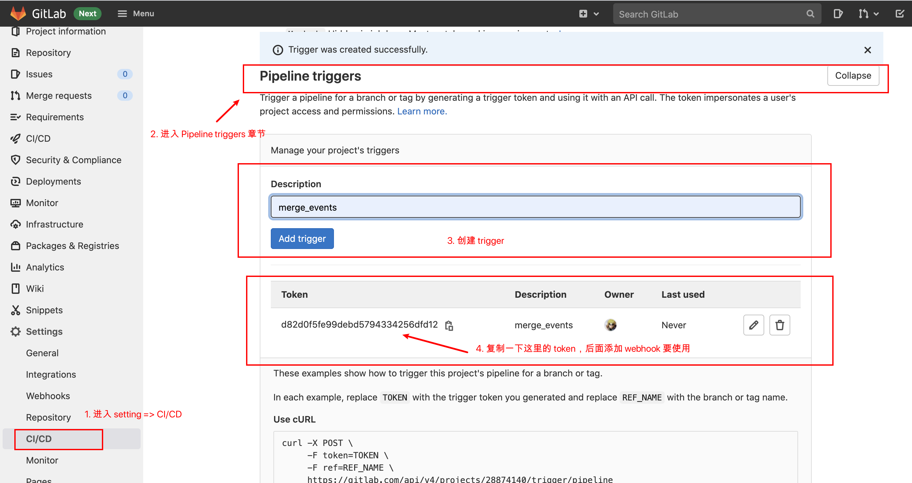


### 添加 hook

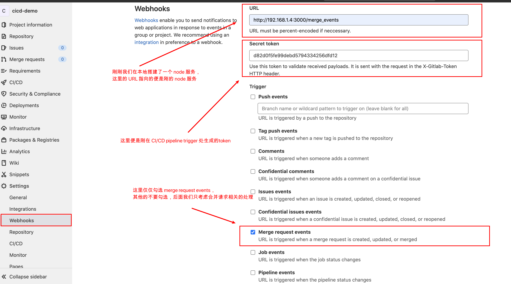


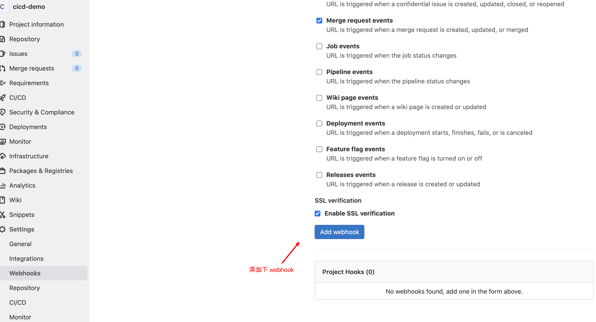

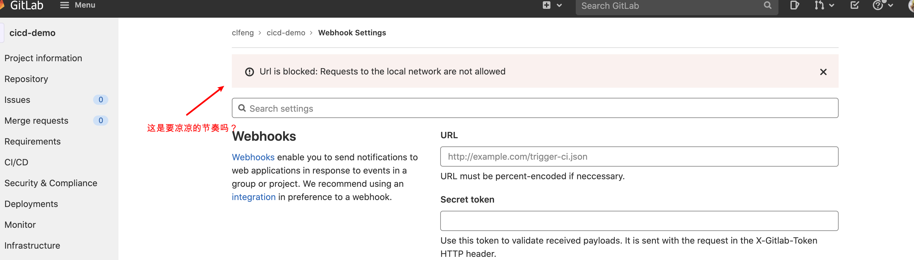


**在官网找到的解决方法**

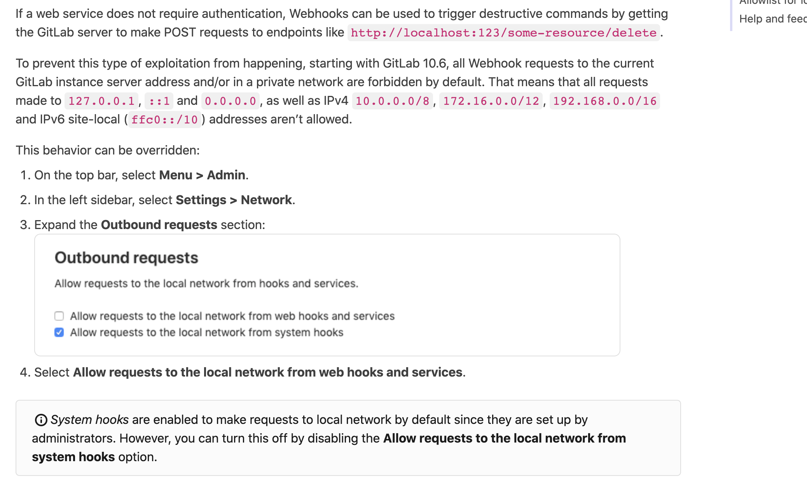

emmmm，因为安全问题，无法直接往本地的网络发请求。而放开限制又需要进入 Admin 面板。但是由于笔者也只是在 GitLab 上注册了一个普通的账号来用，没有 admin 权限，更没有 Admin 面板，看来只能在服务器上自己搭建一个 GitLab了。


## 搭建 GitLab

支持的系统：

- Ubuntu (16.04/18.04/20.04)
- Debian (9/10)
- CentOS (7/8)
- openSUSE Leap (15.2)
- SUSE Linux Enterprise Server (12 SP2/12 SP5)
- Red Hat Enterprise Linux (please use the CentOS packages and instructions)
- Scientific Linux (please use the CentOS packages and instructions)
- Oracle Linux (please use the CentOS packages and instructions)

*注：GitLab 服务器笔者是安装在本地的虚拟机上跑的 centos: 7 系统上的，因此下面的安装操作在centos上进行的*

*官网的安装教程：https://about.gitlab.com/install/*


### 安装 ssh及处理防火墙

```shell
sudo yum install -y curl policycoreutils-python openssh-server perl

# 命令先看下 sshd 服务的状态
sudo systemctl status sshd

# 如果服务没起来则通过以下命令进行操作
sudo systemctl enable sshd
sudo systemctl start sshd

# 这里是防火墙相关的处理，此处直接粘贴的官网的相关命令，但建议如果是初学者，对服务器又不是很了解且是学习的服务器（本地虚拟机），
# 可直接把防火墙关了，费事越到各种问题

# 关闭防火墙，笔者为了省事就直接关了
sudo systemctl stop firewalld

# 以下摘自官网
# Check if opening the firewall is needed with: sudo systemctl status firewalld
sudo firewall-cmd --permanent --add-service=http
sudo firewall-cmd --permanent --add-service=https
sudo systemctl reload firewalld

```


### 添加 GitLab 包存储库并安装包

#### 1.  添加 GitLab 软件包仓库

```shell
curl https://packages.gitlab.com/install/repositories/gitlab/gitlab-ee/script.rpm.sh | sudo bash
```


#### 2. 安装软件包以及设定暴露的地址

```shell
# 将 http://192.168.56.101 替换为你服务器对应的地址
sudo EXTERNAL_URL="http://192.168.56.101" yum install -y gitlab-ee
```

*安装完之后接着回到我们的本地机器（笔者的是mac）*


#### 3. 访问 GitLab

安装成功之后，打开浏览器访问：`http://192.168.56.101`

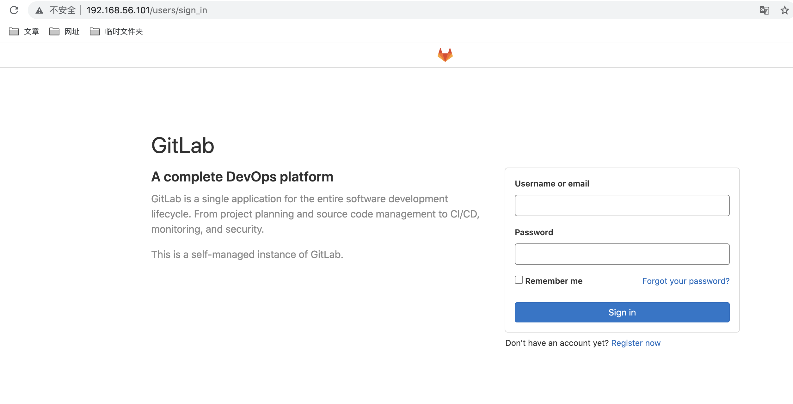


#### 4. 登陆

账号为：root

密码是在执行命令 `sudo EXTERNAL_URL="http://192.168.56.101" yum install -y gitlab-ee` 时随机生成的。

随机生成的密码存储在`/etc/gitlab/initial_root_password` 中，可通过 `cat /etc/gitlab/initial_root_password` 命令查看

*注：密码查看在安装 GitLab 的 centos 服务器上去查看*

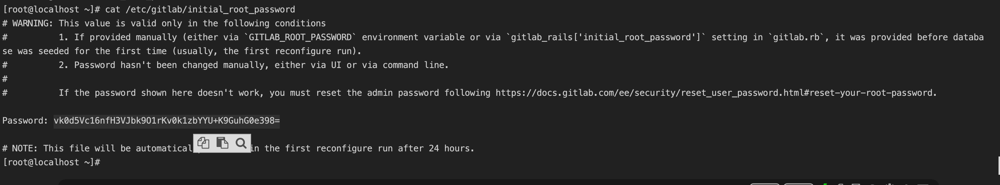

***注：该初始密码会在24小时内被清除掉，所以请及时修改密码***


## 环境准备

### 允许从 Web 钩子和服务向本地网络发出请求

*还记得我们为什么要自己搭建 GitLab吗？为了处理 webhook 无法往本地网络发请求的问题。现在有了超级管理员账号，让我们根据官网的提示，放开相应的限制*

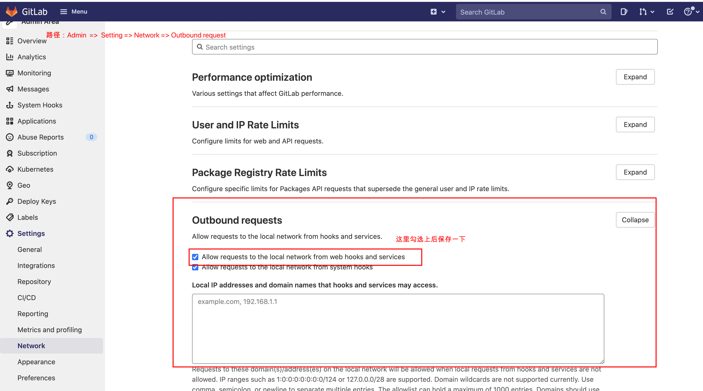


### 项目创建以及添加 SSH Key

#### 创建项目

由于新搭建的项目时全空的，我们来重新创建一个项目


#### 创建并添加 SSH Key

具体操作可参见 https://docs.gitlab.com/ee/ssh/index.html#see-if-you-have-an-existing-ssh-key-pair

一般来说本地都会有生成好的 ssh key，毕竟前面的章节我们一直在拉项目推送代码。所以可以进入到 .ssh 目录去查看对应的的公钥。

```shell
cd .ssh
ls
# 这里是查到的文件
id_ed25519	id_ed25519.pub	id_rsa		id_rsa.pub	known_hosts

# 将输出的内容复制到出来，粘贴到下面的输入框中去
cat id_rsa.pub
```


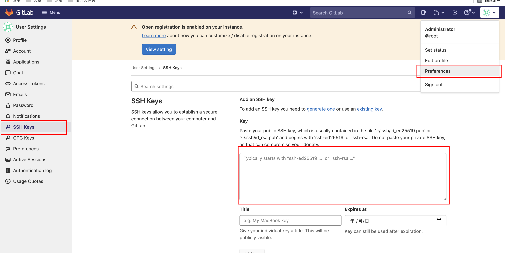


#### 添加 webhook

接着就回到 **添加合并请求 hook** 章节的操作了，根据前面的教程在我们自己搭建的 GitLab 上进行相同的操作，主体步骤为：

1. 注册 runner
2. 添加 Pipeline triggers，拿到安全令牌
3. 添加webhook

根据前面的操作，最终我们将走到以下步骤


#### 启动本地服务并打好断点

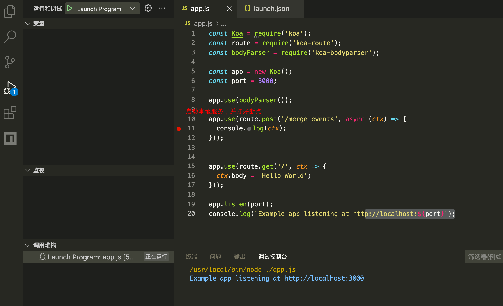


#### 提合并请求查看请求报文

接着我们给项目添加下 .gitlab-ci.yml 文件并提下合并请求，看本地 node 服务接收到的请求是怎样的

```yaml
# 内容还是我们的第一个流水线
# .gitlab-ci.yml
stages:
  - build
  - test
  - deploy

build_job:
  stage: build # 指定job所属stage
  image: centos:7 # 指定执行job的所使用docker镜像
  tags: 
    - clf-runner # 指定执行job的runner（即机器）
  script: # job执行时运行的脚本
    - echo "build project"

test_job:
  stage: test
  image: centos:7
  tags: 
    - clf-runner
  script:
    - echo "test project"

deploy_job:
  stage: deploy
  image: centos:7
  tags: 
    - clf-runner
  script:
    - echo "deploy project"

```


##### 提合并请求

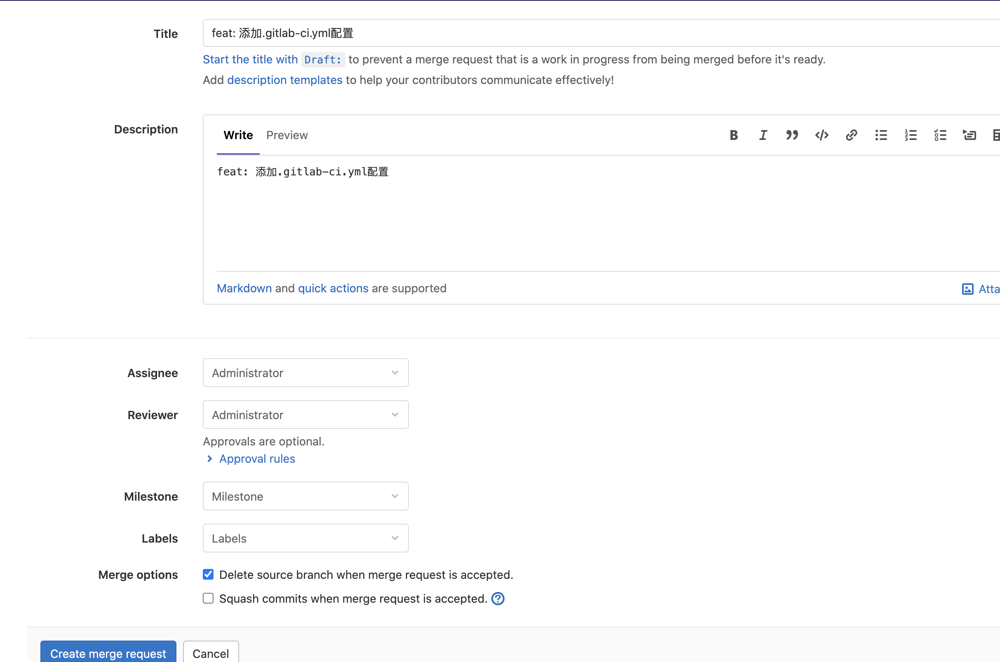


##### 查看请求报文


##### 报文分析

接收到的报文中有着非常多且完整的消息，接下来让我们一起来看看

*注：报文信息比较长，大概过一下知道可能都有什么信息就好了*

```json
// 这里是 ctx.headers 中的报文信息
{
  "content-type": "application/json",
  "user-agent": "GitLab/14.2.3-ee",
  "x-gitlab-event": "Merge Request Hook", // 标明是什么事件
  "x-gitlab-token": "839fa63721bcb59a246d991410b30e", // 这里是我们前面添加的安全令牌（trigger token）
  connection: "close",
  host: "192.168.1.4:3000",
  "content-length": "3696",
}
```

```json
// 这里是 ctx.request.body 中的报文信息
{
  object_kind: "merge_request",
  event_type: "merge_request",
  user: {
    id: 1,
    name: "Administrator",
    username: "root",
    avatar_url: "https://www.gravatar.com/avatar/e64c7d89f26bd1972efa854d13d7dd61?s=80&d=identicon",
    email: "admin@example.com",
  },
  project: {
    id: 2,
    name: "cicd-demo",
    description: "cicd-demo",
    web_url: "http://192.168.56.101/root/cicd-demo",
    avatar_url: null,
    git_ssh_url: "git@192.168.56.101:root/cicd-demo.git",
    git_http_url: "http://192.168.56.101/root/cicd-demo.git",
    namespace: "Administrator",
    visibility_level: 0,
    path_with_namespace: "root/cicd-demo",
    default_branch: "main",
    ci_config_path: null,
    homepage: "http://192.168.56.101/root/cicd-demo",
    url: "git@192.168.56.101:root/cicd-demo.git",
    ssh_url: "git@192.168.56.101:root/cicd-demo.git",
    http_url: "http://192.168.56.101/root/cicd-demo.git",
  },
  object_attributes: {
    assignee_id: 1,
    author_id: 1,
    created_at: "2021-09-11 04:15:57 UTC",
    description: "feat: 添加.gitlab-ci.yml配置",
    head_pipeline_id: null,
    id: 1,
    iid: 1,
    last_edited_at: null,
    last_edited_by_id: null,
    merge_commit_sha: null,
    merge_error: null,
    merge_params: {
      force_remove_source_branch: "1",
    },
    merge_status: "preparing",
    merge_user_id: null,
    merge_when_pipeline_succeeds: false,
    milestone_id: null,
    source_branch: "feat-cicd-clf",
    source_project_id: 2,
    state_id: 1,
    target_branch: "main",
    target_project_id: 2,
    time_estimate: 0,
    title: "feat: 添加.gitlab-ci.yml配置",
    updated_at: "2021-09-11 04:15:57 UTC",
    updated_by_id: null,
    url: "http://192.168.56.101/root/cicd-demo/-/merge_requests/1",
    source: {
      id: 2,
      name: "cicd-demo",
      description: "cicd-demo",
      web_url: "http://192.168.56.101/root/cicd-demo",
      avatar_url: null,
      git_ssh_url: "git@192.168.56.101:root/cicd-demo.git",
      git_http_url: "http://192.168.56.101/root/cicd-demo.git",
      namespace: "Administrator",
      visibility_level: 0,
      path_with_namespace: "root/cicd-demo",
      default_branch: "main",
      ci_config_path: null,
      homepage: "http://192.168.56.101/root/cicd-demo",
      url: "git@192.168.56.101:root/cicd-demo.git",
      ssh_url: "git@192.168.56.101:root/cicd-demo.git",
      http_url: "http://192.168.56.101/root/cicd-demo.git",
    },
    target: {
      id: 2,
      name: "cicd-demo",
      description: "cicd-demo",
      web_url: "http://192.168.56.101/root/cicd-demo",
      avatar_url: null,
      git_ssh_url: "git@192.168.56.101:root/cicd-demo.git",
      git_http_url: "http://192.168.56.101/root/cicd-demo.git",
      namespace: "Administrator",
      visibility_level: 0,
      path_with_namespace: "root/cicd-demo",
      default_branch: "main",
      ci_config_path: null,
      homepage: "http://192.168.56.101/root/cicd-demo",
      url: "git@192.168.56.101:root/cicd-demo.git",
      ssh_url: "git@192.168.56.101:root/cicd-demo.git",
      http_url: "http://192.168.56.101/root/cicd-demo.git",
    },
    last_commit: {
      id: "38719961be0cfa04d15cf4cca5441883219162c0",
      message: "feat: 添加.gitlab-ci.yml配置\n",
      title: "feat: 添加.gitlab-ci.yml配置",
      timestamp: "2021-09-11T12:14:16+08:00",
      url: "http://192.168.56.101/root/cicd-demo/-/commit/38719961be0cfa04d15cf4cca5441883219162c0",
      author: {
        name: "clfeng",
        email: "9331500-clfeng1@users.noreply.gitlab.com",
      },
    },
    work_in_progress: false,
    total_time_spent: 0,
    time_change: 0,
    human_total_time_spent: null,
    human_time_change: null,
    human_time_estimate: null,
    assignee_ids: [
      1,
    ],
    state: "opened",
    action: "open",
  },
  labels: [
  ],
  changes: {
    merge_status: {
      previous: "unchecked",
      current: "preparing",
    },
  },
  repository: {
    name: "cicd-demo",
    url: "git@192.168.56.101:root/cicd-demo.git",
    description: "cicd-demo",
    homepage: "http://192.168.56.101/root/cicd-demo",
  },
  assignees: [
    {
      id: 1,
      name: "Administrator",
      username: "root",
      avatar_url: "https://www.gravatar.com/avatar/e64c7d89f26bd1972efa854d13d7dd61?s=80&d=identicon",
      email: "admin@example.com",
    },
  ],
}

```


## 需求实现

到目前为止我们环境也就真正准备好了。那么让我们重新来会看下我们最初要实现的两个需求。

1. 有合并请求的时候，通过内部工具自动去提醒指派人审代码
2. 三方库升级的卡控以及额外变量的补充


### 自动提醒合并代码

前面我们添加了合并请求时 webhook，在合并请求发生的时候，会自动往我们的 node 服务去发一个 post 请求。于是我们可以通过解析请求中的相应信息知道合并请求的指派人，然后再通过内部聊天工具的 api 给其发送一条信息。

修改 node 服务 app.js 文件

```js
# app.js
const Koa = require('koa');
const route = require('koa-route');
const bodyParser = require('koa-bodyparser');

const app = new Koa();
const port = 3000;

app.use(bodyParser());

app.use(route.post('/merge_events', async (ctx) => {
  const body = ctx.request.body;

  // 合并请求的 url 
  const mergeReqUrl = body.object_attributes.url;

  // 指派人的相关信息，例如这里有 id、username、email
  const assignee = body.assignees[0];

  // 有了这些信息之后我们便可以找到合并请求的指派审核的人员了；
  dim(assignee.id, `有个合并请求需要您进行审核：${mergeReqUrl}`)
}));

// 该函数封装着调用聊天工具 api 通知对应 id 人员的能力
// 具体实现就得看内部的聊天工具了
function dim (userId, message) {
  console.log(`[${userId}]: ${message}`)
}

app.use(route.get('/', ctx => {
  ctx.body = 'Hello World';
}));

app.listen(port);
console.log(`Example app listening at http://localhost:${port}`);
```

这样我们便完成了第一个需求：有合并请求的时候，通过内部工具自动去提醒指派人审代码


### 三方库升级卡控

前面提到，我们可以通过以下命令去实现我们的功能

```shell
git diff HEAD origin/master ./yarn.lock | grep "element-ui";

if [ $? -eq "0" ]; then
  echo "您进行了 elmenent-ui 库的升级，请做好相应的升级验证！"
fi
```

如果我们在要在 job 中执行上面的命令，我们需要：

1. job 所在的容器中可以执行 git 命令
2. 知道合并请求的目标分支（上面写死的 origin/master）,但我们的合并请求可能是 branch_a 合入到 branch_b

为了能在容器中执行 git 命令我们来构建一下自己的容器镜像；

#### 构建镜像

*后续需要将构建的镜像推送到远程服务器，这需要有自己的 docker 账号的，如果没有请先注册一下，链接：https://hub.docker.com/*

我们在cicd-demo项目下创建个 docker 的目录来存放我们编写的 docker 相关的脚本 

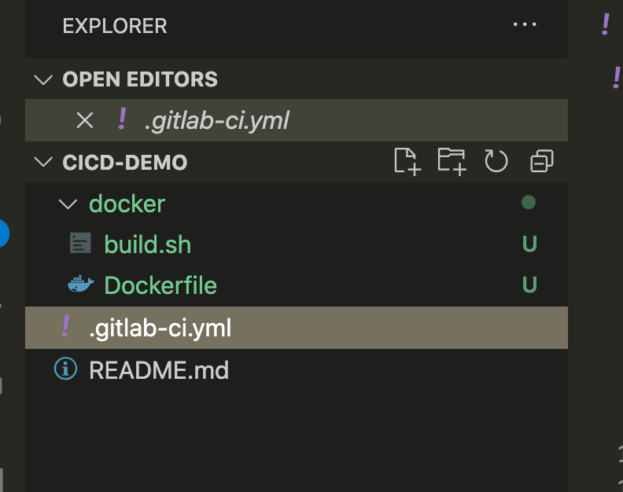

##### 1.  编写 Dockerfile

```shell
# Dockerfile
FROM centos:7
RUN yum install git -y
```


##### 2. 编写构建脚本

```shell
# build.sh
#!/bin/bash

# clfeng/clf-cicd-centos:1.0 为完整的镜像名
# clfeng 为笔者 docker 的账号名（这里要替换成自己的账号名）
# clf-cicd-centos 为笔者自定义的镜像名称
# 1.0 为镜像的标识也可以理解为版本号
docker build -t clfeng/clf-cicd-centos:1.0 .
```


##### 3. 进行镜像的构建

将整个 docker 目录上传到服务器，进行镜像的构建


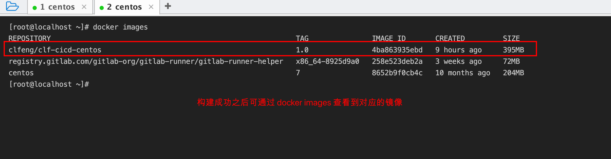


##### 4. 将镜像推送远程仓库

```shell
# 由于使用默认的镜像源总是无法成功推送，这里先设置一下进行源
vi /etc/docker/daemon.json

# 编辑以下内容
{
	"registry-mirrors":["https://registry.docker-cn.com"]
}
```

```shell
# 完成上面的编辑之后重启下 docker
systemctl restart docker
```

```shell
# 登陆 docker 账号，执行下面的命令，然后根据提示输入账号和密码
docker login 

# 将构建的镜像推送到远程仓库
docker push clfeng/clf-cicd-centos:1.0

```

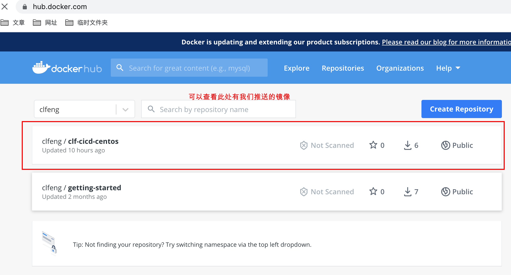


##### 5. 测试镜像是否可用

修改 .gitlab-ci.yml 文件，第一个 job 改成使用我们刚推送的镜像

```yaml
# 其他部分内容省略，这里只修改 build_job
build_job:
  stage: build
  image: clfeng/clf-cicd-centos:1.0 # 这里是关键
  tags: 
    - clf-runner
  script:
    - echo "build project"
    - git --version
```


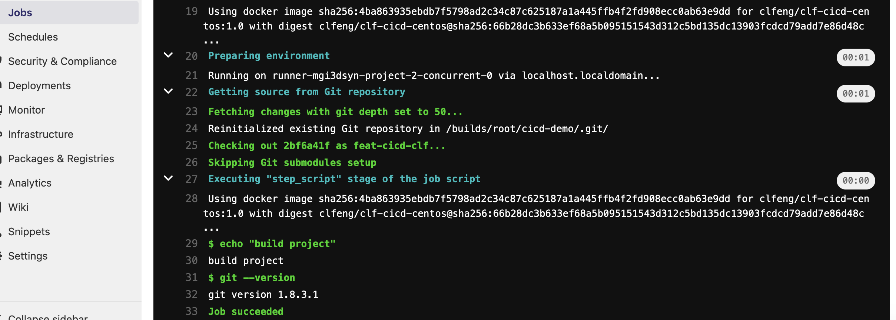


#### 添加卡控相关逻辑

##### 1. 编写卡控脚本

```shell
#!/bin/bash

cd ..;
echo "cur dir: $(pwd)";

git diff HEAD "origin/$CI_MERGE_REQUEST_TARGET_BRANCH_NAME" ./yarn.lock | grep "element-ui";

if [ $? -eq "0" ]; then
  echo "您进行了 elmenent-ui 库的升级，请做好相应的升级验证！";
fi
```


2. ##### 添加分析 job

```yaml
stages:
  - analyse
  - build
  - test
  - deploy

analyse_job:
  stage: analyse
  image: clfeng/clf-cicd-centos:1.0
  tags: 
    - clf-runner
  only:
    - merge_requests
  script:
  	# 这里加下 -x 方便调试
    - cd build && bash -x analyse.sh

build_job:
  stage: build
  image: clfeng/clf-cicd-centos:1.0
  tags: 
    - clf-runner
  script:
    - echo "build project"
    - git --version

test_job:
  stage: test
  image: centos:7
  tags: 
    - clf-runner
  script:
    - echo "test project"

deploy_job:
  stage: deploy
  image: centos:7
  tags: 
    - clf-runner
  script:
    - echo "deploy project"
```


*注：在推送卡控相关的处理之前，可以先添加一下 element-ui@1.0.0 版本到项目中去，然后在升级 element-ui 并推送卡控相关逻辑*


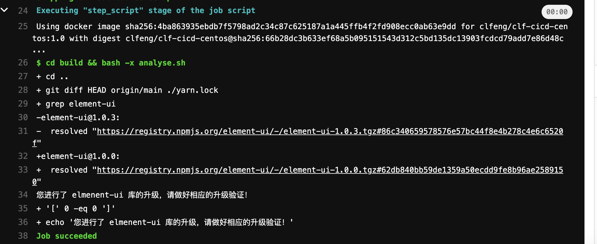


到此我们便可以分析出是否进行了 element-ui 库的升级，但在 cicd 的面板去去看不够明显，能否将提示添加到评论上呢？

当然可以，GitLab 的功能非常强大，针对上面提到的需求我们可以通过调用 GitLab api 进行实现。


##### 3. 将提醒添加到评论区

为了能调用 GitLab api 我们需要添加一下访问令牌，用于请求时做权限认证。

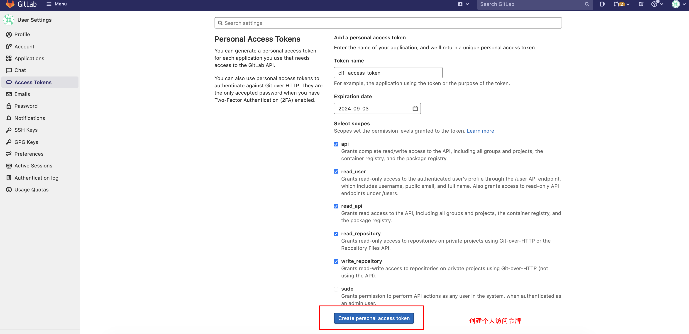

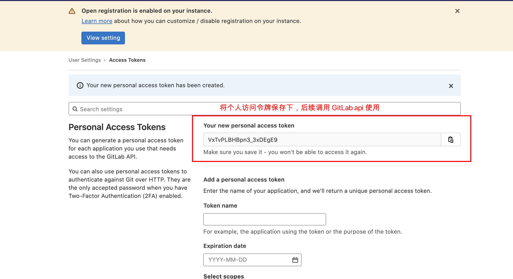


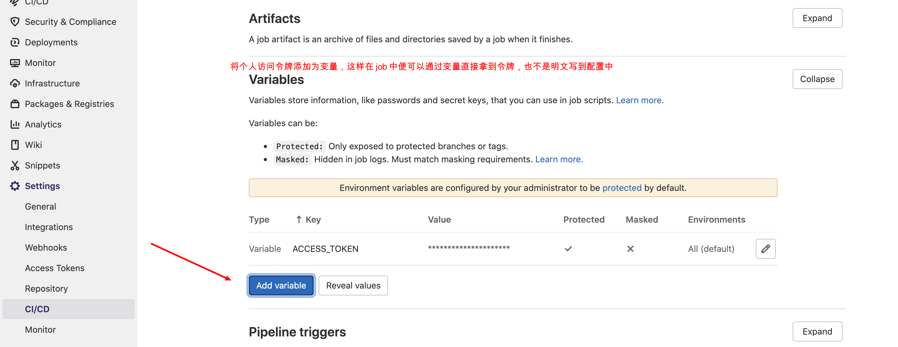


官网上查到的相应的 api

```shell
# 这里面有几个参数
# id: 项目对应的 id
# 合并请求的：id
# 链接 https://docs.gitlab.com/ee/api/notes.html#create-new-merge-request-note
POST /projects/:id/merge_requests/:merge_request_iid/notes
```

这些 id 在那里看呢？

###### 项目 id

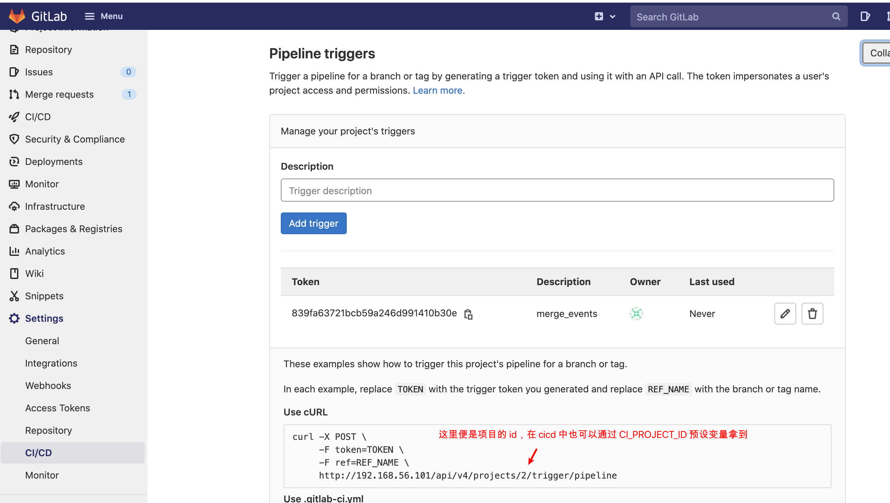


###### 合并请求 id

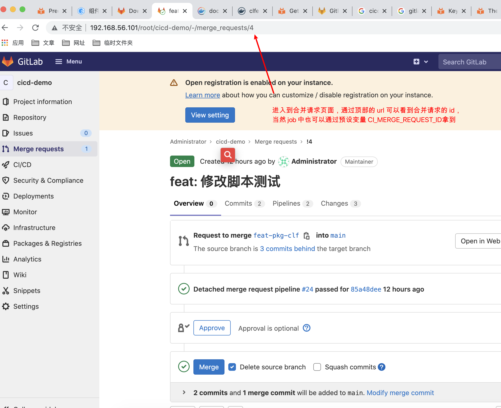


###### 修改卡控脚本

```shell
#!/bin/bash

cd ..;
echo "cur dir: $(pwd)";

git diff HEAD "origin/$CI_MERGE_REQUEST_TARGET_BRANCH_NAME" ./yarn.lock | grep "element-ui";

if [ $? -eq "0" ]; then
  curl -X POST \
    -H "PRIVATE-TOKEN: $ACCESS_TOKEN" \
    -d "body=您进行了 elmenent-ui 库的升级，请做好相应的升级验证！" \
    "http://192.168.56.101/api/v4/projects/$CI_PROJECT_ID/merge_requests/$CI_MERGE_REQUEST_ID/notes"
fi
```


###### 执行结果

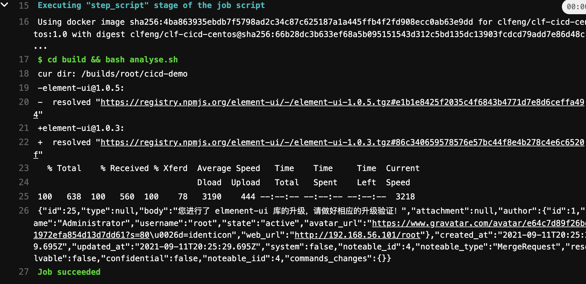

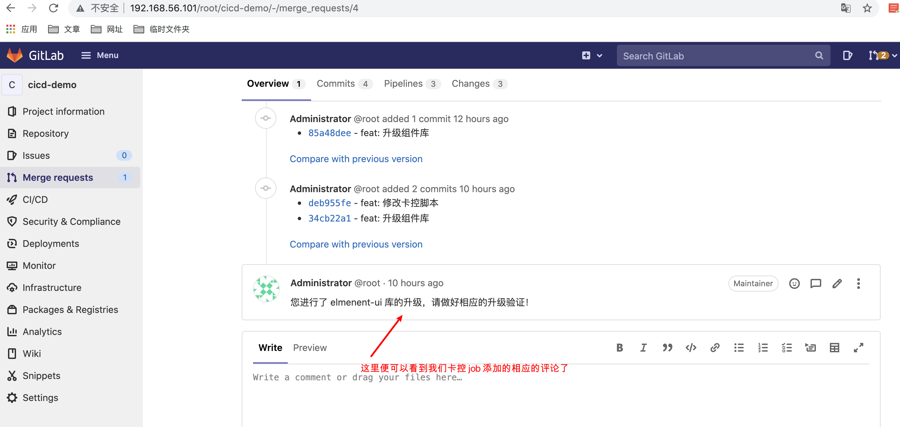


到此为止我们实现我们前面提到的两个需求啦！但通过前面的学习我们也知道做质量卡控需要依赖到 GitLab 的预设变量 `CI_MERGE_REQUEST_TARGET_BRANCH_NAME` ，但如果 GitLab 的版本过低，可能拿到不到该变量，那么我们该怎么处理这个问题呢？


#### 兼容低版本

由于笔者公司内部的 GitLab 版本比较低，便遇到了无法通过 `CI_MERGE_REQUEST_TARGET_BRANCH_NAME`  变量去拿到目标分支的问题。

为了解决这些问题，我们在 node 服务接收到请求时，发一个请求去触发流水线，并携带相应的变量过去。

##### 修改 node 服务

```js
const Koa = require('koa');
const route = require('koa-route');
const bodyParser = require('koa-bodyparser');
const axios = require('axios').default;

const app = new Koa();
const port = 3000;

app.use(bodyParser());

app.use(route.post('/merge_events', async (ctx) => {

  const body = ctx.request.body;

  // 合并请求的 url 
  const mergeReqUrl = body.object_attributes.url;

  // 指派人的相关信息，例如这里有 id、username、email
  const assignee = body.assignees[0];

  // 有了这些信息之后我们便可以找到合并请求的指派审核的人员了；
  dim(assignee.id, `有个合并请求需要您进行审核：${mergeReqUrl}`);

  // 手动触发流水线的相关逻辑
  triggerPipeline(ctx);
  ctx.body = 'trigger success';
}));

// 该函数封装着调用聊天工具 api 通知对应 id 人员的能力
// 具体实现就得看内部的聊天工具了
function dim (userId, message) {
  console.log(`[${userId}]: ${message}`)
}

// 手动触发流水线的相关逻辑
function triggerPipeline(ctx) {
  const token = ctx.headers['x-gitlab-token']; // 前面添加 webhook 时添加的 Secret token
  const {
    project: {
      id // 项目id
    },
    object_attributes: {
      action, // 触发合并请求事件的具体行为
      source_branch, // 源分支
      target_branch, // 目标分支
      iid, // 合并请求的iid
    },
    repository: {
      homepage // 项目地址
    }
  } = ctx.request.body;
  
  const domain = (homepage.match(/^(http:\/\/[^/]+)\/*/))[1];

  if (['open', 'reopen', 'update'].includes(action)) {
    const variables = {
      CLF_MERGE_REUEST: 'true', // 用该标量来标识这是我们在合并请求时通过 api 触发的合并请求流水线
      CLF_MERGE_REQUEST_TARGET_BRANCH_NAME: target_branch,
      CLF_MERGE_REQUEST_ID: iid
    }
  
    const varStr = Object.entries(variables).map(([key, value]) => {
      return `variables[${key}]=${value}`;
    }).join('&');
    
    // 通过 Pipeline triggers 章节查看到的相关api的格式
    // http://192.168.56.101/api/v4/projects/2/ref/REF_NAME/trigger/pipeline?token=TOKEN&variables[RUN_NIGHTLY_BUILD]=true
    const triggerPipelineUrl = `${domain}/api/v4/projects/${id}/ref/${source_branch}/trigger/pipeline?token=${token}&${varStr}`;
  
    // 调用 api 触发流水线
    axios({
      url: triggerPipelineUrl,
      method: 'post',
    }).then(response => {
      console.log(response);
      console.log('created pipeline success');
    }).catch((error) => {
      console.log(error);
      console.log('created pipeline fail');
    });
  }

}

app.use(route.get('/', ctx => {
  ctx.body = 'Hello World';
}));

app.listen(port);
console.log(`Example app listening at http://localhost:${port}`);
```

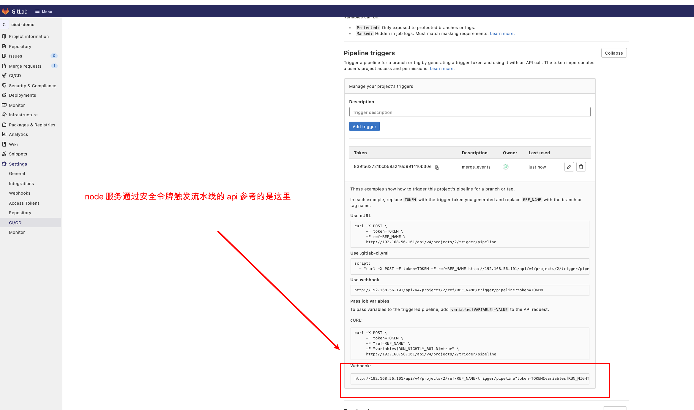


##### 修改 .gitlab-ci.yml

```yaml
stages:
  - mytest
  - analyse

mytest_job:
  stage: mytest
  image: clfeng/clf-cicd-centos:1.0
  tags: 
    - clf-runner
  only: # 这里设置 $CLF_MERGE_REUEST 值为 true 的时候才触发 job，即我们的 node 服务触发的 pipeline 才执行
    variables:
      - $CLF_MERGE_REUEST == "true"
  script: # 这里用于查看是否能取到我们想要的job
    - echo "$CLF_MERGE_REUEST"
    - echo "$CLF_MERGE_REQUEST_TARGET_BRANCH_NAME"
    - echo "$CLF_MERGE_REQUEST_ID"

# 前面加了 . 用于临时注释掉该 job
.analyse_job:
  stage: analyse
  image: clfeng/clf-cicd-centos:1.0
  tags: 
    - clf-runner
  only:
    variables:
      - $CLF_MERGE_REUEST == "true"
  script:
    # - cd build && bash analyse.sh
    - echo "analyse_job"
```


##### 执行结果

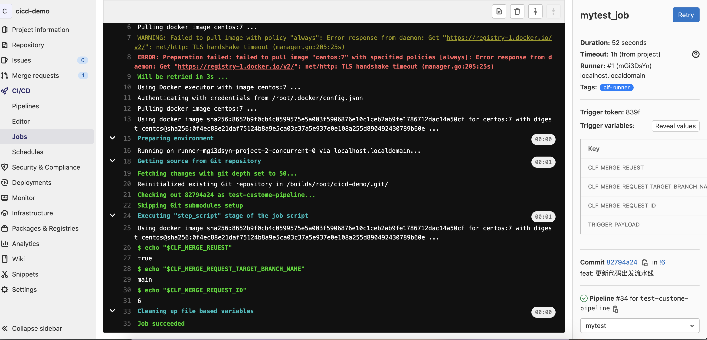


可以看到通过这种方式我们便可以访问拿到目标分支了，当然我们也可以根据自己的需要携带更多的相应值到 pipeline 中。


## 结语

这一章节，我们通过 webhook 的方式实现了有合并请求时去通知对应审核人及时进行代码审核的功能。同时也通过调用 GitLab api 的方式在开发者升级组件库时将相应的提示添加到评论区中去。 结合前面的三篇文章，我们从最基础的环境搭建、基础概念到较为高级的 webhook、GitLab api 调用等内容都进行了一定的涉及。 CI/CD 系列的文章到此也就基本完结了，后续若是有值得分享的实战会再分享，但可能较长一段时间都不会更新啦。希望以上的系列文章能对您有所帮助。

