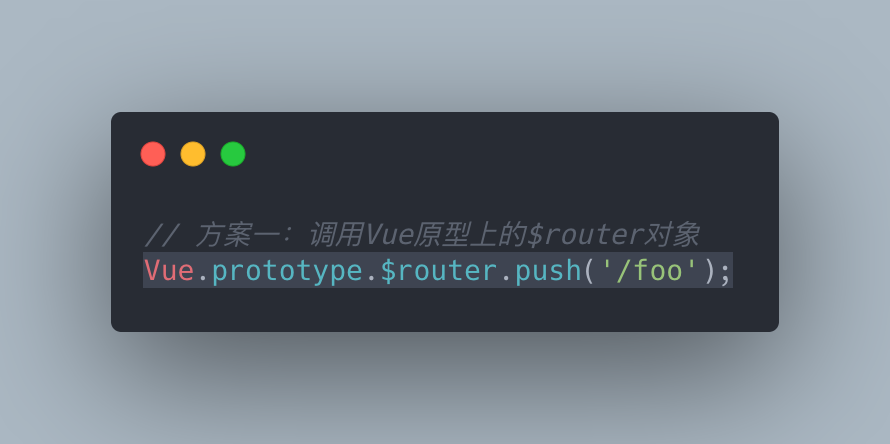
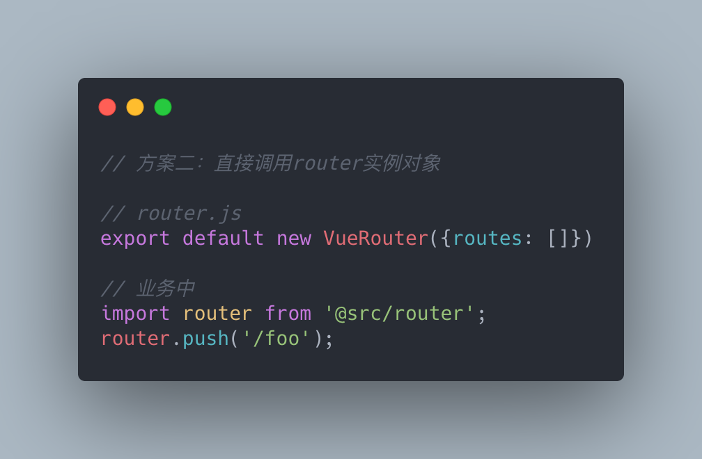

## 前言

Vue3去年发布，在[值得注意的新特性](https://v3.cn.vuejs.org/guide/migration/introduction.html#%E5%80%BC%E5%BE%97%E6%B3%A8%E6%84%8F%E7%9A%84%E6%96%B0%E7%89%B9%E6%80%A7)中，[组合式 API](https://v3.cn.vuejs.org/guide/composition-api-introduction.html#%E4%BB%80%E4%B9%88%E6%98%AF%E7%BB%84%E5%90%88%E5%BC%8F-api)应该是最值得关注的特性之一。

原先Vue将相同逻辑功能提取为[单文件组件（SFC）](https://cn.vuejs.org/v2/guide/single-file-components.html)实现组件复用和维护，如果是SFC之间存在逻辑可复用的部分，通过[混入（mixin）](https://cn.vuejs.org/v2/guide/mixins.html)实现公共功能逻辑复用。在简单业务下看不出什么问题，业务一旦复杂，问题就暴露出来：

- 使用（`data`、 `computed`、`methods`、`watch`）组件选项来组织逻辑代码，统一块逻辑会被拆分到各个option导致逻辑不聚焦，接手别人代码或者review时感觉极为明显。
- `mixin`方式组件内存在命名冲突风险且无提示（因为所有的option都会通过mergeOptions合并到一个组件中，methods或hooks的合并策略可以查看Vue2源码`src/core/util/options.js`），当有两个以上包含同名methods的mixin时还需要考虑mixin的先后顺序
- 通过`mixin`本身是隐式依赖，导致数据来源不清晰，重构无从下手。

基于以上，Vue3提出组合式 API（`composition-api`）解决上述问题。由于种种客观因素必须使用Vue2也可以使用`@vue/composition-api`这个插件提前尝鲜，以下为个人在Vue2中`@vue/composition-api`中的实践总结，存在纰漏欢迎批评指正。

## 实践核心

- `composition-api`核心的api之一：`ref`返回的是一个响应式对象，其中只有一个属性`.value`，由于是响应式数据，当`value`变化时能够追踪到并触发`watcher`更新。

- 另一个核心api：`reactive`，其本质上是`Vue.observable`

- `composition-api`主要围绕`setup`这个新的组件选项，将各个独立的状态变化逻辑抽离成hooks，各个hooks负责各个子状态管理，返回响应式数据，在`setup`中推荐采用函数式编程的思想，去组织响应式数据成直观的代码逻辑（负责组件整体逻辑）。

- `@vue/composition-api`中的`setup`钩子是在`beforeCreate`之后和`created`之前触发，所以只会执行一次，靠hooks返回的状态变化来更新`watcher`。

  > `@vue/composition-api`源码中是在`beforeCreate`钩子去`initSetup`，没有再靠前的钩子了，导致和Vue3的`setup`有些差异，Vue3的`setup`执行时机是在`beforeCreate`之前，不过业务很少会涉及到这个钩子影响不大

- `setup`钩子中是没有this指向Vue实例的，因为它不会找到组件实例。`setup` 的调用发生在 `data` property、`computed` property 或 `methods` 被解析之前，所以它们无法在 `setup` 中被获取。

>  其余关于`composition-api`的其他API说明不多赘述，[官方文档](https://v3.cn.vuejs.org/api/basic-reactivity.html)非常清晰

## 实践场景

#### 场景1：根据参数不同获取异步数据展示

约定组合函数hooks以`use*`开头，且函数返回响应式数据和对数据的处理函数。data就可以由钩子函数或者请求参数变化而触发自身更新，而在`setup`中通过返回的响应式data数组做下一步操作（编码上不需要考虑时序前后问题，因为响应式数据一旦变化我们完全可以知道）。

数据状态控制交由hooks去处理，整体更符合JavaScript 的直觉。这样在业务较为复杂的场景中，setup也能保证清晰的逻辑。

#### 场景2：表单组件的v-model场景

受控组件，由外部控制数据

#### 场景3：组件需要跨层级往后代传递状态或者函数 provide/inject

父组件提供数据或者函数，子组件接受这些数据和函数。建议注入的响应式数据使用readonly，以免被子组件修改。

#### 场景4：router路由使用

由于在`composition-api`的`setup`中不存在this指向当前Vue组件，而且采用`@composition-api`也应该尽量减少this使用，所以没办法像Vue2之前通过`this.$router`去获取路由操作。

1. 由`Vue2`源码中`Vue.prototype._init`可知，Vue实例化时入的router、render等配置，通过mergeOption合并到根实例的`$options`属性上。由`Vue-router`源码中`/src/install.js`中可知，通过Vue.use安装之后会取根实例的router挂载在Vue原型$router上，所以Vue原型上的$router和router路由实例是同一个对象引用。方案一和方案二：

   方案一：

   

   方案二：

   

2. setup第二参数中的root指向当前组件实例（即Vue2中methods或者hooks中的this指向），等同于getCurrentInstance()返回值，**但不建议使用**。

   方案三：

   

3. 类似其他挂载在组件实例上的对象也是差不多的处理方式，如：axios、vuex等

#### 场景5：ref和reactive使用场景区别

思考在不经过composition-api的情况下，如何监听到数据（基本类型和引用类型）的变化？

如果是引用类型，可以借助`reactive`，`reactive`**只处理对象**，返回对象是经过**深层响应式转换**的副本，即类似以往Vue组件对data函数返回值的处理。

如果是基本类型，composition-api给出的解决方案是将数据封装一层对象，数据作为对象的value属性，调用`reacitve`进行处理返回，这样value重新赋值即可捕获到，这就是ref()。同时为了保证不同数据类型的行为统一（即调用ref返回的对象始终包含.value属性），对于对象也是封装到value属性后整个做响应式转化，因而ref处理对象时会比reactive多一层性能消耗。

那么，什么情况下使用ref？什么时候是reacive？

使用ref场景：

1. 需要响应式转换的数据是基本类型
2. 需要重新赋值的对象
   - 对reactive返回的对象引用重新赋值，引用地址改变会导致丢失响应式
   - 如果是该对象是只有存在重新赋值而没有修改属性的情况，推荐使用`shallowRef`，相对于`ref`性能损耗较小

使用reactive场景：

1. 响应式对象不需要重新赋值，只需要调整对象的属性

#### 场景6：可能出现覆盖的场景

setup函数返回的对象属性会合并到组件实例上，且setup执行时机比组件data函数执行要早，所以在data函数返回对象中，如果和setup返回对象出现同名属性，会导致setup返回的属性被覆盖。

#### 场景7：set/del

由于Vue还是停留在Vue2版本，所以受制于 [Vue 2.x 响应式系统的限制](https://vuejs.org/v2/guide/reactivity.html#For-Objects)，不能为响应式对象新增属性。`@composition-api`提供了`set/del`过度方案。

## 总结

composition-api重点通过响应式数据来组织逻辑，将状态管理细化到各个组织函数，也尽量将函数写于setup之外，避免setup函数中过于庞大。

另外，Vue社区有基于Composition-api实现的一套工具类的hooks函数：**VueUse**，有兴趣的小伙伴可以耍耍，阅读其中源码也能对hooks理解更深一些。（由于Vue2和Vue3存在着差异，所以在VueUse内部作者基于Vue2和Vue3统一成了通用库`Vue-demi`）

以上均为个人在vue2 composition-api的部分实践，可能存在纰漏，望批评指正。

## 参考

- [Vue3 值得注意的新特性](https://v3.cn.vuejs.org/guide/migration/introduction.html#%E5%80%BC%E5%BE%97%E6%B3%A8%E6%84%8F%E7%9A%84%E6%96%B0%E7%89%B9%E6%80%A7)
- [组合式 API](https://v3.cn.vuejs.org/guide/composition-api-introduction.html#%E4%BB%80%E4%B9%88%E6%98%AF%E7%BB%84%E5%90%88%E5%BC%8F-api)
- [@vue/composition-api](https://github.com/vuejs/composition-api)
- [响应性API](https://v3.cn.vuejs.org/api/basic-reactivity.html)
- [官方rfc讨论](https://github.com/vuejs/rfcs/blob/function-apis/active-rfcs/0000-function-api.md#comparison-with-react-hooks)
- [生命周期钩子](https://v3.cn.vuejs.org/guide/composition-api-lifecycle-hooks.html)
- [模板引用](https://v3.cn.vuejs.org/guide/composition-api-template-refs.html#jsx-%E4%B8%AD%E7%9A%84%E7%94%A8%E6%B3%95)
- [stackoverflow关于使用ref和reactive场景讨论](https://stackoverflow.com/questions/61452458/ref-vs-reactive-in-vue-3)
- [script setup](https://v3.cn.vuejs.org/api/sfc-script-setup.html#%E5%9F%BA%E6%9C%AC%E8%AF%AD%E6%B3%95)
- [VueUse](https://vueuse.org/guide/index.html)
- [vue-demi](https://github.com/vueuse/vue-demi)
- [@vue/composition-api其余限制](https://github.com/vuejs/composition-api/blob/main/README.zh-CN.md)

