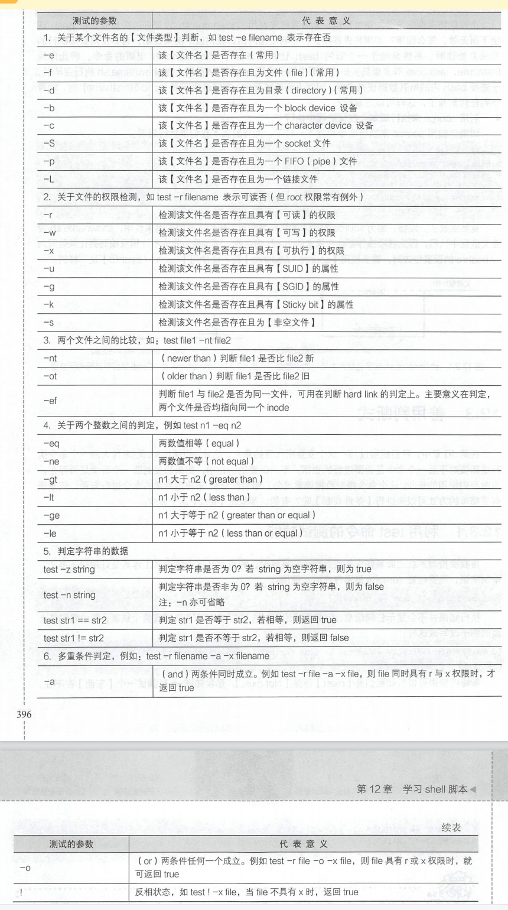
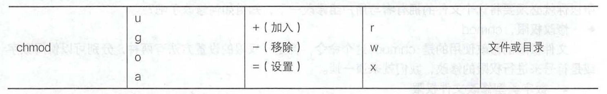

# 前端工程师的 Shell 修行  

## shell 与 shell 脚本

**Shell**（也称为**壳层**）在[计算机科学](https://zh.wikipedia.org/wiki/電腦科學)中指“为用户提供用户界面”的软件，通常指的是[命令行界面](https://zh.wikipedia.org/wiki/命令行界面)的[解析器](https://zh.wikipedia.org/wiki/解析器)。一般来说，这个词是指[操作系统](https://zh.wikipedia.org/wiki/作業系統)中提供访问[内核](https://zh.wikipedia.org/wiki/内核)所提供之服务的程序。Shell 也用于泛指所有为用户提供操作界面的程序，也就是程序和用户[交互](https://zh.wikipedia.org/w/index.php?title=交互&action=edit&redlink=1)的层面。因此与之相对的是[内核](https://zh.wikipedia.org/wiki/内核)（英语：**Kernel**），内核不提供和用户的交互功能。

**类型：**
 - 命令行
 - 图形界面

*注：壳程序的功能只是提供用户操作系统的一个界面，因此这个壳程序需要可以调用其他软件才好。 --from 《鸟哥的 Linux 私房菜》*


**什么是shell 脚本：**shell 脚本是利用 shell 的功能所写的一个【程序（program）】, 这个程序使用纯文本文件，将一些 shell 的语法与命令（含外部命令）写在里面，搭配正则表达式、管道命令与数据流重定向等功能，以达到我们所需要的处理目的。


**为什么学习 shell 脚本：**

- 通用：Linux 各种发行版的 shell 都相同
- 远程管理：命令行模式就是比较快

## shell 脚本

### 变量

#### 类别

- 普通变量
  - 全局变量
  - 局部变量
- 环境变量


#### 定义变量

- 变量与变量内容以一个等号【=】来连接（*等号的两边不能有空格*）

  ```shell
  myname=clf
  ```

- 双引号内的特殊字符如 $ 等，可以保有原本的特性

  ```shell
  var="lang is $LANG";
  
  echo $var; # lang is zh_CN.UTF-8
  ```

- 单引号内的特殊字符则仅为一般字符（纯文本）

  ```shell
  var='lang is $LANG';
  
  echo $var; # lang is $LANG
  ```


- 基于其他命令提供的信息设置变量的内容

  ```shell
  version=$(uname -r); # 更推荐该种写法
  # version=`uname -r`
  echo $version;
  ```

- 通常大写字符为系统默认变量，自行设置的变量可以使用小写字符（推荐习惯）

- 取消变量的方法为使用 unset

  ```shell
  unset myname
  ```

- 定义局部变量

  ```shell
  #!/bin/bash
  # 定义函数
  function func(){
      test=99;
      echo "inner test: $test";
      # 输出 inner test: 99
  }
  
  # 调用函数
  func;
  
  echo "outter test: $test";
  # 输出 outter test:  99
  
  ```

  ```shell
  #!/bin/bash
  # 定义函数
  function func(){
      local test=99; # 在函数内通过关键字 local 定义的局部变量只能在函数内访问
      echo "inner test: $test";
      # 输出 inner test: 99
  }
  
  func;
  
  echo "outter test: $test";
  # 输出 outter test: 
  ```

  

- 定义环境变量

	```shell
  export named="clfeng";
  declare -x named="clfeng";  
  ```

#### 声明变量的类型

declare,typeset 关键字。这两个关键字的功能是一样，就是声明变量的类型

```shell
sum=100+300+50;
echo $sum;
# 输出 "100+300+50"

declare -i sum=100+300+50;
echo $sum;
# 输出 450

# 将sum变成环境变量
declare -xi sum=100+300+50;
export | grep sum;

# 进行取消操作
declare +x sum;

# 让 sum 变成只读，不可修改
declare -r sum=10;
sum=20; # 报错

```


#### 查看环境变量

```shell
env
# 或者
export

# 查看所有变量（含环境变量与自定义变量）
set
```


#### 读取来自键盘输入的变量
read 关键字

```shell
read test_var;
# 接着输入 this is a test var

echo $test_var;
# 输出 this is a test var

read -p "Please keyin your name:" -t named;

#tip
# Please keyin your name:clfeng

# 如果用户没有输入则使用default作为默认值
echo ${named:-default};
#clfeng

```


#### 变量内容的删除、取代与替换

##### 删除

#：从前往后，符合替换文字的 【最短的】那一个

##：从前往后，符合替换文字的【最长的】那一个

```shell
# 格式
# ${variable#/replace_reg};
# ${variable##/replace_reg};

echo $PATH;
# /usr/local/sbin:/usr/local/bin:/usr/sbin:/usr/bin:/root/bin

echo ${PATH#/*local/sbin:};
# /usr/local/bin:/usr/sbin:/usr/bin:/root/bin

echo ${PATH##/*:};
# /root/bin
```


#：从后往前，符合替换文字的 【最短的】那一个

##：从后往前，符合替换文字的【最长的】那一个

```shell
# 格式
# ${variable%/replace_reg};
# ${variable%%/replace_reg};

echo $PATH;
# /usr/local/sbin:/usr/local/bin:/usr/sbin:/usr/bin:/root/bin


echo ${PATH%:*bin}
# /usr/local/sbin:/usr/local/bin:/usr/sbin:/usr/bin


echo ${PATH%%:*bin}
# /usr/local/sbin
```


##### 替换

```shell
echo $PATH
# /usr/local/sbin:/usr/local/bin:/usr/sbin:/usr/bin:/root/bin

# 将第一个找到的 sbin 替换为 SBIN
echo ${PATH/sbin/SBIN}
# /usr/local/SBIN:/usr/local/bin:/usr/sbin:/usr/bin:/root/bin

# 将所有 sbin 替换为 SBIN
echo ${PATH//sbin/SBIN}
# /usr/local/SBIN:/usr/local/bin:/usr/SBIN:/usr/bin:/root/bin
```


##### 总结

| 变量设置方式               | 说明                                                         |
| -------------------------- | ------------------------------------------------------------ |
| ${变量#关键字}             | 若变量内容从头开始的数据符合【关键词】，则将符合的最短数据删除 |
| ${变量##关键字}            | 若变量内容从头开始的数据符合【关键词】，则将符合的最长数据删除 |
| ${变量%关键字}             | 若变量内容从尾向前的数据符合【关键词】，则将符合的最短数据删除 |
| ${变量%%关键字}            | 若变量内容从尾向前的数据符合【关键词】，则将符合的最长数据删除 |
| ${变量/旧字符串/新字符串}  | 若变量内容符合【旧字符串】则【第一个旧字符串会被新字符串替换】 |
| ${变量/旧字符串//新字符串} | 若变量内容符合【旧字符串】则【全部的旧字符串会被新字符串替换】 |


#### 变量的测试与内容替换

| 变量设置方式     | str 没有设置           | str 为空字符串         | str 已设置为非空字符串 |
| ---------------- | ---------------------- | ---------------------- | ---------------------- |
| var=${str-expr}  | var=expr               | var=                   | var=$str               |
| var=${str:-expr} | var=expr               | var=expr               | var=$str               |
| var=${str+expr}  | var=                   | var=expr               | var=expr               |
| var=${str:+expr} | var=                   | var=                   | var=expr               |
| var=${str=expr}  | str=expr<br />var=expr | str不变<br />var=      | str不变<br />var=$str  |
| var=${str:=expr} | str=expr<br />var=expr | str=expr<br />var=expr | str不变<br />var=$str  |
| var=${str?expr}  | expr 输出至 stderr     | var                    | var=$str               |
| var=${str:?expr} | expr 输出至 stderr     | expr 输出至 stderr     | var=$str               |


```shell
echo ${username}
# 输出：空白行

echo ${username-root}
# 输出：root

username="clfeng"
echo ${username-root}
# 输出：clfeng
```


```shell
username=""
echo ${username-root}
# 输出 空白行

# 注意以下代码 - 前带有 :
echo ${username:-root}
# 输出: root
```

**小结：** 比较实用的可以记住：如果变量为空或者未设置，使用默认内容可采用语法格式 `${var:-default_value}`


#### 变量引用小结

从前面不难的示例中不难发现变量的引用有两种方式 $variable 和 ${variable}；在使用场景上，如果我们只是简单的引用一个变量那么就使用 $variable；如果还有进行一些操作，例如替换变量内容的话便使用 ${variable} 的形式吧。


### 判断式

#### test 命令的测试功能

**参数列表**



**注：-eq -ne -gt -lt -le 等测试参数主要用于数字比较，如果是字符串的比较情况 == 与 !=**


```shell
#!/bin/bash
# filename: file_perm.sh
# 1. 让使用者输入文件名，并且判断使用者是否真的有输入字符？
echo -e "Please input a filename, I will check the filename's type and permission. \n\n";
read -p "Input a filename : " filename;
test -z $filename && echo "Your must input a filename." && exit 0;

# 2. 判断文件是否存在？若不存在则显示信息并结束脚本
test ! -e $filename && echo "The filename '${filename}' DO NOT exist" && exit 0;

# 3. 开始判断文件类型与属性
test -f $filename && filetype="regular file";
test -f $filename && fieltype="directory";
test -r $fiilename && perm="readable";
test -w $filename && perm="$perm writable";
test -x $filename && perm="$perm executable";

# 4. 开始输出信息
echo "The filename: $filename is a $filetype";
echo "And the permissions for you are: $perm";
```


#### 判断符号 []

中括号的使用方法与test几乎一模一样，只是中括号比较常用在条件判断式 if...then..fi 的情况中。

**注意：中括号的的左括号的右边以及右括号的左边需要有空格**

```shell
HOME="/home/clf";

# 注意：中括号的两端需要有空格符来分隔。
[ -z "$HOME" ]; echo $?;

[ "$HOME" == "$MALL" ]; echo $?;
```


### 条件判断

#### if...then

```shell
if [ 条件判断式 ]; then
	当条件判断式成立时，可以进行的命令工作内容
fi

# 一个条件判断，分成功执行与失败执行
if [ 条件判断式 ]; then
	当条件判断式成立时，可执行执行的命令
else
	当条件判断式不成立时，可执行执行的命令
fi

# 多个条件判断
if [ 条件判断式一 ]; then
	当条件判断式一成立时，可执行的命令
elif [ 条件判断式二 ]; then
	当条件判断式二成立时，可执行的命令
else
	当条件判断式一与二均不成立时，可执行的命令
fi
```


```shell
# 多条件判断
# && 代表 AND
# || 代表 or

[ "$yn" == "Y" -o "$yn" == "y" ];

# 上式可替换为
[ "$yn" == "Y" ] || [ "$yn" == "y" ];

```


```shell
#!/bin/bash
# filename: ans_yn2.sh
# description: if...then 示例
read -p "Please input (Y/N):" yn;

if [ "$yn" == "Y" ] || [ "$yn" == "y" ]; then
	echo "OK, continue";
	exit 0;
fi

if [ "$yn" == "N" ] || [ "$yn" == "n" ]; then
	echo "Oh, interrupt!";
	exit 0;
fi

echo "I don't konw what your choice is " && exit;
```


#### case...esac

```shell
case $变量名称 in
"第一个变量内容")
	程序段
	;;
"第二个变量内容")
	程序段
	;;
*)
# 不包含第一个变量内容与第二个变量内容的其他程序执行段
	exit 1;
	;;
esac
```


```shell
#!/bin/bash
# filename: hello-3.sh
case $1 in 
"hello")
	echo "Hello, how are you ?";
	;;
"")
	echo "You MUST input parameters, ex> {$0 someword}";
	;;
*)
	echo "Usage $0 {hello}";
esac
```


### 函数 (function)

```shell
#!/bin/bash
# filename: show123-3.sh
function printit () {
	echo "Your choice is $1";
}

echo "This programe will print your selection !";
case $1 in 
"one")
	printit 1; # 请注意 printit 命令后面还有接参数
	;;
"two")
	printit 2; 
	;;
"three")
	printit 3;
	;;
*)
	echo "Usage $0 {one|two|tree}";
	;;
esac

```


### 循环（loop）

#### while do done、until do done (不定循环)

```shell
while [ condition ] # <== 中括号内的状态就是判断式
do # <== do 是循环的开始
	程序段落;
done # <== done 是循环的结束
```

```shell
# 当 condition 条件成立时，就终止循环，否则就程序进行循环的程序段
util [ condition ]
do
	程序段落;
done
```

```shell
#!/bin/bash
# filename: yes_to_stop.sh

while [ "$yn" != "yes" -a "$yn" != "YES" ]
do
 	read -p "Please input yes/YES to stip this program: " yn;
done

echo "OK! you input the correct answer.";
```

```shell
#!/bin/bash
# filename: yes_to_stop-2.sh

until [ "$yn" == "yes" -o "$yn" == "YES" ]
do
 	read -p "Please input yes/YES to stip this program: " yn;
done

echo "OK! you input the correct answer.";
```


#### for...do...done (固定循环)

```shell
for var in con1 con2 con3 ...
do
	程序段
done
```

```shell
#!/bin/bash
# filename: show_animal.sh
for animal in dog cat elephant
do
	echo "There are ${animal}s...";
done
```


### shell 脚本的默认变量（$0, $1...）

- $#：代表后接的参数【个数】
- $@：代表【"$1" "$2" "$3" "$4"】之意，每个变量是独立的（用双引号扩起来）
- $*：代表【"$1c$2c$3c$4"】，其中 c 为分隔字符，默认为空格
- $0: 脚本文件名
- $n: n > 0, 表示第 n 个变量
- $$: 当前 Shell 进程ID


```shell
#!/bin/bash
# filename: how_paras.sh
echo "The script name is  ==> $0";
echo "Total parameter number is ==> $#";
[ "$#" -lt 2 ] && echo "The number of parameter is less than 2. Stop here" && exit 0;
echo "Your whole parameter is ==> '$@'";
echo "The 1st parameter ==> $1";
echo "The 2nd parameter ==> $2";
```

```shell
sh how_paras.sh theone haha quot
# The script name is  ==> how_paras.sh
# Total parameter number is ==> 3
# Your whole parameter is ==> 'theone haha quot'
# The 1st parameter ==> theone
# The 2nd parameter ==> haha
```


### shift: 造成参数变量号码偏移

```shell
#!/bin/bash
# filename: shift_paras.sh
echo "Total parameter number is ==> $#";
echo "Your whole parameter is ==> '$@'";

# 进行第一次【一个变量的 shift】
shift;
echo "Total parameter number is ==> $#";
echo "Your whole parameter is ==> '$@'";

# 进行第二次【3个变量的 shift】
shift 3;
echo "Total parameter number is ==> $#";
echo "Your whole parameter is ==> '$@'";

```

```shell
bash shift_paras.sh one two tree four five six seven eight nine ten
# Total parameter number is ==> 10
# Your whole parameter is ==> 'one two tree four five six seven eight nine ten'
# Total parameter number is ==> 9
# Your whole parameter is ==> 'two tree four five six seven eight nine ten'
# Total parameter number is ==> 6
# Your whole parameter is ==> 'five six seven eight nine ten'

```


### 脚本的执行方式差异（source、sh script、./script）

- 通过sh script 及 ./script 方式执行脚本时，该脚本都会使用一个新的 bash 环境来执行脚本内的命令
- 通过 source 方式执行脚本，脚本会在父进程中执行

```shell
#!/bin/bash
# filename: showname.sh

read -p "Please input your first name: " firstname;
read -p "Please input your last name: " lastname;
echo -e "\n Your full name is :${firstname} ${lastname}";
```


```shell
# 在命令行中测试 sh 方式执行脚本
echo ${firstname} ${lastname};
# 没有数据输出

sh showname.sh;
# Please input your first name: chen
# Please input your last name: liangfeng
# Your full name is :chen liangfeng

echo ${firstname} ${lastname};
# 没有数据输出
```


```shell
# 在命令行中测试 source 方式执行脚本
echo ${firstname} ${lastname};
# 没有数据输出

source showname.sh;
# Please input your first name: chen
# Please input your last name: liangfeng
# Your full name is :chen liangfeng

echo ${firstname} ${lastname};
# chen liangfeng
```


### shell 脚本的跟踪与调试

```shell
sh [-nvx] scripts.sh

选项与参数：
-n : 不要执行脚本，仅查询语法的问题
-v : 在执行脚本前，先将脚本文件的内容输出到屏幕上
-x : 将使用到的脚本内容显示到屏幕上
```


## 命令

### 命令查看

#### 查看命令如何使用

```shell
man command
command --help
```


#### 查看命令是否是 bash 的内置命令

```shell
type command
```


### 查找命令

| 命令    | 适用场景                                                     | 优缺点           | 说明                                                         |
| ------- | ------------------------------------------------------------ | ---------------- | ------------------------------------------------------------ |
| find    | 1. 查找特定路径下的文件（配合glob mod）<br />2. 查找具有某些特征的文件，查找特定路径下（大小，修改时间等等） | 功能强大，速度慢 | 直接查找硬盘                                                 |
| locate  | 命令形式`locate [-ir] keyword`<br />在忘记某个文件的完整文件名时，可以通过该命令去查找，得到完整的文件名 | 功能单一，速度快 | 利用数据库来查找文件名                                       |
| whereis | 主要针对 /bin/sbin 下面的执行文件、/usr/share/man 下面的 man page 文件，以及几个比较特定的目录来处理；具体可通过 `whereis -l` 命令去查看 | 速度快           | 只找系统中某些特定目录下面的文件                             |
| which   | 查找【执行文件】的绝对路径                                   | 速度快           | 根据【PATH】这个环境变量所规范的路径，去查找执行文件的文件名。 |

#### locate/updatedb

locate 寻找的数据是由已建立的数据库 /var/lib.mlocate/ 里面的数据所查找到的。

**限制：**

数据库的建立默认是每天执行一次，所以新建立起来的文件，如果在数据库更新之前去查找会找不到。可通过 updatedb 命令手动更新。


### 通配符与特殊符号

| 符号 | 意义                                                         |
| ---- | ------------------------------------------------------------ |
| *    | 代表【0个到无穷多个】任意个字符                              |
| ?    | 代表【一定有一个】任意字符                                   |
| []   | 同样代表【一定有一个在括号内】的字符（非任意字符）。例如 [abcd] 代表【一定有一个字符，可能是a、b、c、d这四个任何一个】 |
| [-]  | 若有减号在中括号内时，代表【在编码顺序内的所有字符】。例如【0-9】代表0-9之间的所有数字，因为数字的语系编码是连续的。 |
| [^]  | 若中括号内的第一个字符为指数符号（^），那代表【反向选择】，例如 `[^abc]` 代表 一个定有一个符号，只要是非 a、b、c的其他字符就接受的意思 |


### 数据流重定向

- 标准输入（stdin）：代码为 0， 使用 < 或 <<
- 标准输出（stdout）：代码为 1，使用 > 或 >>
- 标准错误输出（stderr）：代码为 2，使用 2> 或 2>>


- `1>`: 以覆盖的方法将［正确的数据］输出到指定的文件或设备上；

- `1>>`：以累加的方法将［正确的数据］输出到指定的文件或设备上；

- `2>`：以覆盖的方法将［错误的数据］输出到指定的文件或设备上；

- `2>>`：以累加的方法将［错误的数据］输出到指定的文件或设备上；


```shell
# 将 stdout stderr 分别存到不同的文件中．
find /home -name .bashrc > list_right 2> list_error;

# 将错误的数据丢弃，屏幕上显示正确的数据．
find /home -name .bashrc 2> /dev/null;

# 将命令的数据全部写入名为 list 的文件中
find /home -name .bashrc > list 2>&1;
find /home -name .bashrc &> list;
```


**standard input: < 与 <<**

```shell
cat > catfile 
testing 
cat file test 
# <== 这里按下［ ctrl]+d 来退出。

cat catfile 
# testing 
# cat file test
```


```shell
cat > catfile << "eof"
> This is a test 
> OK now stop
> eof

cat catfile 
# This is a test 
# OK now stop
```


### xargs

产生某个命令的参数

```shell
cut -d ':' -f 1 /etc/passwd | head -n 3
# root
# bin
# daemon

id root
# uid=0(root) gid=0(root) 组=0(root)

# 注：id 不是管道命令
cut -d ':' -f 1 /etc/passwd | head -n 3 | xargs -n 1 id;
# uid=0(root) gid=0(root) 组=0(root)
# uid=1(bin) gid=1(bin) 组=1(bin)
# uid=2(daemon) gid=2(daemon) 组=2(daemon)
```


### 减号【-】的用途

在管道命令当中，常常会使用到前一个命令的 stdout 作为这次的 stdin，某些命令需要用到文件名（例如 tar）来进行处理时，该 stdin 与 stdout 可以利用减号 “-” 来代替，举例来说

```shell
mkdir /tmp/homeback;
tar -cvf - /home | tar -xvf - -C /tmp/homeback;
```

上面这个例子是说：【我将 /home 里面的文件给它打包，但打包的数据不是记录到文件，而是传送到 stdout，经过管道后，将 tar -cvf - /home 传送给后面的 tar -xvf -】。后面的这个 - 则是使用前一个命令的 stdout，因此，我们就不需要使用文件名了。


### 命令执行的判断依据

| 命令执行情况   | 说明                                                         |
| -------------- | ------------------------------------------------------------ |
| cmd1 && cmd2   | 1. 若 cmd1 执行完毕且正确执行 ( $? 等于 0 )，则开始执行 cmd2 <br />2. 若 cmd1 执行完毕且为错误  ( $? 不等于 0 )， 则 cmd2 不执行 |
| cmd1 \|\| cmd2 | 1. 若 cmd1 执行完毕且正确执行 ( $? 等于 0)， 则 cmd2 不执行<br />2. 若 cmd1 执行完毕且为错误  ( $? 不等于 0)，则开始执行 cmd2 |


### 选取命令：cut、grep

#### cut

在文件的每一行中提取片断；

cut 主要的用途在于将同一行里面的数据进行分解，最常使用在分析一些数据或文字数据的时候。

```shell
echo $PATH
# /usr/local/sbin:/usr/local/bin:/usr/sbin:/usr/bin:/root/bin

echo $PATH | cut -d ':' -f 2
# /usr/local/bin

echo $PATH | cut -d ':' -f 2,3
# /usr/local/bin:/usr/sbin

```


```shell
export
# declare -x HISTCONTROL="ignoredups"
# declare -x HISTSIZE="1000"
# declare -x HOME="/root"

# export | cut -c 12-20 则表示取第12-20个字符片段
export | cut -c 12-
# HISTCONTROL="ignoredups"
# HISTSIZE="1000"
# HOME="/root"

```


#### grep

grep是分析一行信息，若当中有我们所需要的信息，就将该行拿出来。

用法

```shell
# 形式一
grep [option] [pattern] [file1, file2, ...]

# 形式二
command | grep [option] [pattern] 
```

#### egrep

egrep 相当于  `grep -E` 的简写


### 排序命令：sort、wc、uniq

#### sort

```shell
cat /etc/passwd | sort;

# /etc/passwd 内容以 : 来分隔的，我想以第三栏来排序
cat /etc/passwd | sort -t ':' -k 3;
```


#### uniq

删除排序文件中的重复行

```shell
# 使用 last 将账号列出，仅取出账号栏，进行排序后仅取出一位
last | cut -d ' ' -f 1 | sort | uniq;

# 承上 ，如果我还想要知道每个人的登陆次数
last | cut -d ' ' -f 1 | sort | uniq -c;

```


#### wc

输出文件中的行数、单词数、字节数

```shell
# /etc/man_db.conf 里面到底有多少相关字、行、字符数
cat /etc/man_db.conf | wc
# 行			 字符		 字符数
# 131     723    5171

```


### 双向重定向：tee

从标准输入写往文件和标准输出

```shell
# 将 last 的输出存一份到 last.list 文件中；
last | tee last.list | cut -d " " -f 1;
```


### 字符转换命令：tr、join、past、expand、split

#### tr

tr 可以用来删除一段信息当中的文字，或是进行文字信息的替换。

```shell
# 将last 输出的信息中，所有的小写变成大写字符．
last | tr '[a-z]' '[A-Z]';

# 将／etc/passwd 输出的信息中，将冒号:删除
cat /etc/passwd | tr -d ':'
```


#### join

在公共字段上连接两个文件的行 

```shell
head -n 3 /etc/passwd /etc/shadow
# ==> /etc/passwd <==
# root:x:0:0:root:/root:/bin/bash
# bin:x:1:1:bin:/bin:/sbin/nologin
# daemon:x:2:2:daemon:/sbin:/sbin/nologin

# ==> /etc/shadow <==
#root:$6$Edc14VxV$r98Vt6fIy8L9lT3t0VY7mQLRtAJd1ikCde3uwhUXLxExcm6Dv1jMVDbADQtMyDfTd18ellNkzIGBs346ZcasO0:18878:0:99999:7:::
# bin:*:18353:0:99999:7:::
# daemon:*:18353:0:99999:7:::

# 由输出的数据可以发现这两个文件的最左边栏位都是相同账号，且以 : 分隔
join -t ':' /etc/passwd /etc/shadow | head -n 3;

# root:x:0:0:root:/root:/bin/bash:$6$Edc14VxV$r98Vt6fIy8L9lT3t0VY7mQLRtAJd1ikCde3uwhUXLxExcm6Dv1jMVDbADQtMyDfTd18ellNkzIGBs346ZcasO0:18878:0:99999:7:::
# bin:x:1:1:bin:/bin:/sbin/nologin:*:18353:0:99999:7:::
# daemon:x:2:2:daemon:/sbin:/sbin/nologin:*:18353:0:99999:7:::

```

#### past

合并文件各行

```shell
paste /etc/passwd /etc/shadow
```

#### expand

将 [tab] 按键转成空格键

```shell
grep '^MANPATH' /etc/man_db.conf | head -n 3
# MANPATH_MAP     /bin                    /usr/share/man
# MANPATH_MAP     /usr/bin                /usr/share/man
# MANPATH_MAP     /sbin                   /usr/share/man

grep '^MANPATH' /etc/man_db.conf | head -n 3 | cat -A
# MANPATH_MAP^I/bin^I^I^I/usr/share/man$
# MANPATH_MAP^I/usr/bin^I^I/usr/share/man$
# MANPATH_MAP^I/sbin^I^I^I/usr/share/man$

grep '^MANPATH' /etc/man_db.conf | head -n 3 | expand -t 6 | cat -A
# MANPATH_MAP /bin              /usr/share/man$
# MANPATH_MAP /usr/bin          /usr/share/man$
# MANPATH_MAP /sbin             /usr/share/man$
```


#### split

将文件拆分成多个文件

```shell
cp /etc/passwd passwd;
split -l 5 passwd passwd_split_
ls | grep 'passwd*';
# passwd
# passwd_split_aa
# passwd_split_ab
# passwd_split_ac
# passwd_split_ad
# passwd_split_ae
# passwd_split_af
# passwd_split_ag
# passwd_split_ah
# passwd_split_ai

# 将上面的文件合成一个文件
cat passwd_split* >> passwd_bak;
```


### 流编辑器（Sed）

Sed(Stream Editor) 流编辑器。对标准输出或文件逐行进行处理。

#### 语法格式

```shell
# 形式一：
stdout | sed [option] "pattern command";
sed [option] "pattern command" file
```


#### pattern 用法表

```shell
# 匹配第10行
sed -n '10 p' /etc/passwd;

# 匹配 1-10行
sed -n '1,10 p' /etc/passwd;

# 第 10 行，开始16行结束, 不包括16行
sed -n '10,5+ p' /etc/passwd;

# root 开头的行
 sed -n '/^root/ p' /etc/passwd;
 
# 以 root 开头的行到以 daemon 开头的行
sed -n '/^root/,/^daemon/ p' /etc/passwd;

# 从第 1 行到daemon开头的行
sed -n '1,/^daemon/ p' /etc/passwd;

# 从daemon开头的行，到第 10 行
sed -n '/^daemon/,10 p' /etc/passwd;

```


#### 编辑命令

| 类别 | 编辑命令     | 含义                                                    |
| ---- | ------------ | ------------------------------------------------------- |
| 查询 | p            | 打印                                                    |
| 增加 | a            | 行后追加                                                |
| 增加 | i            | 行前追加                                                |
| 增加 | r            | 将后面指定文件的内容追加到匹配到的行后面                |
| 增加 | w            | 匹配行写入外部文件                                      |
| 删除 | d            | 删除                                                    |
| 修改 | s/old/new    | 将行内第一个 old 替换为 new                             |
| 修改 | s/old/new/g  | 将行内所有的 old 替换为 new                             |
| 修改 | s/old/new/2g | 同一行内，只替换从第2个开始到剩下所有的符合条件的字符串 |
| 修改 | s/old/new/2  | 同一行内，只替换第 2 个                                 |
| 修改 | s/old/new/ig | 将行内所有的 old 替换为 new，忽略大小写                 |


#### 反向引用

```shell
# str.txt 文件的内容如下：
hadApp is a bigdata frame
Spark hadBBp Kafaka
Skill on hadCCp
Paper Of hadDDp
Google hadEEp
```


```shell
# 将文件中的类型为 hadAAp、hadBBp 等替换为hadAAps、hadBBps
sed -i 's/had..p/&s/g' str.txt;

# 同上，语法形式不同而已
sed -i 's/\(had..p\)/\1s/g' str.txt;

# 将 hadAAp、hadBBp 替换为 hadoop
sed -i 's/\(had\)..p/&1oop/g' str.txt
```


### awk

awk 是一个文本处理工具，通常用于处理数据并生成结果报告。


#### 语法格式

```shell
# 形式一：输入为文件
awk 'BEGIN{} pattern {commands} END{}' file_name;

# 形式二：标准输出
standard output | awk 'BEGIN{} pattern {commands} END{}';
```


#### 参数解释

| 语法格式   | 解释                     |
| ---------- | ------------------------ |
| BEGIN{}    | 正式处理数据之前         |
| pattern    | 匹配模式                 |
| {commands} | 处理命令，后面可能多行   |
| END{}      | 处理完所有匹配数据后执行 |


#### awk 的内置变量

| 内置变量                    | 含义                                            |
| --------------------------- | ----------------------------------------------- |
| $0                          | 整行内容                                        |
| $1-$n                       | 当前行的第1-n个字段                             |
| NF[number field]            | 当前行的字段个数，也就是多少列                  |
| NR[number row]              | 当前行的行号，从1开始计数                       |
| FNR[file number row]        | 多文件处理时，每个文件行号单独技术，都是从1开始 |
| FS[field separator]         | 输入字段分隔符。不指定默认以空格或tab键分割     |
| RS[row separator]           | 输入行分隔符。默认回车分隔\n                    |
| OFS[output field separator] | 输出字段分隔符。默认为空格                      |
| ORS[output row separator]   | 输出行分隔符。默认为回车换行                    |
| FILENAME                    | 当前输入的文件名称                              |
| ARGC                        | 命令行参数个数                                  |
| ARGV                        | 命令行参数数组                                  |


#### printf的格式说明

| 格式符 | 含义                     |
| ------ | ------------------------ |
| %s     | 打印字符串               |
| %d     | 打印十进制数             |
| %f     | 打印一个浮点数           |
| %x     | 打印十六进制数           |
| %o     | 打印八进制数             |
| %e     | 打印数字的科学计数法形式 |
| %c     | 打印单个字符的ASCII码    |


| 修饰符 | 含义                                     |
| ------ | ---------------------------------------- |
| -      | 左对齐                                   |
| +      | 右对齐                                   |
| #      | 显示8进制在前面加0，显示16进制在前面加0x |


```shell
# 以字符串格式打印 /etc/passwd 中的第 7 个字段，以 “:” 作为分隔符
awk 'BEGIN{FS=":"} {printf "%s\n", $7}' /etc/passwd;

# 以 10 进制格式打印 /etc/passwd 中的第 3 个字段，以 ”:“ 作为分隔符
awk 'BEGIN{FS=":"} {printf "%d\n", $3}' /etc/passwd;

# 以浮点数格式打印 /etc/passwd 中的第 3 个字段，以 ”:“ 作为分隔符
awk 'BEGIN{FS=":"} {printf "%f\n", $3}' /etc/passwd;

# 以浮点数格式打印 /etc/passwd 中的第 3 个字段，以 ”:“ 作为分隔符；保留两位小数
awk 'BEGIN{FS=":"} {printf "%0.2f\n", $3}' /etc/passwd;

# 以16进制数格式打印 /etc/passwd 中的第 3 个字段，以 ”:“ 作为分隔符
awk 'BEGIN{FS=":"} {printf "%x\n", $3}' /etc/passwd;

# 以16进制数格式打印 /etc/passwd 中的第 3 个字段，以 ”:“ 作为分隔符；在前面加一个 0X
awk 'BEGIN{FS=":"} {printf "%#x\n", $3}' /etc/passwd;

# 以8进制数格式打印 /etc/passwd 中的第 3 个字段，以 ”:“ 作为分隔符
awk 'BEGIN{FS=":"} {printf "%o\n", $3}' /etc/passwd;

# 以8进制数格式打印 /etc/passwd 中的第 3 个字段，以 ”:“ 作为分隔符；在前面加一个 0
awk 'BEGIN{FS=":"} {printf "%#o\n", $3}' /etc/passwd;

# 以科学计数法打印 /etc/passwd 中的第 3 个字段，以 ”:“ 作为分隔符
awk 'BEGIN{FS=":"} {printf "%e\n ", $3}' /etc/passwd;

# 格式化打印两个字段
awk 'BEGIN{FS=":"} {printf "%20s %20s\n", $1, $7}' /etc/passwd;

# # 格式化打印两个字段，左对齐
awk 'BEGIN{FS=":"} {printf "%-20s %-20s\n", $1, $7}' /etc/passwd;
```


#### 模式匹配的两种方式

- 第一种模式匹配：RegExp
- 第二种模式匹配：关系运算匹配
  - 常见逻辑运算符：`>、>=、<、<=、==、!=`  
  - 其他逻辑运算符：`~//、!~//` 匹配后面的正则表达式的、不匹配后面的正则表达式的
  - 布尔运算符表达式：`||、&&、!` 或、与、非

```shell
# RegExp
# 匹配 /etc/passwd 文件中含有 root 字符串的所有行
awk 'BEGIN{FS=":"} /root/ {print $0}' /etc/passwd;

# 匹配 /etc/passwd 文件中以 yarn 开头的所有行
awk 'BEGIN{FS=":"} /^yarn/ {print $0}' /etc/passwd;

# 关系运算匹配
# 以 : 为分隔符，匹配 /etc/passwd 文件中第 3 个字段小于 50 的所有行信息
awk 'BEGIN{FS=":"} $3 < 50 {print $0}' /etc/passwd;

# 以 : 为分隔符，匹配 /etc/passwd 文件中第 3 个字段大于 50 的所有行信息
awk 'BEGIN{FS=":"} $3 > 50 {print $0}' /etc/passwd;

# 以 : 为分隔符，匹配 /etc/passwd 文件中第 7 个字段为 /bin/bash 的所有行信息
awk 'BEGIN{FS=":"} $7 == "/bin/bash" {print $0}' /etc/passwd;

# 以 : 为分隔符，匹配 /etc/passwd 文件中第 7 个字段不为 /bin/bash 的所有行信息
awk 'BEGIN{FS=":"} $7 != "/bin/bash" {print $0}' /etc/passwd;

# 以 : 为分隔符，匹配 /etc/passwd 文件中第 3 个字段包含3个数字以上的行信息
awk 'BEGIN{FS=":"} $3~/[0-9]{3,}/ {print $0}' /etc/passwd;

# 以 : 为分隔符，匹配 /etc/passwd 文件中包含 root 或 yarn 的所有行信息
awk 'BEGIN{FS=":"} $1 == "root" || $1 == "yarn" {print $0}' /etc/passwd;

# 以 : 为分隔符，匹配 /etc/passwd 文件中第 3 个字段小于 50 并且第 4 个字段大于50的所有行信息
awk 'BEGIN{FS=":"} $3 < 50 && $4 > 50 {print $0}' /etc/passwd;
```


#### awk动作表达式中的算术运算符

| 运算符  | 含义                      |
| ------- | ------------------------- |
| +       | 加                        |
| -       | 减                        |
| *       | 乘                        |
| /       | 除                        |
| %       | 模                        |
| ^ 或 ** | 乘方                      |
| ++x     | 在返回x变量之前，x变量加1 |
| x++     | 在返回x变量之后，x变量加1 |

```shell
# 数值运算
awk 'BEGIN{num1=20;num2=30;print num1 - num2}';

# 计算 /etc/services 文件中空白行的数量
awk '/^$/ {sum++} END{print sum}' /etc/services


# 计算学生课程分数平均值，学生课程文件内容如下（保存到文件 student.txt 中）：
# Allen 80 90 96 98
# Mike  93 98 92 91
# zhang 78 76 87 92
# Jerry 86 89 68 92
# Han   85 95 75 90
# Li    78 88 98 100

# 计算结果
# Allen 80 90 96 98 87.1

awk 'BEGIN{printf "%-10s %-10s %-10s %-10s %-10s %s\n", "Name", "Language", "Math", "English", "Physics", "Average" } {total=$2 + $3 + $4 + $5; average=total / 4;printf "%-10s %-10d %-10d %-10d %-10d %0.2f\n", $1, $2, $3, $4, $5, average}' student.txt;

# 计算 1+2+3+4+...+100 的和，请使用 while、do while、for 三种循环方式实现
# while
awk -f while.awk;

# while.awk 相关内容
BEGIN{
        while (i <= 100)
        {
                sum+=i;
                i++;
        }
        print sum;
}

# do while
awk -f do-while.awk;

# do-while.awk 相关内容
BEGIN{
        do
        {
          sum+=i;
          i++;
        } while (i <= 100)
        
        print sum;
}

# for
awk -f for.awk
BEGIN{
        for(i=0; i<=100; i++)
        {
                sum+=i;
        }

        print sum;
}
```


#### 字符串函数对照表

| 函数名                | 解释                                                   | 函数返回值                |
| --------------------- | ------------------------------------------------------ | ------------------------- |
| length(str)           | 计算字符串长度                                         | 整数长度值                |
| index(str1, str2)     | 在 str1 中查找 str2 的位置                             | 返回值为位置索引，从1计数 |
| tolower(str)          | 转换为小写                                             | 转换后的小写字符串        |
| toupper(str)          | 转换为大写                                             | 转换后的大写字符串        |
| substr(str,m,n)       | 从 str 的 m 个字符开始，截取 n 位                      | 截取后的子串              |
| split(str, arr, fs)   | 按 fs 切割字符串，结果保存 arr                         | 切割后的子串的个数        |
| match(str, RE)        | 在 str 中按照RE查找，返回位置                          | 返回索引位置              |
| sub(RE, RepStr, str)  | 在 str 中搜索符合RE的字串将其替换为 RepStr，只替换一个 | 替换的个数                |
| gsub(RE, RepStr, str) | 在 str 中搜索符合RE的字串讲起替换为 RepStr，替换所有   | 替换的个数                |


```shell
# 以 : 为分隔符，返回 /etc/passwd 中每行中每个字段的长度
awk -f example_1.awk /etc/passwd;

# example_1.awk 的内容
BEGIN{
        FS=":"
}

{
        i=0
        while(i < NF)
        {       
                if ( i == (NF - 1)) {
                        printf "%d", length($i);
                } else {
                        printf "%d:", length($i);
                }
                i++;
        }
        print "";

}


# 搜索字符串 "I have a dream" 中出现 "ea" 字符串的位置
awk 'BEGIN{str="I have a dream"; location=index(str, "ea"); print location}';
awk 'BEGIN{str="I have a dream"; location=match(str, "ea"); print location}';

# 将字符串 "Hadoop is a bigdata Framework" 全部转换为小写
awk 'BEGIN{str="Hadoop is a bigdata Framework"; print tolower(str)}';

# 将字符串 "Hadoop is a bigdata Framework" 全部转换为大写
awk 'BEGIN{str="Hadoop is a bigdata Framework"; print toupper(str)}';

# 将字符串 "Hadoop Kafka Spark Storm HDFS YARN Zookeeper", 按照空格为分隔符，分隔每部分保存到数组 array 中
awk 'BEGIN{str="Hadoop Kafka Spark Storm HDFS YARN Zookeeper"; split(str, arr, " "); for (a in arr) print arr[a]}';

# 搜索字符串 "Tranction 2345 Start:Selecte * from master" 第一个数字出现的位置
awk 'BEGIN{str="Tranction 2345 Start:Selecte * from master"; location=match(str, /[0-9]/); print location}';

# 截取字符串 "transaction start" 的子串，截取条件从第4个字符开始，截取5位
awk 'BEGIN{str="transaction start"; sub_str=substr(str, 4, 5); print sub_str}';

# 替换字符串 "Tranction 243 Start, Event ID:9002" 中第一个匹配到的数字串为 $ 符号
awk 'BEGIN{str="Tranction 243 Start, Event ID:9002"; sub(/[0-9]+/, "$", str); print str}';

```

####  选项

| 选项 | 解释          |
| ---- | ------------- |
| -v   | 参数传递      |
| -f   | 指定脚本文件  |
| -F   | 指定分隔符    |
| -V   | 查看awk版本号 |

```shell
# 计算横向数据总和，计算纵向数据总和
# Allen 80 90 96 98
# Mike  93 98 92 91
# zhang 78 76 87 92
# Jerry 86 89 68 92
# Han   85 95 75 90
# Li    78 88 98 100

BEGIN{
        printf "%-10s%-10s%-10s%-10s%-10s%-10s\n", "Name", "Language", "Math", "English", "Physics", "Total"
}
{
        total=$2+$3+$4+$5;
        language_sum += $2;
        math_sum += $3;
        english_sum += $4;
        physics_sum += $5;
        printf "%-10s%-10d%-10d%-10d%-10d%-10d\n", $1, $2, $3, $4, $5, total;
}
END {
        printf "%-10s%-10d%-10d%-10d%-10d\n", "", language_sum, math_sum, english_sum, physics_sum, $5
}
```


## 文件的属性与权限管理

Linux 一般将文件可读写的身份分为三个类别，分别是拥有者（owner）、所属群组（group）、其他人（others），且三种身份各有读（read）、写（write）、执行（execute）等权限。

### 角色分类

- 拥有者：当一个用户创建一个文件，该用户便是文件的拥有者。文件是用户的私有的，其他人没有查看修改的权限。

- 用户组：若一个文件除了拥有者自己外的部分人拥有查看修改的权限，则可将这部分人划入到一个用户组中去，并对该用户组开发文件的权限，这样除了拥有者之外，用户组也拥有了文件的查看修改权限。
- 其他人：既不是文件的拥有者也不属于对文件具有权限的用户者的人，则为其他人。

### 文件属性与权限

```shell
# 使用 ls -al 查看目录下的文件内容
dr-xr-x---.  4    root    root   281   		11月  8 22:33    .
dr-xr-xr-x.  17   root    root   224   		2月  17 2021 		..
-rw-r--r--.  1    root    root   0   			7月  10 22:39    10000
-rw-------.  1    root    root   1430   	2月  17 2021     anaconda-ks.cfg
-rw-r--r--.  1 		root 		root   0 				9月  20 21:33 		student.awk
[    1   ]  [2]   [3]    [ 4 ]   [5]  		[  6    ]  			 [   7     ]
[文件类型权限][链接] [拥有者][用户组] [文件容量]  [修改日期]			[   文件名   ]

```

使用`ls -al` 命令查看当前目录下文件的相关属性时第一栏为文件的类型及权限的说明；

我门以 student.awk 文件的类型权限 `-rw-r--r--` 为例进行说明：

该列共有十个字符，第1个字符表明文件的类型。后续则以3个字符为一组，分别代表用户、用户组、其他人的读、写、可执行权限。

#### 文件类型：

第一个字符表示的是文件的类型，其可能的值与含义：

- `[d]`: 目录

- `[-]`: 文件
- `[l]`: 链接文件
- `[b]`: 设备文件里面的可供存储的周边设备（可按块随机读写的设备）
- `[c]`: 设备文件里面的串行端口设备，例如键盘、鼠标（一次性读取设备）

#### 权限：

角色的权限由三个字符进行描述，依次为：

1. 读（r）
2. 写（w）
3. 可执行（x）

如果没有权限则用 `-` 表示，且需注意的是描述读、写、可执行的权限的位置是固定不变的；

前面示例中 student.awk  的类型权限描述为 `-rw-r--r--`，解释起来便是：student.awk 为一个普通文件，其拥有者具有读写的权限，用户组拥有读的权限，其他人也具有读的权限。

### 修改文件的属性与权限

- chgrp:   修改文件所属用户组
- chown：修改文件拥有者
- chmod：修改文件的权限，SUID、SGID、SBIT 等的特性


#### 修改用户组

```shell
# 修改用户组示例
# 创建一个名为 mytest 的文件
touch mytest;

# 初始时的相关权限信息
ls -al | grep 'mytest';
# -rw-r--r--. 1 root root    0 11月 10 21:46 mytest

# 添加一个名为 clfTest 的用户组
groupadd clfTest;

# 添加后可查看 /etc/group 可看到有上面添加的用户组
# 将 mytest 的用户组改为 clfTest
# 也可修改为其他的用户组，但是用户组必须是存在 /etc/group 中的
chgrp clfTest mytest;

# 查看 mytest 的权限
ls -al | grep mytest;
# -rw-r--r--. 1 root clfTest    0 11月 10 21:46 mytest

```


#### 修改拥有者

```shell
# 修改文件拥有者示例
# 依旧使用前面创建的 mytest 文件
# 创建用户 clfeng
adduser clfeng;

# 设置用户 clfeng 的密码
passwd clfeng;

# 将 mytest 文件的拥有者改为 clfeng
chown clfeng mytest;

# 查看文件相关属性
ls -al | grep mytest;
# rw-r--r--. 1 clfeng clfTest    0 11月 10 21:46 mytest
```


#### 修改权限

文件权限的设置方式有两种，分别可以使用数字或是符号来进行权限的修改。

权限的数字对照表

```shell
r: 4
w: 2
x: 1
```

每种身份（owner、group、others）都拥有读、写、可执行三种权限，每种身份的权限数字是各自三个权限（r、w、x）的累加，例如当权限为：[-rwxrwx---] ，数字则是

```shell
owner= rwx = 4+2+1 = 7
group= rwx = 4+2+1 = 7
others = --- = 0+0+0 = 0
```

```shell
chmod [-R] xyz 文件或目录
选项与参数
xyz：就是刚刚提到的数字类型的权限属性，为rwx属性值的相加
-R：进行递归（recursive）修改，亦即连同子目录下的所有文件都会修改
```


##### 使用数字进行权限修改

```shell
# 修改文件权限示例
# 查看文件相关属性
ls -al | grep mytest;
# rw-r--r--. 1 clfeng clfTest    0 11月 10 21:46 mytest

# 将权限变成[-rwxr-xr--]
chmod 754 mytest;

# 查看权限
ls -al | grep mytest;
# -rwxr-xr--. 1 clfeng clfTest    0 11月 10 21:46 mytest

```


##### 符号类型修改文件权限



```shell
# 移除文件所有权限
chmod 000 mytest;

# 查看一下权限
ls -al | grep mytest
# ----------. 1 clfeng clfTest    0 11月 10 21:46 mytest

# 设置文件拥有者权限为读写可执行，设置用户组的权限为读可执行
chmod u=rwx,g=rx mytest;
ls -al | grep mytest;
# -rwxr-x---. 1 clfeng clfTest    0 11月 10 21:46 mytest

# 移除可执行权限
chmod a-x mytest；

# 查看下权限，可看到 chmod a-x mytest；命令将所有角色的可执行权限都移除了
ls -al | grep mytest;
#-rw-r-----. 1 clfeng clfTest    0 11月 10 21:46 mytest

# 添加可执行权限
chmod a+x mytest;
ls -al | grep mytest
# -rwxr-x--x. 1 clfeng clfTest    0 11月 10 21:46 mytest

```

### 目录与文件的权限意义

#### 权限对文件的重要性

文件是实际含有数据的地方 ，包括一般文本文件、数据库文件、二进制可执行文件（ binary program ）等 因此，权限对于文件来说，它的意义是这样的：

- r（read）: 可读取此文件的实际内容，如读取文本文件的文字内容等；
- w（write）：可以编辑、新增或是修改该文件的内容（但不含删除该文件）；
- x （eXcute）：该文件具有可以被系统执行的权限

当你对一个文件具有w权限时，你可以具有写入、编辑、新增、修改文件内容的权限，但并不具备有删除该文件本身的权限。对于文件的 rwx 来说，主要都是针对文件的内容而言，与文件名的存在与否没有关系，因为文件记录的是实际的数据。


#### 权限对目录的重要性

文件是存放实际数据的所在，那么目录主要是存储什么？目录主要的内容在记录文件名列表，文件名与目录有强烈的关联，所以如果是针对目录时，那个r、w、x对目录是什么意义呢？

- r （read contents in directory）：表示具有读区目录结构列表的权限，所以当你具有读取（r）一个目录的权限时，表示你可以查询该目录下的文件名数据，所以你就可以利用 ls 这个命令将该目录的内容列表显示出来

-  w（modify contents of directory）：这个可写入的权限对目录来说，是很了不起的，因为它表示你具有改动该目录结构列表的权限，也就是下面这些权限：

  - 建立新的文件与目录
  - 删除已经存在的文件与目录（不论该文件的权限时什么）
  - 将已存在的文件或目录进行更名
  - 移动该目录内的文件、目录位置

  总之，目录的 w 权限就与该目录下面的文件名的变动有关。

- x （access directory）：目录的 x 代表的是用户能否进入该目录成为工作目录的用途，所谓的工作目录（work directory）就是目前所在的目录。


## 参考链接

https://zh.wikipedia.org/wiki/%E6%AE%BC%E5%B1%A4

《鸟哥的 Linux 私房菜》

https://coding.imooc.com/class/314.html
