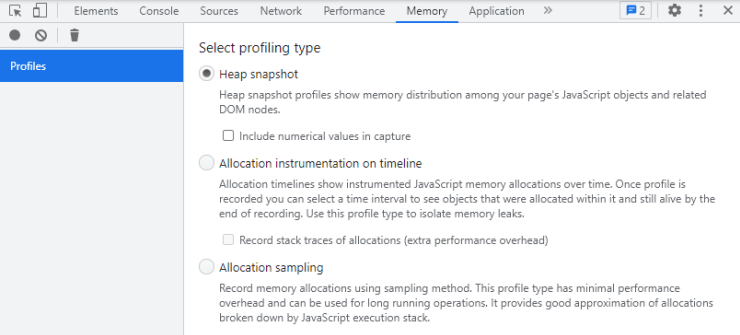
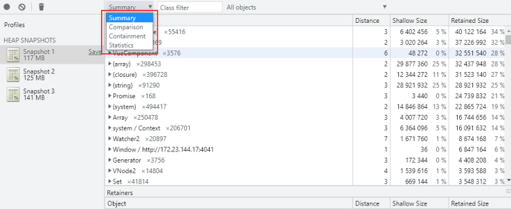
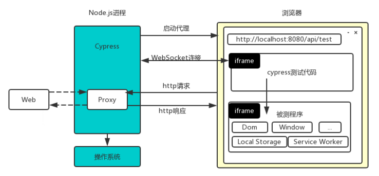
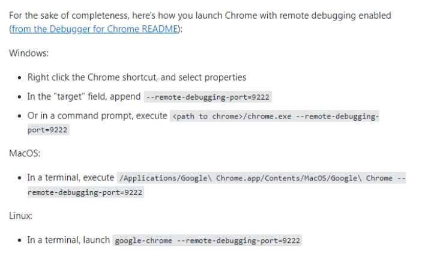
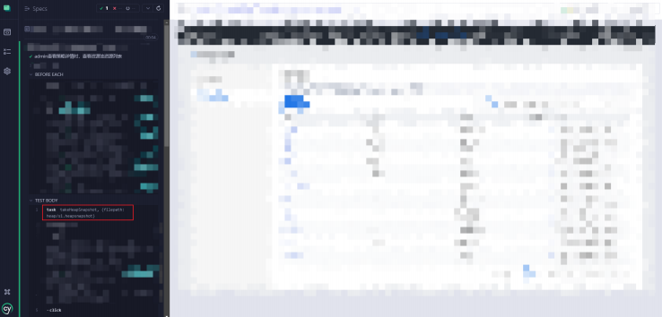

## 什么是 Heap snapshot

> The Chrome DevTools heap profiler shows memory distribution by your page's JavaScript objects and related DOM nodes

DevTools 的堆快照性能分析会显示网页的 JavaScript 对象和相关 DOM 节点中的内存分配情况。



一个常见的疑惑是，Profile 面板中快照结果里的 Comparison（需生成两个堆快照才会出现）、Dominator（已废弃）、Containment 和 Summary 四种视图之间有什么区别。 四个视图分别从不同角度分析快照数据：

Comparison 视图（比较视图）可以显示哪些对象已经被垃圾回收正确释放了，一般在该视图中比较一次操作前后的内存快照数据。通过检查空闲内存中的变量增量和引用数来确定内存泄露的存在和原因。

Dominators 视图用来确认对象已经没有其他未知的引用，并且垃圾回收可以正常工作。(新版本 Chrome 中，该面板已经去掉，新增了 Statistics（统计信息），统计不同类型数据所占的内存)

Summary 视图（摘要视图）可以按照类型追踪对象及其内存使用情况，对象会以构造器名分组显示，主要用于寻找 DOM 内存泄露的场景。

Containment 视图（控制视图）可以更清晰的了解到对象的结构，借此可以分析出在全局作用域中对该对象的引用情况（例如 window），可以用来分析闭包，以更低的层次去查看对象情况。



## Cypress 是否支持 Chrome DevTools 协议

通过 Cypress 运行 e2e 测试方式（node）去拍摄运行时的堆快照，那必须要支持 Chrome Debugging 协议（以下简称 CDP），从 Cypress 官方文档或者 Github 上的 issue 不难看出，Cypress 是支持 CDP 的。



图片来源: https://www.processon.com/embed/5edc4c37e401fd69195b7f23

Github 相关 issue：

https://github.com/cypress-io/cypress/issues/7942

Cypress 提供了 `Cypress.automation("remote:debugger:protocol", {...}` 可以满足一些常用的场景，比如设置浏览器的语言：

```javascript
Cypress.automation("remote:debugger:protocol", {
	command: "Emulation.setLocaleOverride",
    params: {
      locale: "de-AT",
    },
})
```

## Cypress 如何拍摄快照

事实上使用 `Cypress.automation` 监听 `remote:debugger:protocol` 事件没有[具体的类型推导](https://github.com/cypress-io/cypress/issues/7519)以及相关的快捷封装等，使用起来会比较有心智负担，可以结合 

[Chrome DevTools Protocol ](https://chromedevtools.github.io/devtools-protocol/)官方文档辅助去调用命令满足部分场景。

个人认为可以封装一个 cdp 插件，并使用 `on('task', {...})` 监听，在 e2e 测试文件中可以直接使用 `cy.task('takeHeapSnapshot')` 方式进行拍摄堆快照。

Cypress 运行一个 node 进程并通过 ws 连接与浏览器进行通讯，结合 [chrome-remote-interface](https://github.com/cyrus-and/chrome-remote-interface) 库，在 `e2e.setupNodeEvents` 中通过监听 `task` 并封装对应的任务即可在 e2e 测试文件中进行调用。

```javascript
// cypress.config.ts
// ...
e2e: {
	// ...
	setupNodeEvents(on, config) {
		// ...
		on('task', {
			takeHeapSnapshot: () => {}
		}
		// ...
	}
	// ...
}
// ...
    
// demo.test.ts
cy.task('takeHeapSnapshot');
```

在日常开发过程，例如 VSCode 中 Launch Chrome 的话，都需要在一个已知的端口上运行，首先需要配置好 `--remote-debugging-port=xxx`（默认 9222 端口号） ，这样才可以使用调试功能。



同样地，Cypress 测试代码运行在浏览器端，在浏览器加载前需要获取可用的端口号并设置 `--remote-debugging-port` ，也为后面初始化 CDP 客户端（基于 [chrome-remote-interface](https://github.com/cyrus-and/chrome-remote-interface) 库）提供有效的端口。

```typescript
// cdpPlugin.ts
let port = 0;

const setRdpPortWhenBrowserLaunch = (launchOptionsOrArgs: Cypress.BrowserLaunchOptions) => {
    const args = Array.isArray(launchOptionsOrArgs) ? launchOptionsOrArgs : launchOptionsOrArgs.args;

    const ensureRdpPort = (args: string[] | (Cypress.BrowserLaunchOptions & any[])) => {
        const existing = args.find(arg => arg.slice(0, 23) === '--remote-debugging-port');

        if (existing) {
            return Number(existing.split('=')[1]);
        }

        const port = 40000 + Math.round(Math.random() * 25000);

        args.push(`--remote-debugging-port=${port}`);

        return port;
    };

    port = ensureRdpPort(args);

    console.log('Ensure remote debugging port %d', port);
};
```

```typescript
// cypress.config.ts
export default defineConfig({
	// ...
    e2e: {
        setupNodeEvents(on, config) {
            const { setRdpPortWhenBrowserLaunch } = cdpPlugin();

            on('before:browser:launch', (_, launchOptionsOrArgs) => {
                setRdpPortWhenBrowserLaunch(launchOptionsOrArgs);
            });
            return config;
        },
    },
    // ...
});
```

接下来初始化 [chrome-remote-interface](https://github.com/cyrus-and/chrome-remote-interface) 库，绑定刚才获取到的端口号。

```typescript
// cdpPlugin.ts
import CDP from 'chrome-remote-interface';

let client: CDP.Client | null = null;

// ...

const initCDPClient = async () => {
    if (!port) {
        throw new Error('Please set the remote debugging port first!');
    }

    if (!client) {
        client = await CDP({
            port,
        });
    }
};
```

```typescript
// cypress.config.ts
export default defineConfig({
	// ...
    e2e: {
        setupNodeEvents(on, config) {
            const { setRdpPortWhenBrowserLaunch, initCDPClient } = cdpPlugin();

            on('before:browser:launch', (_, launchOptionsOrArgs) => {
                setRdpPortWhenBrowserLaunch(launchOptionsOrArgs);
            });
            
             on('task', {
                takeHeapSnapshot: async (opts: TakeHeapSnapshotType) => {
                    await initCDPClient();

                    return null;
                },
            });
            return config;
        },
    },
    // ...
});
```

参照 [Chrome DevTools Protocol](https://chromedevtools.github.io/devtools-protocol/) 官方文档，找到拍摄堆快照的[方式](https://chromedevtools.github.io/devtools-protocol/tot/HeapProfiler/#method-takeHeapSnapshot)，并且将其以流形式存储到 `.snapshot` 文件内（提供文件存储位置 filePath），方便后续分析内存泄漏。

```typescript
// cdpPlugin.ts
import CDP from 'chrome-remote-interface';
import fs from 'fs';

export interface TakeHeapSnapshotType {
    filePath: string;
    beforeTakeCallback?: () => void;
    afterTakeCallback?: () => void;
}

let port = 0;
let client: CDP.Client | null = null;

const setRdpPortWhenBrowserLaunch = (launchOptionsOrArgs: Cypress.BrowserLaunchOptions) => {
    const args = Array.isArray(launchOptionsOrArgs) ? launchOptionsOrArgs : launchOptionsOrArgs.args;

    const ensureRdpPort = (args: string[] | (Cypress.BrowserLaunchOptions & any[])) => {
        const existing = args.find(arg => arg.slice(0, 23) === '--remote-debugging-port');

        if (existing) {
            return Number(existing.split('=')[1]);
        }

        const port = 40000 + Math.round(Math.random() * 25000);

        args.push(`--remote-debugging-port=${port}`);

        return port;
    };

    port = ensureRdpPort(args);

    console.log('Ensure remote debugging port %d', port);
};

const initCDPClient = async () => {
    if (!port) {
        throw new Error('Please set the remote debugging port first!');
    }

    if (!client) {
        client = await CDP({
            port,
        });
    }
};

const takeHeapSnapshot = async (opts: TakeHeapSnapshotType) => {
    if (!client) {
        throw new Error('Please init the cdp client first!');
    }

    const { filePath, beforeTakeCallback = null, afterTakeCallback = null } = opts;

    if (beforeTakeCallback) {
        beforeTakeCallback();
    }

    const writeStream = fs.createWriteStream(filePath, { encoding: 'utf-8' });
    const dataHandler = (data: { chunk: string }) => {
        writeStream.write(data.chunk);
    };

    const progressHander = (data: { done: number; total: number; finished: boolean }) => {
        const percent = ((100 * data.done) / data.total) | 0;
        console.log(`heap snapshot ${percent}% complete`);
    };

    client.on('HeapProfiler.addHeapSnapshotChunk', dataHandler);
    client.on('HeapProfiler.reportHeapSnapshotProgress', progressHander as SafeAny);

    await client.send('HeapProfiler.takeHeapSnapshot', {
        reportProgress: true,
        captureNumericValue: true,
    });

    writeStream.end();

    if (afterTakeCallback) {
        afterTakeCallback();
    }
};

export const cdpPlugin = () => {
    return {
        setRdpPortWhenBrowserLaunch,
        initCDPClient,
        takeHeapSnapshot,
    };
};

```

```typescript
// cypress.config.ts
export default defineConfig({
	// ...
    e2e: {
        setupNodeEvents(on, config) {
            const { setRdpPortWhenBrowserLaunch, initCDPClient } = cdpPlugin();

            on('before:browser:launch', (_, launchOptionsOrArgs) => {
                setRdpPortWhenBrowserLaunch(launchOptionsOrArgs);
            });
            
            on('task', {
                takeHeapSnapshot: async (opts: TakeHeapSnapshotType) => {
                    await initCDPClient();
                    await takeHeapSnapshot(opts);

                    return null;
                },
            });
            return config;
        },
    },
    // ...
});
```

配置好后在对应的 e2e 测试文件内调用。

```typescript
// xxx.e2e.ts
describe('test', () => {
    it('test', () => {
        // baseline
        cy.task('takeHeapSnapshot', {
            // filePath 为写入的文件存放地址
            filePath: path.join(__dirname, `../heap/s1.heapsnapshot`),
        });
        
        cy.contains('xxx').click();
       
        // ...
        
        // target
        cy.task('takeHeapSnapshot', {
            filePath: path.join(__dirname, `../heap/s2.heapsnapshot`)
        });
        
        // back
        cy.get('xxx').click();
        
        // final
        cy.task('takeHeapSnapshot', {
            filePath: path.join(__dirname, `../heap/s3.heapsnapshot`)
        });
    })
});
```

注意：部分项目本身比较大，可能导致运行 task 超时问题，可以将 Cypress 任务的超时时间设置为 2 分钟。

```typescript
// cypress.config.ts
export default defineConfig({
	// ...
    e2e: {
        taskTimeout: 120000,
    },
    // ...
});
```

若想在某些特定模式下才针对 e2e 测试文件执行拍摄堆快照，其他情况下跳过，可以设置 `--env XXXX=xxx` 。

```json
// package.json
{
    "scripts": {
        "cy-test:e2e": "pnpm exec cypress open -C ./cypress/cypress.config.ts --e2e --browser chrome --env LOCAL_MODE=1",
    }
}
```

```typescript
// cypress.config.ts
export default defineConfig({
	// ...
    e2e: {
        setupNodeEvents(on, config) {
            on('task', {
                takeHeapSnapshot: async (opts: TakeHeapSnapshotType) => {
                    /** 只在指定的模式下运行，否则跳过 */
                    if (!config.env.LOCAL_MODE) {
                        console.log('Skip take heap snapshot.');
                        return null;
                    }
					// ...
                    return null;
                },
            });
            return config;
        },
    },
    // ...
});
```



## 参考链接

[Cypress Automation](https://glebbahmutov.com/blog/cypress-automation/)

[Expose and document Chrome DevTools Protocol](https://github.com/cypress-io/cypress/issues/7942)

[Chrome DevTools Protocol](https://chromedevtools.github.io/devtools-protocol/)

[chrome-remote-interface](https://github.com/cyrus-and/chrome-remote-interface)