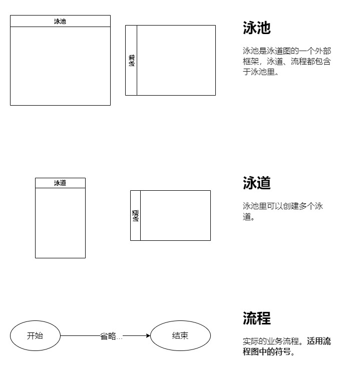
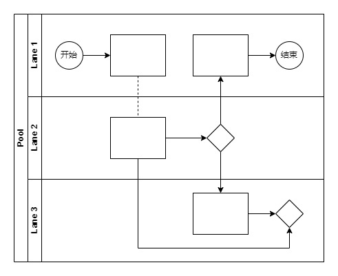
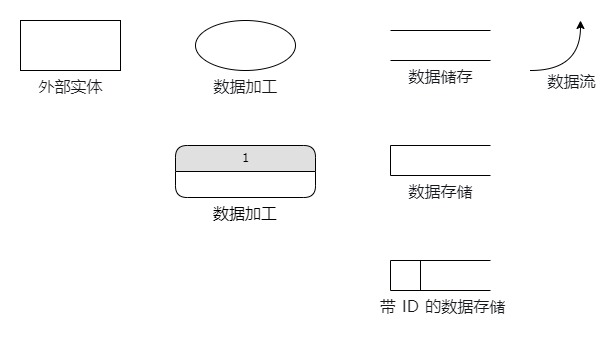
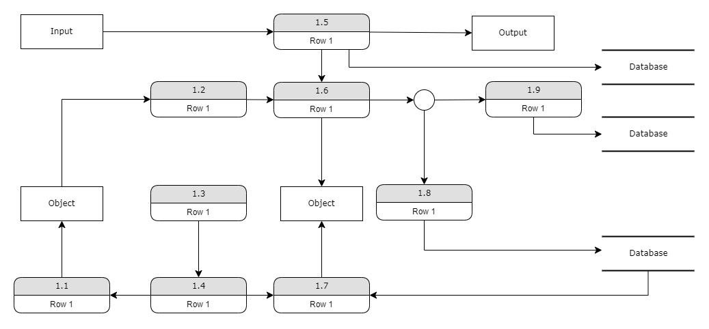
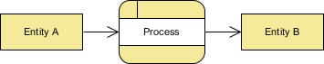
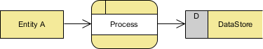
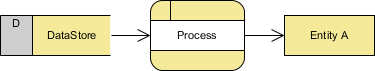
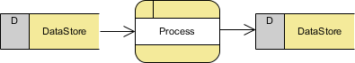
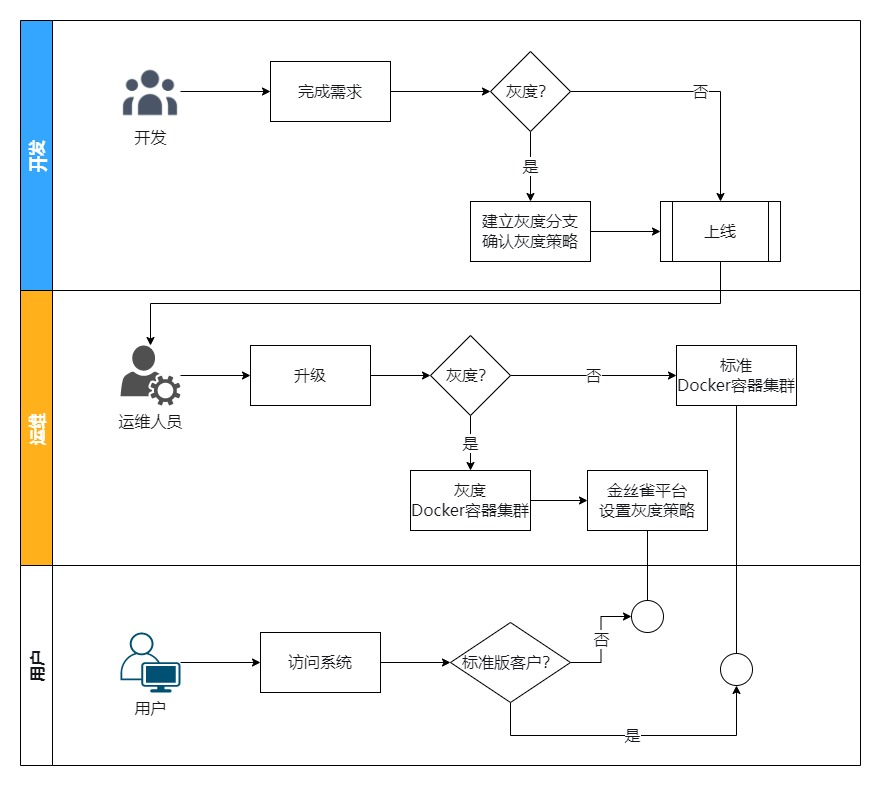
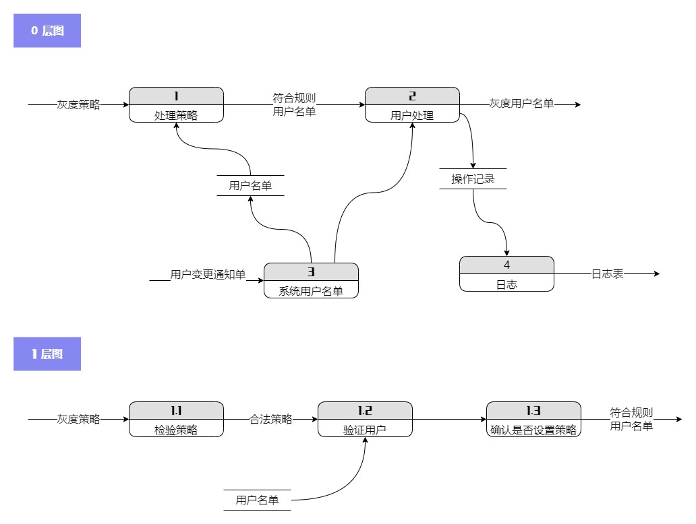

# 一图胜千言系列——泳道图和数据流图

> 一张图片胜过千言万语

在阅读别人的程序设计文档时，我们经常可以看到各种各样的图，常见的分别是**统一建模语言（UML）**、**系统建模语言（SysML）**、**流程图（Flow Chart）**、**数据流图 (Data Flow Diagram)**。

本文将介绍方案设计和程序设计过程中常遇到两种图的类型：【泳道图】和【数据流图】，并通过一个【前端灰度方案】来进行一个实践。

系列文章：[一图胜千言系列——流程图和时序图](https://juejin.cn/post/7153432342919397383)

## 泳道图

泳道图（Swimlane Diagram），也叫跨职能流程图，旨在分析和展示各个部门在同一任务流程上的不同进程，明确流程环节所属的阶段、流程环节负责人、组织机构或部门。泳道图的名称由来，是流程图中对职能部门的划分像游泳池泳道相类似比拟而来。

**说明：**泳道图（跨职能流程图）有垂直和水平两种表现方式。我们可以用垂直或者水平跨职能流程图展示任意跨职能流程。

### 常见符号

泳道图的符号比流程图的要多出以下几种。

### 基本结构

从上图可以形象地看出，一个大泳池里面存放了3个泳道，每个泳道拥有自己的内容。这就是泳道图。

### 基本原则

1. **分析功能的关键逻辑。**确定涉及的所有人员和部门；确定每个人扮演的角色，承担什么任务，梳理参与者的关系；要完成的任务，以及任务流程。
2. **明确开始与结束的路径。**每个功能模块中，从哪里开始流程，到哪里终结流程；开始与结束只有一个。
3. **确定功能模块与核心路径。**核心流向一定要清晰。
4. **优化顺序，合并异常流程。**确保流程顺畅，各部门工作协调。
5. **合并和拆分流程有依据。**先复杂后简单，先加法后减法；调研相关产品，合并、分拆有理有据。
6. **垂直排版更加强调职能单位，而水平排版则更突显过程。**排版方式的选择通常由个人兴趣决定，而不是严格要求或指导原则。

### 基本步骤

1. 创建水平泳道时，将参与者列在左边；创建垂直泳道则将参与者列在上边。
2. 使用标准的符号，在单个泳道上依次描述流程步骤。
3. 与过程中的参与者确认我们的图，并做任何必要的调整。
4. 这张图现在可以用来传达一个标准化的流程，明确责任和义务。
5. 重复 2-4，直到所有参与者的流程都出现在泳池中，就基本完成了泳道图。
6. 根据目的审查和修改流程图：优化发散场景，补全遗落内容，进一步提高图的完成度。

### 绘制细节

在绘制时，往往会犯这些常见错误。遵循下边绘制细节，我们可以在一定程度上保证图表的质量。

1. 尽可能保持图表小而集中。仅包括实际参与流程并使用不超过 12 个泳道。
2. 编写步骤时要直接简洁。坚持短语和句子片段，如果我们要使用专业术语，请在文档下添加注释以定义它们。
3. 在同一泳道中连接步骤时，步骤应按顺序（从上到下，从左到右）列出，并且仍应使用线或箭头连接。
4. 使用颜色更好地区分部门或个人，可以让图表更易于理解。可以添加一些用来补充说明的图标和图形，但要控制好数量。
5. 不断分析泳道图，删除掉流程中存在的差距、冗余和瓶颈。

## 数据流程图

数据流程图（Data Flow Diagram，DFD）是描述系统数据流程的工具，它将数据独立抽象出来，通过图形方式描述信息的来龙去脉和实际流程。它是一种能全面地描述信息系统逻辑模型的主要工具。它可以利用少数几种符号综合的反映出信息在系统中的流动、处理和存储的情况。数据流程图具有抽象性和概括性。

**注意**：数据流图和程序设计中的程序流程图是不同的，数据流图关心的是企业业务系统中的数据处理加工的客观过程，并不关心未来电子化处理的加工过程；数据流图中流动的只是数据，并没有控制过程，但在程序流程图当中，必须有控制逻辑。

### 常见符号

- **外部实体**是向系统提供数据或从系统接收输出的人、部门、外部组织或其他信息系统。
- **数据加工**描述输入数据流到输出数据之间的变换，也就是输入数据流经过什么处理后变成了输出数据。
- **数据存储**是某种数据保存后的逻辑统称，不是指保存数据的物理地点和物理介质。每个数据存储都有一个名字。
- **数据流**是处理功能的输入/输出，箭头表示数据流向。

### 基本结构

### 基本原则

1. 数据流程图上所有图形符号必须是前面所述的四种基本元素。
2. 数据流程图的主图必须含有前面所述的四种基本元素，缺一不可。
3. 数据流程图上的数据流必须封闭在外部实体之间，外部实体可以是一个，也可以是多个。
4. 处理过程至少有一个输入数据流和一个输出数据流。
5. 任何一个数据流子图必须与它的父图上的一个处理过程对应，两者的输入数据流和输出数据流必须一致，即所谓“平衡”。
6. 数据流程图上的每个元素都必须有名字。

### 基本步骤

1. 把一个系统看成一个整体功能，明确信息的输入和输出。
2. 找到系统的外部实体。一旦找到外部实体，则系统与外部世界的界面就可以确定下来，系统的数据流的源点和终点也就找到了。
3. 找出外部实体的输入数据流和输出数据流。
4. 在图的边上画出系统的外部实体。
5. 从外部实体的输入流（源）出发，按照系统的逻辑需要，逐步画出一系列逻辑处理过程，直至找到外部实体处理所需的输出流，形成数据流的封闭。
6. 将系统内部数据处理又分别看做整体功能，其内部又有信息的处理、传递、存储过程。
7. 如此一级一级地剖析，直到所有处理步骤都很具体为止。
8. 根据目的审查和修改流程图：优化发散场景，补全遗落内容，进一步提高图的完成度。

### 绘制细节

在绘制时，往往会犯这些常见错误。遵循下边绘制细节，我们可以在一定程度上保证图表的质量。

1. **画数据流而不是控制流**。数据流反映系统“做什么”，不反映“如何做”，因此箭头上的数据流名称只能是名词或名词短语，整个图中不反映加工的执行顺序。
2. **一般不画物质流**。数据流反映能用计算机处理的数据，并不是实物，因此对目标系统的数据流图一般不要画物质流。
3. 如果一张数据流图中的某个加工分解成另一张数据流图时，则上层图为父图，直接下层图为子图。子图及其所有的加工都应该进行编号。
4. 父图与子图的平衡。子图是对父图中处理逻辑的详细描述, 因此父图中数据的输入和输出必须在子图中反映。父图与子图的平衡是数据流守恒原则的体现, 即对每一个数据处理功能来说，要保证分解前后的输入数据流与输出数据流的数目保持不变。
5. 当某层数据流图中的数据存储不是父图中相应加工的外部接口，而只是本图中某些加工之间的数据接口，则称这些数据存储为局部数据存储。
6. 数据流程图的绘制一般是**从左到右进行**。从左侧开始标出外部实体，然后画出由外部实体产生的数据流，再画出处理逻辑、数据流、数据存储等元素及其相互关系，最后在流程图的右侧画出接收信息的系统外部实体。
7. 每个加工**至少**有一个输入数据流和一个输出数据流。
8. 一个加工的输出数据流，**不应与输入数据流同名**，即使他们的组成完全相同。
9. **合理命名，准确编号**。对数据流程图的基本元素进行编号, 这样有利于编写数据字典及方便系统设计人员和用户的阅读与理解。
10. **数据处理输入/输出协调**。只有流入没有流出，则数据处理无需存在；只有流出没有流入的数据处理不可能满足。
11. **数据存储输入/输出协调**。数据存储必定有输入数据流和输出数据流，缺少任何一个则意味着遗漏了某些加工。
12. **数据流至少有一端连接处理框**。外部实体之间不应该存在数据流，数据流不能直接从外部实体直接传送到数据存储，也不能从数据存储直接传送到外部实体，都必须经过加工处理 。

| 错误                                                 | 正确画法                                             | 原因                                                         |
| :--------------------------------------------------- | :--------------------------------------------------- | :----------------------------------------------------------- |
|  |  | 没有经由程序处理，实体不能将数据传送至另一个实体。           |
|  |  | 没有经由程序处理，数据不能直接从实体传送到数据存储。         |
|  |  | 没有经由程序处理，数据不能直接从数据存储传送至实体。         |
|  |  | 没有经由程序处理，数据不能直接从一个数据存储传送到另一个数据存储。 |

## 实践：灰度发布方案

我们需要一个方案：在不影响用户正常使用工作的前提下，引入小部分的用户来使用新版本，帮助我们测试用户对于新版本的接受程度；避免决策失误所产生的问题影响到大部分甚至全量用户，保证了产品平滑过度。

### 场景梳理

首先梳理场景流程，这里有个问题需要考虑：从什么视角去梳理？因为不同的人看到的流程是不一样的。

答案：取决于需要解决什么问题，因为我们要管理用户可以使用系统的版本，所以从用户视角出发是一个合适的选择。梳理完出发点后

### 泳道图

遵循【基本步骤】，我们可以进行一个泳道图的绘制。

从上图不难看出，系统中的三个参与者（开发、运维、用户）都有各自明确的流程，相互之间的交互也有体现。

### 数据流图

遵循【基本步骤】，我们可以进行一个数据流图的绘制。

从上图中不难看出，数据流图是用来表现各个系统/模块间数据的流向：在什么环节需要输入怎么样的数据，经过什么样的加工，获取的数据最终流向哪里。

## 总结

各种图的绘制都是需要在平常中不断练习、打磨，这样才能有成长。
