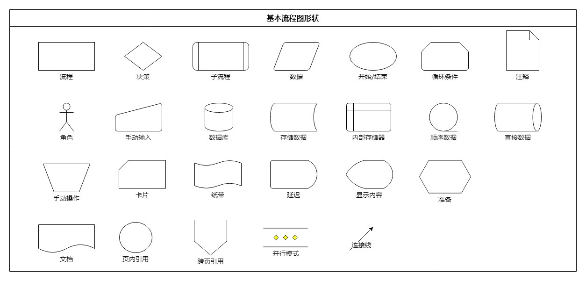
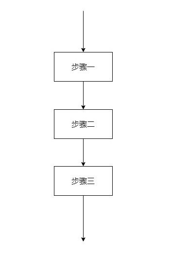
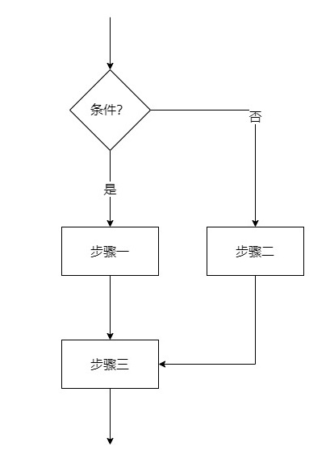
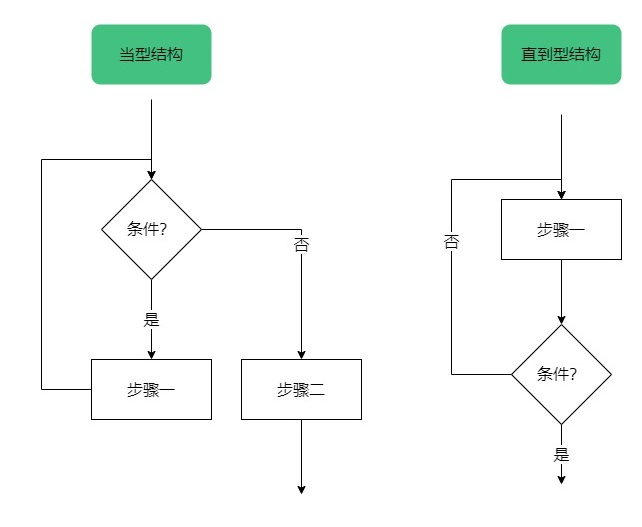
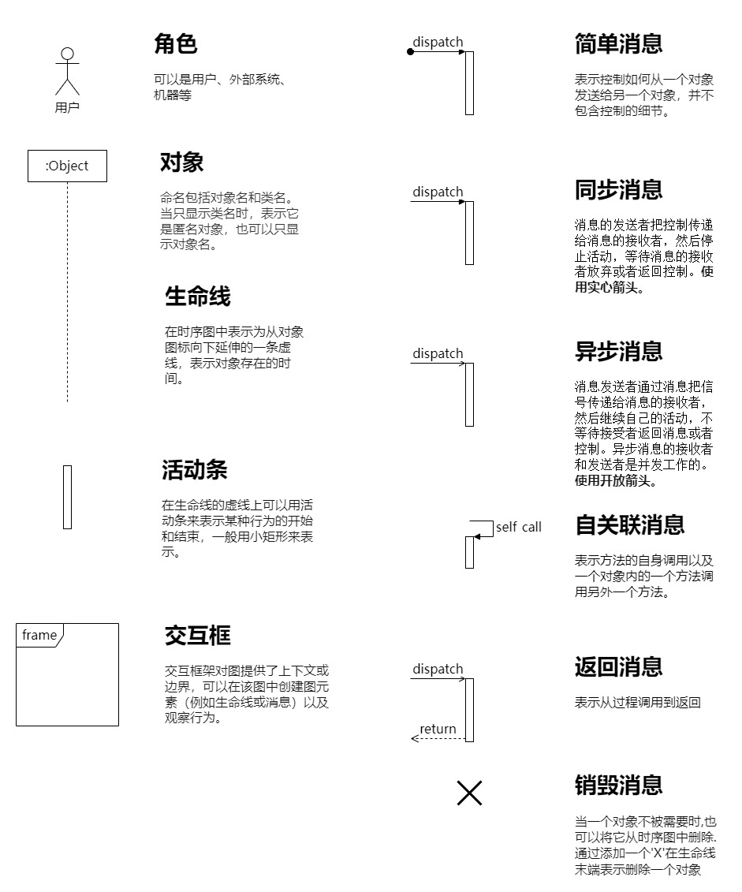
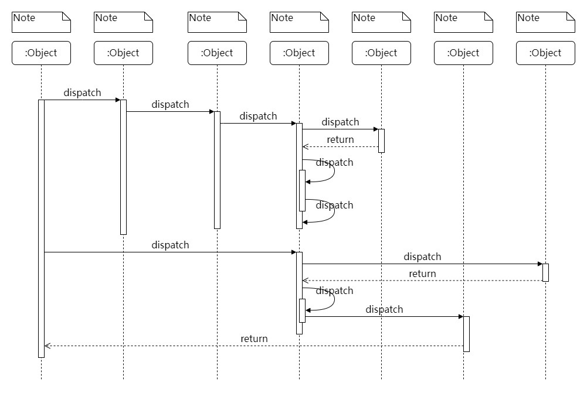
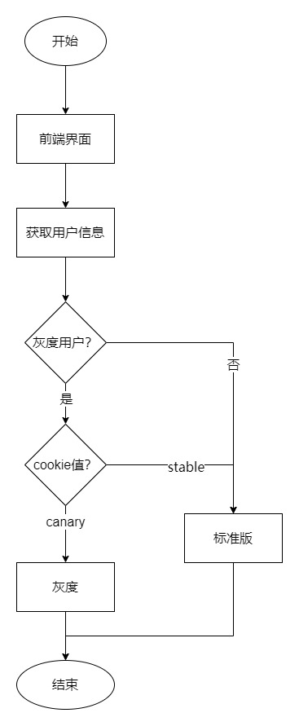
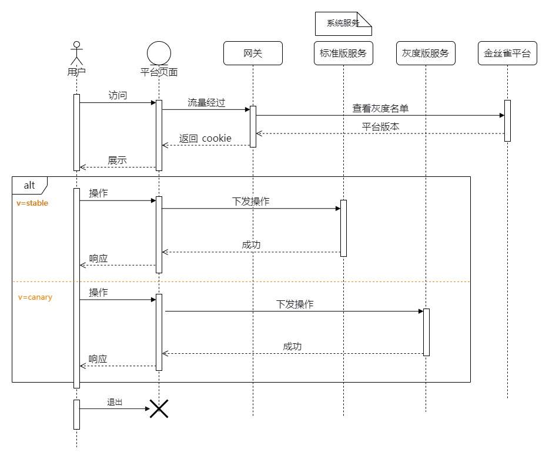

# 怎么做到一图胜千言

> 一张图片胜过千言万语

本文将介绍方案设计和程序设计过程中常遇到两种图的类型：【流程图】和【时序图】。

## 流程图

**流程图（Flow Chart），顾名思义，就是用来直观地描述一个工作过程的具体步骤图，它使用图形表示流程思路，是一种极好的方法**。它在一些技术设计、工作步骤及商业简报等领域应用较为广泛，也可以称之为输入-输出图。它通常用一些图框来表示各种类型的操作，在框内写出各个步骤，然后用带箭头的线把它们连接起来，以表示执行的先后顺序，用图形表示执行步骤，十分直观形象，易于理解。

### 什么时候需要流程图

首先，流程图作为一个工具，帮助我们把一个复杂的过程简单而直观地展示出来，大大提高了我们的效率。其次，在我们画出一张流程图之后，方便我们将实际操作的步骤和我们想象的过程进行比较、对照，更加方便我们寻求改进的机会。最后，流程图还能帮助我们将工作过程中复杂的、有问题的、重复的部分、多余的环节以及可以简化和标准化的地方都显示出来，有利于我们把复杂流程简单化。

通常，对于希望创建流程的人来说，无论创建的是什么样的流程，流程图都是很有用的。画流程图主要有以下好处：

1. 一张简明的流程图，能帮我们梳理方案的实现，让思考的思路更清晰、逻辑更顺畅，有助于流程的逻辑实现和有效解决实际问题。
2. 流图还能帮助我们查漏补缺，避免技术方案上出现遗漏，确保方案的完整性。通过梳理流程上的关键节点，可以快速发现遗漏之处，以便及时整改，保证后续方案执行的顺畅。
3. 流程图能够有效提升我们与同事之间的沟通效率。当一个技术方案比较复杂，判定条件较多，用口头难以表达清楚，用一张流程图，就能高效地解决沟通问题。

### 常见符号

首先需要注意的就是流程图的符号要求。

如上图所示，这些就是流程图设计中比较常用的一些形状。它们都有特定的含义，正确的使用能让流程图更加清晰。在绘制流程图中，符号使用是最容易出错的。

### 三大结构

流程图规范有三大结构，分别为顺序结构、选择结构和循环结构。

#### 顺序结构

这种结构最简单，各个步骤是按先后顺序执行的。如图，A、B、C是三个连续的步骤，它们是按顺序执行的，即完成上一个框中指定的操作才能再执行下一个动作。

#### 选择结构

选择结构又称分支结构，用于判断给定的条件，根据判断的结果判断某些条件，根据判断的结果来控制程序的流程。

#### 循环结构

循环结构又称为重复结构，指在程序中需要反复执行某个功能而设置的一种程序结构。它由循环体中的条件，判断继续执行某个功能还是退出循环。

根据判断条件，循环结构又可细分为以下两种形式：先判断后执行的循环结构（当型结构），和先执行后判断的循环结构（直到型结构）。

### 绘制细节

1. 绘制流程图时，为了提高流程图的逻辑性，应遵循从左到右、从上到下的顺序排列。
2. 一个流程从开始符开始，以结束符结束。开始符号只能出现一次，而结束符号可出现多次。若流程足够清晰，可省略开始、结束符号。
3. 菱形为判断符号，必须要有“是和否（或Y和N）”两种处理结果，意思是说，菱形判断框一定需要有两条箭头流出；且判断符号的上下端流入流出一般用“是（或Y）”，左右端流入流出用“否（或Y）”。
4. 同一流程图内，符号大小需要保持一致，同时连接线不能交叉，连接线不能无故弯曲。
5. 流程处理关系为并行关系的，需要将流程放在同一高度。
6. 必要时应采用标注，以此来清晰地说明流程，标注要用专门的标注符号。
7. 处理流程须以单一入口和单一出口绘制，同一路径的指示箭头应只有一个。
8. 同一路径的指示箭头应只有一个。
9. 流程图中，如果有参考其他已经定义的流程，不需重复绘制，直接用已定义流程符号即可。
9. 不要在一张图上表达两种不同的信息流。
9. 一个完整图最好不要超过 20 个节点，节点越多，图的复杂度上升，可读性也会随之下降。

## 时序图

**时序图是基于交互的对象行为建模，是 UML 用于描述对象之间信息的交互过程的方法，是描述对象间协作关系的模型。**

时序图用于捕获系统运行中对象之间有时间顺序的交互，是由生命线和消息组成。

### 常见符号

首先给大家介绍一下时序图中常见的符号及其作用。

如上图所示，这些就是时序图设计中比较常用的一些形状。

### 基本结构

时序图将交互关系表示为一个二维图。纵向是时间轴，时间沿竖线向下延伸。横向轴代表了在协作中各独立对象的类元角色。类元角色用生命线表示。当对象存在时，角色用一条虚线表示，当对象的过程处于激活状态时，生命线是一个双道线。消息用从一个对象的生命线到另一个对象生命线的箭头表示。箭头以时间顺序在图中从上到下排列。

### 绘制细节

1. 明确上下文，剔除掉无关紧要的场景，确保关注点都放在核心需求上。
2. 初始化整个交互活动的对象放置在最左端。
3. 交互频繁的对象放在相邻的位置。
4. 明确角色和对象，无关的对象可以剔除。
5. 区分好同步信息和返回信息，同步信息用的是实线，返回信息用的是虚线，不是向左的线就是返回信息。

## 实践：灰度发布方案

我们需要一个方案：在不影响用户正常使用工作的前提下，引入小部分的用户来使用新版本，帮助我们测试用户对于新版本的接受程度；避免决策失误所产生的问题影响到大部分甚至全量用户，保证了产品平滑过度。

### 场景梳理

首先梳理场景流程，这里有个问题需要考虑：从什么视角去梳理？因为不同的人看到的流程是不一样的。

答案：取决于需要解决什么问题，因为我们要管理用户可以使用系统的版本，所以从用户视角出发是一个合适的选择。梳理完出发点后

### 流程图

从上图，不难看出流程图对于简单逻辑场景表达效果很棒，但是不适用于复杂的逻辑，复杂场景意味着图内元素增多，很难把控。

而且我们发现流程图的内容很少涉及状态变化、数据流动的表达。

### 时序图

上图侧重于交互，适合按照时间顺序体现一个业务流程中交互细节，但是时序图并不擅长体现复杂逻辑分支。

如果某个逻辑分支特别重要，可以选择再画一个时序图。例如支付流程中有支付成功正常流程，也有支付失败异常流程，这两个流程都非常重要，所以可以用两张时序图体现。

## 总结

各种图的绘制都是需要在平常中不断练习、打磨，这样才能有成长。

