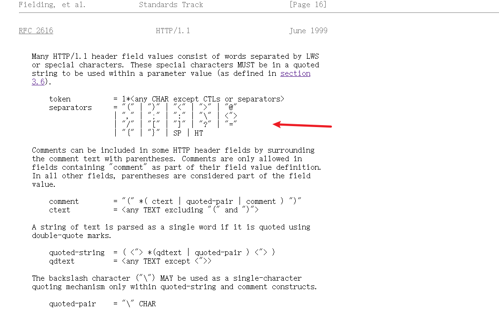

## 建立WebSocket

在客户端创建一个 `WebSocket` 应用程序其实很简单，只需要简单的一行，例如：

```ts
const ws = new WebSocket('ws://localhost:8080');
```

语法也就两个参数

```ts
webSocket = new WebSocket(url, protocols);
```

### url

需要连接的服务器地址，一般以 `ws` 或者 `wss` 开头，这两种不同的协议可以类比为 `http` 和 `https` 的差异

#### 疑问一

`WebSocket` 自定义一套协议机制，那为什么不采用 `http` 协议呢？

> WebSocket的连接协议也可以用于浏览器之外的场景，可以通过非 HTTP 协商机制交换数据。

#### 疑问二

如果我设置一个错误协议的 URL 或者是一个正确协议但不存在的 URL 分别会出现什么错误提示？

这里手动测试一下就行，例如：

错误协议的 URL：

```ts
new WebSocket('http://localhost')
```


正确协议但不存在的 URL：

```ts
const ws = new WebSocket('ws://localhost:555');

ws.addEventListener('error', event => {
    console.log(event);
});

ws.addEventListener('close', event => {
    console.log(event.code, event.reason);
});
```


### protocols

可以是一个协议字符串或一个协议字符串数组

#### 疑问一

这个协议名的约束是啥？这里看 [RFC 规范](https://www.rfc-editor.org/rfc/rfc6455#section-4.1)

> The request MAY include a header field with the name |Sec-WebSocket-Protocol|.  If present, this value indicates one or more comma-separated subprotocol the client wishes to speak, ordered by preference. The elements that comprise this value MUST be non-empty strings with characters in the range U+0021 to U+007E not including separator characters as defined in [RFC2616] and MUST all be unique strings. The ABNF for the value of this header field is 1#token, where the definitions of constructs and rules are as given in [RFC2616].

请求可能会包含一个叫 `Sec-WebSocket-Protocol` 的请求字段。如果这个字段存在，那么根据需要客户端可以使用单个或者多个以逗号分隔的子协议。组成这个值的元素必须是非空字符串，字符在 U+0021 到 U+007E 范围内，不包括 [RFC2616] 中定义的分隔符并且必须都是唯一字符串。这个头字段值的 ABNF 是1#token，其中的定义构造和规则在 [RFC2616] 中给出。

其中 RFC2616 中定义的分隔符为，如图所示：



如果协议中包含了这些分隔符会出现什么场景，如下图所示：


解释：

1. `U+0021 到 U+007E`之间的字符是啥？

可以参考[维基百科](https://en.wikipedia.org/wiki/List_of_Unicode_characters)，由此可以得出中文名是不符合规范的，它不在这个范围内

2. `ABNF`是什么？

`Augmented Backus–Naur form`的缩写，这里可以参考[维基百科](https://en.wikipedia.org/wiki/Augmented_Backus%E2%80%93Naur_form)

3. `1#token`是什么？

在`WebSocket`协议中，`1#token`是一个`ABNF`规则，用于定义一个或多个标记（`token`）的序列。其中，#表示“至少一个”，1#表示“至少一个标记”。标记是一种由可见字符组成的字符串，用于表示协议中的各种元素，例如请求头字段、响应头字段、URI等。标记由一系列字符组成，其中每个字符都必须是以下范围内的字符：U+0021到U+007E：ASCII可见字符，不包括空格和分隔符。在1#token规则中，标记之间用逗号分隔。例如，以下是一个符合1#token规则的字符串：token1,token2,token3，在这个字符串中，有三个标记，它们之间用逗号分隔。

在 [RFC2616](https://www.rfc-editor.org/rfc/rfc2616#section-2.1) 中也有关于`1#element`的作用

#### 疑问二

**这个协议有什么作用呢？**

在 [RFC6455](https://www.rfc-editor.org/rfc/rfc6455#section-1.9) 中说明了协议的使用，但是这个章节在一开始也说明了这个使用规范是**非标准**，因此这个协议的用途其实可以多元化，这个协议的目的是一个服务器可以根据指定的 `protocol` 来应对不同的互动情况

下面列举了几种用途：
1. 协议为多个域名，为不同网站提供服务

例如一个 `WebSocket` 服务器为两个不同网站提供服务：

```ts
const ws = new WebSocket('ws://localhost:80', 'chat.example.com');
const ws1 = new WebSocket('ws://localhost:80', 'chat.example.org');
```

或者给不同版本的网站提供服务：

```ts
const ws = new WebSocket('ws://localhost:80', 'bookings.example.net');
const ws1 = new WebSocket('ws://localhost:80', 'v2.bookings.example.net');
```

2. 作为消息格式，在 `http` 协议中的 `Content-Type` 能够返回不同的响应内容来代表不同的数据格式，例如 `application/json`、`text/html`，那么这个参数也可以用来表示期望的数据内容，例如可以设置`json`、`text`
3. 作为加解密 `key`，比如使用这个协议的 `key` 作为加密的密钥

总而言之：这个 `protocol` 可以根据需要来动态设置

## 实例属性

### `protocol`

服务器支持的协议，如果未指定协议，那么返回为空

```ts
const ws = new WebSocket('ws://localhost:80');
ws.addEventListener('open', () => {
    console.log(ws.protocol === ''); // true
});
```

如果选择了一种协议

```ts
// 服务器
// 例如使用ws包进行选择
const wss = new WebSocketServer({
    port: 80,

    // 选择最后一种协议
    handleProtocols: (protocols) => {
        return Array.from(protocols).pop() || '';
    }
});

// 客户端
const ws1 = new WebSocket('ws://localhost:80', ['a', 'b']);
ws.addEventListener('open', () => {
    console.log(ws.protocol === 'b'); // true
});
```

### url

创建 `WebSocket` 实例对象的 `URL`，**注意**这个返回的url是符合规范的

例如：

1. 自动补全：

```ts
// 虽然后缀未加/，但是获取的时候会自动加上
const url = 'ws://localhost:55';
const ws = new WebSocket(url);

ws.addEventListener('open', () => {
    console.log(ws.url); // ws://localhost:55/
});
```

2. 默认端口不显示：

```ts
const url = 'ws://localhost:80/';
const ws = new WebSocket(url);

ws.addEventListener('open', () => {
    console.log(ws.url); // ws://localhost/
});
```

### readyState

当前 `WebSocket` 的连接状态

- 0(WebSocket.CONNECTING): 正在连接中
- 1(WebSocket.OPEN): 已经连接并且可以通信
- 2(WebSocket.CLOSING): 正在关闭
- 3(WebSocket.CLOSED): 连接关闭或者连接未成功

```ts
const url = 'ws://localhost:80/';
const ws = new WebSocket(url);

ws.addEventListener('open', () => {
    console.log(ws.readyState); // 1

    // 0, 1, 2, 3
    console.log(WebSocket.CONNECTING, WebSocket.OPEN, WebSocket.CLOSING, WebSocket.CLOSED);
});
```

### binaryType

返回 `WebSocket` 连接所传输的二进制数据类型

存在两种：`blob`（默认值）、`ArrayBuffer`

```ts
const url = 'ws://localhost:80/';
const ws = new WebSocket(url);

ws.addEventListener('open', () => {
    console.log(ws.binaryType); // blob
});
```

这个值由**客户端**自己决定

```ts
const url = 'ws://localhost:80/';
const ws = new WebSocket(url);

ws.binaryType = 'arraybuffer';

ws.addEventListener('open', () => {
    console.log(ws.binaryType); // arraybuffer
});
```

### bufferedAmount

> **是一个只读属性，用于返回已经被**send()方法放入队列中但还没有被发送到网络中的数据的字节数。一旦队列中的所有数据被发送至网络，则该属性值将被重置为 0。但是，若在发送过程中连接被关闭，则属性值不会重置为 0。如果你不断地调用send()，则该属性值会持续增长

那么这个属性有什么用呢？这里问问 `ChatGPT`


整体思路也就是有一个缓冲区概念，如果当前正在发送数据，那么放入缓冲区中，否则直接发送数据

### extensions

输出服务端已选择的拓展值，具体可以查看 [RFC6455 Extensions
](https://www.rfc-editor.org/rfc/rfc6455#section-9)

值得注意的是这个值由客户端决定需要哪些拓展值，如果客户端不存在，那么服务端就不应该去设置

目前我 `Chrome` 中默认存在两种拓展值，`permessage-deflate` 和 `client_max_window_bits`

#### perMessageDeflate

使用[deflate](https://en.wikipedia.org/wiki/Deflate)压缩技术压缩消息，

```ts
// 服务端
const wss = new WebSocketServer({
    port: 80,
    perMessageDeflate: true
});
```


#### client_max_window_bits

用于控制客户端压缩拓展的最大窗口大小

```ts
const wss = new WebSocketServer({
    port: 80,
    perMessageDeflate: {
        clientMaxWindowBits: 8
    }
});
```

## 实例方法

### close

关闭`WebSocket`，语法为`WebSocket.close(code, reason)`

#### code

数字状态码，它表示的是`WebSocket`关闭后打印出的值，在关闭事件`CloseEvent`内获取，未赋值的情况下默认`1005`

1. `0-999`：未使用状态码
2. `1000-2999`：有具体定义的含义和未来可能被定义的保留值
3. `3000-3999`：提供给库和框架使用
4. `4000-4999`：提供给用户自定义

具体各个数字代表的含义可以看[RFC6455-The WebSocket Protocol](https://www.rfc-editor.org/rfc/rfc6455#section-7.4.1)

#### reason

连接关闭的原因，最大字符串长度不能超过 123 个**字节**

如果超过了会发生什么事？使用代码测试一下，结果如下图所示：


显而易见，直接抛出异常

#### 举几个案例

1. 未建立连接之前或正在建立连接之前关闭

最终打印出 `1006`，具体原因在另一篇 [WebSocket疑问解答](https://juejin.cn/post/7222186286563672119) 给出

```ts
const ws = new WebSocket('ws://localhost:80/');
ws.addEventListener('close', event => {
    // 1006, ''
    console.log(event.code, event.reason);
});
ws.close();
```

2. 建立连接后主动关闭

其中 `1005` 表示表示没有收到预期的状态码，如果手动加上状态码和原因，那么输出的就是手动赋值的状态码以及原因

```ts
const ws = new WebSocket('ws://localhost:80/');

ws.addEventListener('open', () => {
    ws.close();
});

ws.addEventListener('close', event => {
    // 1005, ''
    console.log(event.code, event.reason);
});
ws.close();
```

3. 服务器代码主动断开

客户端打印 `1005`，如果手动加上状态码和原因，那么输出的就是手动赋值的状态码以及原因

```ts
import { WebSocketServer } from 'ws';

const wss = new WebSocketServer({
    port: 80,
});

wss.on('connection', (ws, req) => {
    ws.close();
});
```

4. 服务器进程关闭

手动把开启的服务器进程杀掉，那么客户端显示的失败状态码为 `1006`，原因为空字符串

### send

发送消息，语法为`WebSocket.send(data)`

#### data

一共有四种类型可以作为传输数据

1. `string`

```ts
ws.send('Hello World!');
```

2. `ArrayBuffer`

```ts
ws.addEventListener('open', () => {
    const buffer = new ArrayBuffer(12);
    const view = new DataView(buffer);
    const arr = [
        72, 101, 108, 108, 111,
        32, 87, 111, 114, 108,
        100, 33
    ];
    arr.forEach((num, index) => {
        view.setUint8(index, num);
    });
    ws.send(buffer);
});

```

3. `Blob`

```ts
// 客户端
ws.addEventListener('open', () => {
    const message = new Blob(['Hello World!']);
    ws.send(message);
});

// 服务器
wss.on('connection', (ws, req) => {
    ws.on('message', (data) => {
        console.log(data.toString()); // Hello World!
    });
});
```

4. `TypedArray` 或者 `DataView`

```ts
// 客户端
ws.addEventListener('open', () => {
    const message = new Uint8Array([
        72, 101, 108, 108, 111,
        32, 87, 111, 114, 108,
        100, 33
    ]);
    ws.send(message);
});

// 服务端
wss.on('connection', (ws, req) => {
    ws.on('message', (data) => {
        console.log(data.toString()); // Hello World!
    });
});
```

或者

```ts
ws.addEventListener('open', () => {
    const view = new DataView(new ArrayBuffer(12));
    const arr = [
        72, 101, 108, 108, 111,
        32, 87, 111, 114, 108,
        100, 33
    ];
    arr.forEach((num, index) => {
        view.setUint8(index, num);
    });
    ws.send(view);
});
```

## 事件

和其他事件一致，有两种声明方式

```ts
addEventListener('open', (event) => {});

onopen = (event) => {};
```

### open

当 `WebSocket` 处于 `open` 状态，即 `readyState` 为 `1` 时触发

该打开事件参数为普通的[Event](https://developer.mozilla.org/en-US/docs/Web/API/Event)

### message

当 `WebSocket` 接收到消息触发

该消息事件参数为 [MessageEvent](https://developer.mozilla.org/en-US/docs/Web/API/MessageEvent)，继承于普通的 [Event](https://developer.mozilla.org/en-US/docs/Web/API/Event)，相比于普通的 Event，该事件多了五个参数

- data：接收到的消息
- origin：发送消息的来源
- lastEventId：事件唯一ID
- source：消息发送者
- ports：一组 [MessagePort](https://developer.mozilla.org/en-US/docs/Web/API/MessagePort) 对象，表示与发送消息的通道关联的端口

依次打印出来如图所示：


**注意：**

在这里其实可以不用关注 `lastEventId`，因为[HTML规范](https://html.spec.whatwg.org/multipage/comms.html#dom-messageevent-lasteventid-dev)中说明了它为[SSE](https://html.spec.whatwg.org/multipage/server-sent-events.html#server-sent-events)提供

`source` 和 `ports` 也可以不用关注，具体看[HTML规范](https://html.spec.whatwg.org/multipage/comms.html#dom-messageevent-lasteventid-dev)

### error

当 `WebSocket` 的连接由于一些错误事件的发生 (例如无法发送一些数据) 而被关闭时，一个`error`事件将被引发

该关闭事件参数为普通的[Event](https://developer.mozilla.org/en-US/docs/Web/API/Event)

### close

当 `WebSocket` 连接关闭后被触发，即 `readyState` 为 `3` 时触发

该关闭事件参数为[CloseEvent](https://developer.mozilla.org/en-US/docs/Web/API/CloseEvent)，继承于普通的[Event](https://developer.mozilla.org/en-US/docs/Web/API/Event)，相比于普通的Event，该事件多了三个参数

- code: 关闭连接的状态码
- reason: 关闭连接的原因
- wasClean: Boolean，连接是否完全关闭

前两个参与之前已经介绍过，这里说一下 `wasClean`，如果是代码手动 `close`，那么一般为 `true`，那么什么场景下为 `false` 呢？

1. 突然断开服务器进程
2. 连接未建立时手动调用 `close` 方法关闭

## 参考文章

- [MDN](https://developer.mozilla.org/en-US/docs/Web/API/WebSockets_API/Writing_WebSocket_client_applications)
- [《High Performance Browser Networking》](https://hpbn.co/websocket/#websocket-api)
- [RFC2616-Hypertext Transfer Protocol -- HTTP/1.1](https://www.rfc-editor.org/rfc/rfc2616)
- [RFC6455-The WebSocket Protocol](https://www.rfc-editor.org/rfc/rfc6455)
- [wikipedia deflate](https://en.wikipedia.org/wiki/Deflate)