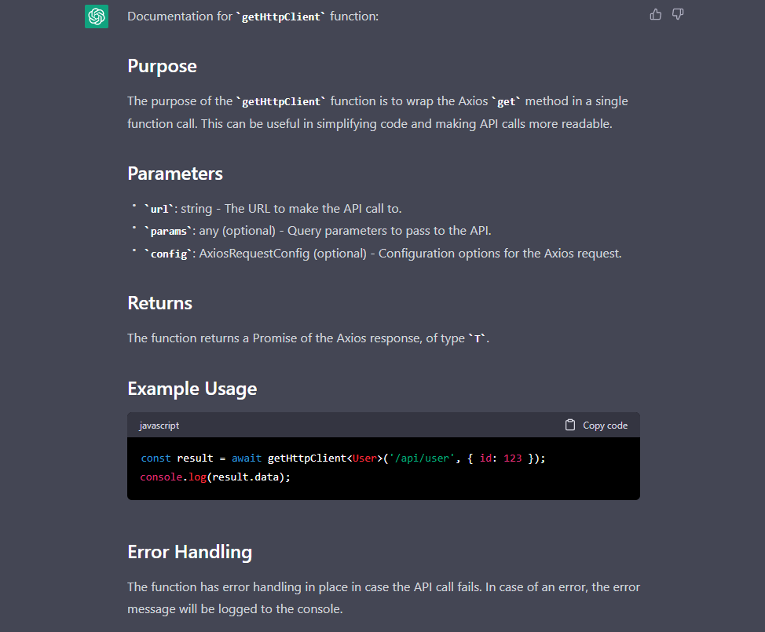
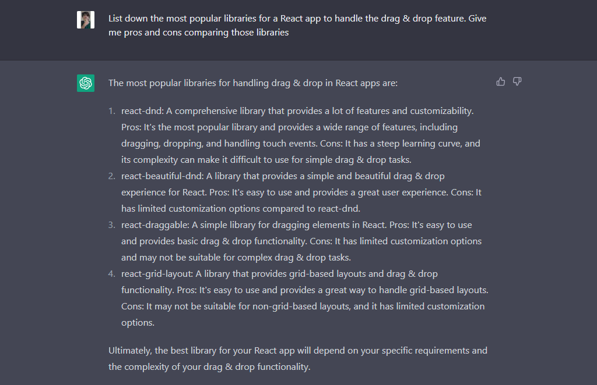

# 前言

chatGPT 是一种基于深度学习的自然语言处理模型，具有强大的语义理解和语义化文字生成能力。在开发中，chatGPT 可以帮助开发者提高效率和准确性，从而提高开发效率和质量。本文将围绕 chatGPT 的应用进行探讨，包括生成、检验、转化和信息获取等方面。

首先，我们需要了解 chatGPT 的基本原理。chatGPT 是一种基于 Transformer 模型的语言模型，其核心思想是通过多层自注意力机制来实现对输入文本的理解和生成。具体来说，chatGPT 通过将输入文本分解为一系列 token，并将其转换为向量表示，然后通过多层自注意力机制来计算每个 token 与其他 token 之间的关系，从而实现对输入文本的理解和生成。

在 chatGPT 的应用中，生成、检验、转化、信息获取是其中四个重要的方向。我们可以围绕这四个方向构建一些 chatGPT 的小工具。

省流：

- 生成
  1. 自然语言描述转代码
  2. 代码自动补全
  3. 代码重构
- 检验
  1. 代码问题检查
  2. 代码重构建议
  3. 代码规范检查
- 转化
  1. 编程语言转换
  2. 数据格式转换
  3. 编程语言转自然语言描述
- 信息获取

# 生成

在生成方面，chatGPT 的优势在于其语义理解能力强、语义化文字生成能力强。这使得 chatGPT 可以生成符合语法和语义规则的代码，从而提高代码的质量和可读性。此外，由于 chatGPT 的可定制性强，我们可以根据特定领域的数据进行训练，从而提高模型的准确性和性能。需要注意的是，在代码生成和优化方面，chatGPT 的输出结果可能存在误差和偏差，需要进行适当的验证和调整。

## 生成代码

chatGPT 可以用于生成重复性的代码、特定领域的代码等。例如，我们可以使用 chatGPT 来生成前端页面的 HTML 和 CSS 代码，从而提高开发效率和准确性。此外，chatGPT 还可以用于生成后端代码、机器学习代码等。

## 生成文档

chatGPT 可以用于生成各种类型的文档，例如组件使用说明文档、数据分析报告等。例如，我们可以使用 chatGPT 来生成前端组件的使用说明文档，从而提高开发效率和准确性。此外，chatGPT 还可以用于生成数据分析报告、测试报告等。

## 生成测试

chatGPT 可以用于生成各种类型的测试，例如单元测试、集成测试等。例如，我们可以使用 chatGPT 来生成前端页面的单元测试代码，从而提高开发效率和准确性。此外，chatGPT 还可以用于生成后端测试代码、机器学习测试代码等。

# 检验

在开发中，代码检验是一个非常重要的任务。chatGPT 可以用于检查代码问题、提供代码重构建议等。例如，我们可以使用 chatGPT 来检查前端页面的代码问题，从而提高代码的质量和可读性。此外，chatGPT 还可以用于提供代码重构建议、检查代码规范等。

在代码检验方面，chatGPT 的优势在于其语义理解能力强、语义化文字生成能力强。这使得 chatGPT 可以检查符合语法和语义规则的代码问题，并提供相应的重构建议和规范检查。

# 转化

在开发中，编程语言和自然语言之间的转化是一个非常重要的任务。chatGPT 可以用于实现编程语言和自然语言之间的相互转换，例如 js 转 ts、json 转 yaml、js 转中文描述等。这些转换可以帮助开发者更好地理解和使用编程语言，从而提高开发效率和准确性。

这个很好理解，就不上图了。

# 信息获取

在开发中，信息获取是一个非常重要的任务。chatGPT 可以用于实现各种类型的信息获取，例如 API 文档查询、技术文档查询、代码片段查询等。这些信息获取可以帮助开发者更好地理解和使用技术文档和代码库，这些查询可以帮助开发者更好地理解和使用技术文档和代码库，从而提高开发效率和准确性。

# 总结

本文围绕 chatGPT 的应用进行了探讨，包括生成、检验、转化和信息获取等方面。在这些应用场景中，chatGPT 具有强大的语义理解和语义化文字生成能力，可以帮助开发者提高效率和准确性，从而提高开发效率和质量。此外，我们还探讨了 chatGPT 的原理和实际用例，以便更好地理解其应用和优势。总的来说，chatGPT 是一种非常有潜力的语言模型，可以应用于各种领域，帮助我们更好地理解和使用自然语言，从而提高生产力和创造力。

总之，chatGPT 是一种非常有潜力的语言模型，可以帮助我们更好地理解和使用自然语言，从而提高生产力和创造力。在未来，我们可以期待 chatGPT 在各种领域的应用，为我们带来更多的便利和创新。

> [7 Ways ChatGPT Can Help Developers](https://cult.honeypot.io/reads/how-can-chatgpt-help-developers/)
