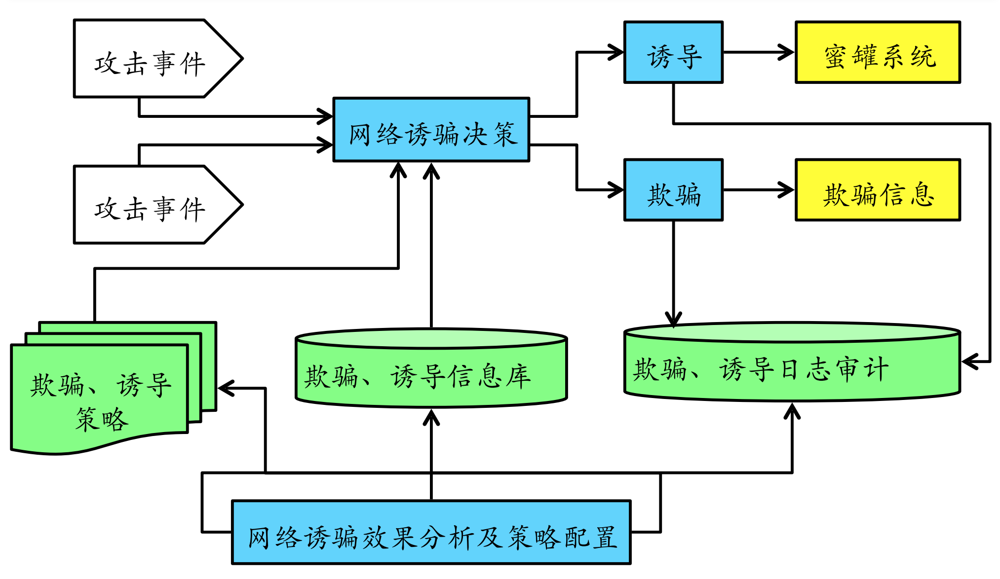

# 蜜罐技术

> 什么是蜜罐技术

- [蜜罐（英语：honeypot）是一个电脑术语，专指用来侦测或抵御未经授权操作或者是黑客攻击的陷阱，因原理类似诱捕昆虫的蜜罐因而得名。](https://zh.wikipedia.org/wiki/%E8%9C%9C%E7%BD%90_(%E9%9B%BB%E8%85%A6%E7%A7%91%E5%AD%B8))

- 简单说就是，暴露漏洞诱惑黑客来攻击，然后收集攻击的手法的一种技术

> 蜜罐的起源

- 1990 年：小说《The Cuckoo's Egg》发表，蜜罐的概念第一次出现在公众视野。
- 1997 年：Fred Cohen 发布 DTK 项目，一个用于模拟网络服务的虚拟系统，这是第一个公开的蜜罐系统。
- 2000 年：蜜网项目组成立，同时发布了 Gen II 蜜网项目，在这个项目中，真实系统被用于蜜罐用途。

> 蜜罐常见的分类

- 按照蜜罐的交互性差异可以分为
  - 低交互
  - 高交互(提供真实的操作系统和服务，而不是模拟；比如shadow Damon；Lyrebird)
  - 混合型

- 按照蜜罐的部署目标
  - 产品型（侧重于分流真实的网络攻击流量）
  - 研究型 （主要目的是收集攻击流量，研究攻击行为、了解攻击意图和提取攻击主体特征）

## 蜜罐关键技术

- 蜜罐基本体系架构图
  
  [参考资料](http://www.caict.ac.cn/kxyj/qwfb/ztbg/202112/P020211217578331946009.pdf)

> 技术一：怎么把你骗进来（欺骗技术）
- 部署一些空系统（无业务模拟的真实完整操作系统及应用程序）镜像系统（对生产业务进行镜像模拟）。虚拟系统(基于虚拟机软件不包含真实业务和业务数据的镜像系统) 让外部来扫描
- 识别到攻击者流量后，通过在正式环境中改变路由（防火墙、SDN、ARP、WAF等）、返回特定响应的方式将攻击者牵引到特定的蜜罐地址
- 一些欺骗设计技术 [网络欺骗的操作系统](http://www.joca.cn/CN/abstract/abstract19095.shtml)、端⼝扫描欺骗设计、Web 扫描欺骗信息设计（都是伪造一个假的身份信息和你交流）

> 技术二：怎么让你知道我不是在骗你（伪装技术）
- [伪装成 服务/应用/系统/网络/主机 等  ](https://www.modb.pro/db/120315)
  - 虚拟机伪装（在网络层面和主机层面隐藏虚拟机的特征，让入侵者认为目标主机是真实物理主机）
  - 蜜罐伪装:隐藏蜜罐业务相关的痕迹和特征

> 技术三：怎么让你在不知情的情况下偷走你的东西（信息捕获技术）
> 
[主要是基于入侵检测技术，在不同层面获取攻击者信息](https://baike.c114.com.cn/view.asp?id=19212-FBE92F11)
- 系统层面，蜜罐可以实现键盘捕获、屏幕记录和进程访问历史记录。
- 网络层面，蜜罐支持攻击图（路径）的重建。
- 数据层面，蜜罐支持基于蜜信的传播路径重构

## 安全问题

- [案例：连接MySql读取攻击者信息](https://cloud.tencent.com/developer/article/1959756)
- 这个就是利用MySql漏洞故意暴露给外部扫描，然后让攻击者连接上，反过来读取攻击者电脑信息
- 所以乱连接人家设备也是会被套取信息的哈哈