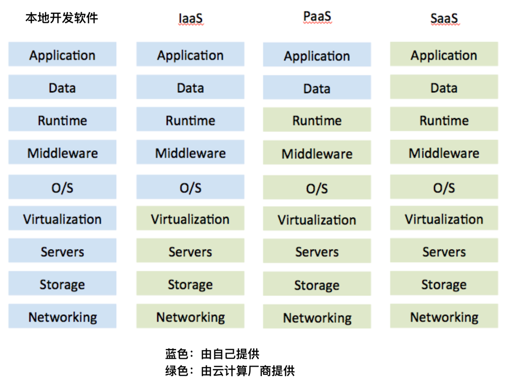
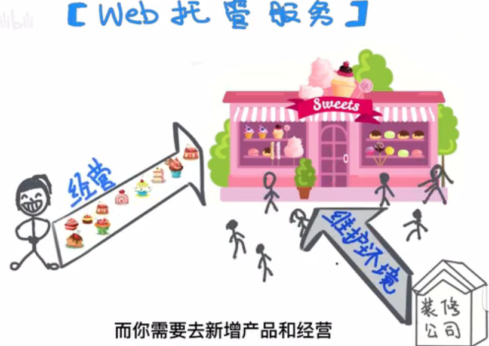
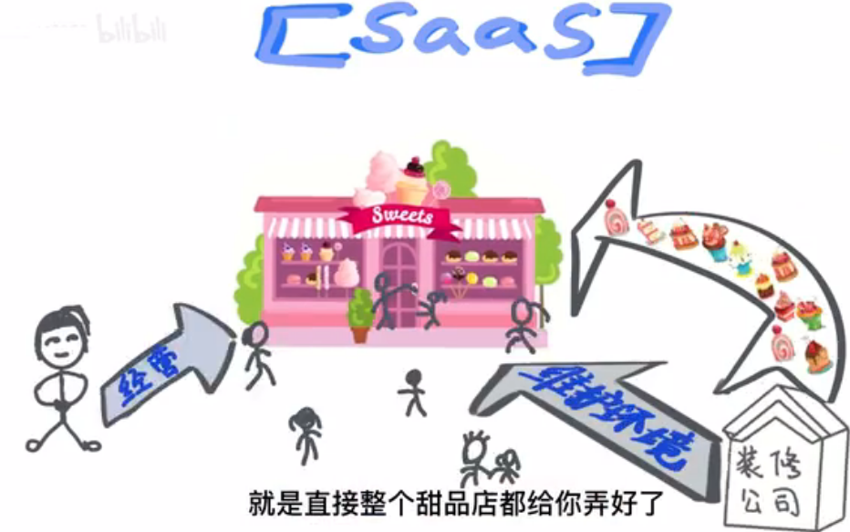
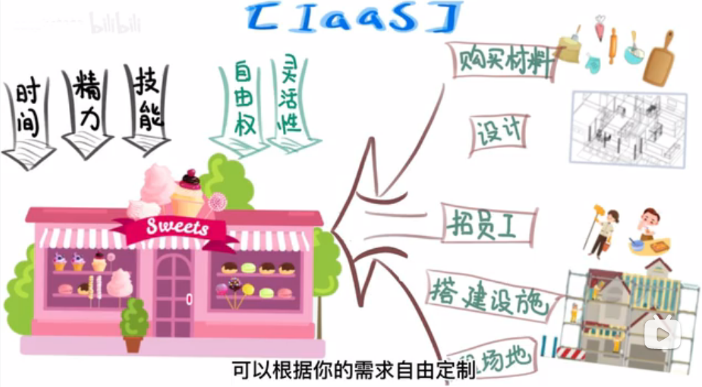
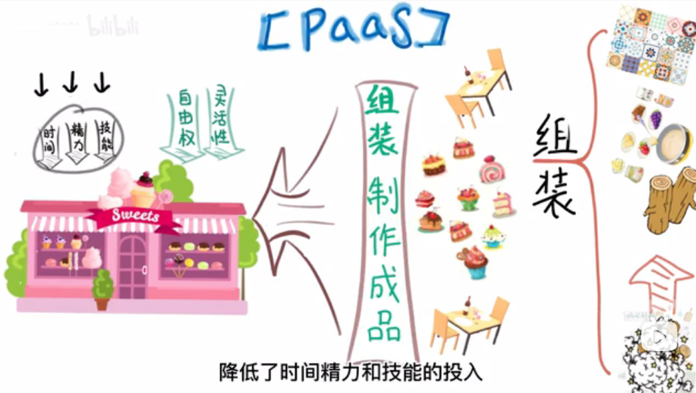
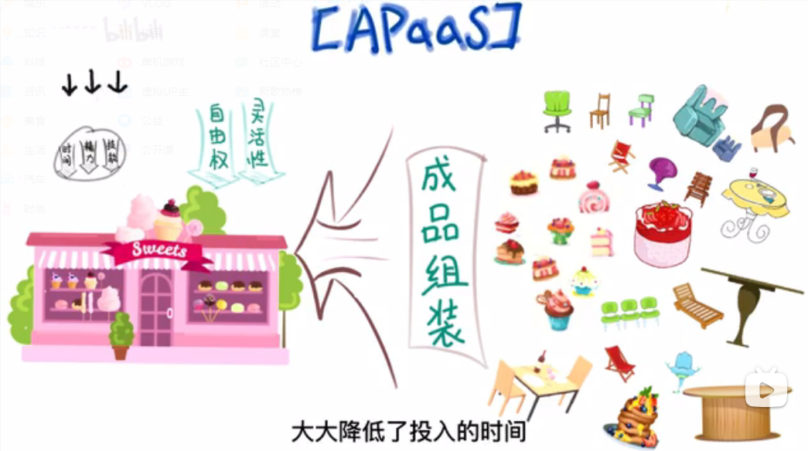
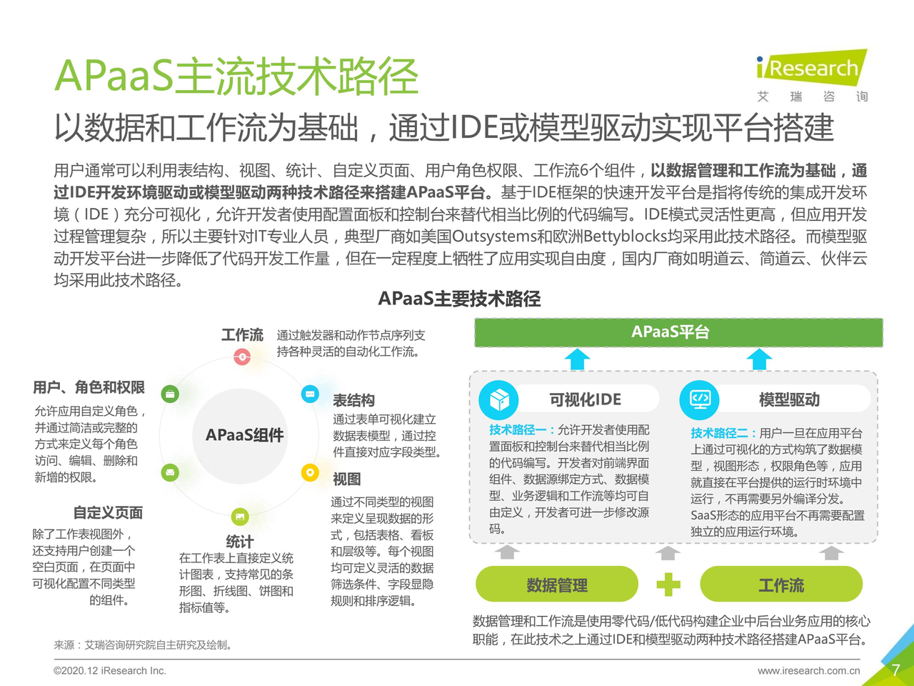
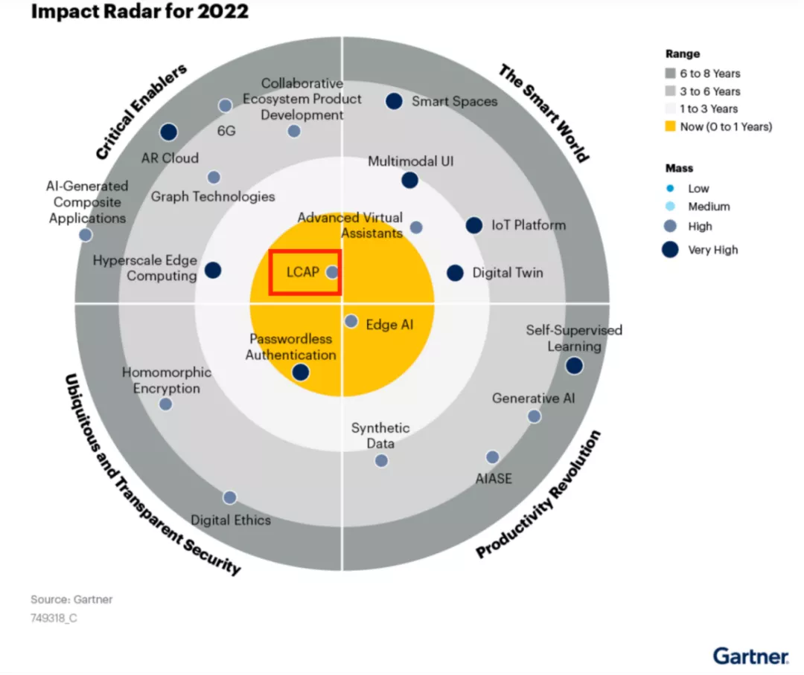
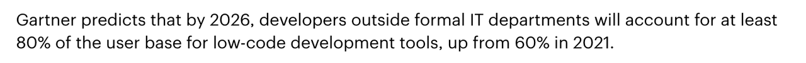

# 读懂SaaS,IaaS,PaaS,APaaS-了解低代码平台

## 一、开头小故事
我记得大概是两三年前，那会我刚毕业吧，然后我宿友给了我小几千让我帮忙开发个网站来---收房租（？？），那会刚毕业一看到小几千那叫一个开心哇，不就是整几个表单，再整几个表格，再给搭个服务器就解决的事儿嘛，简单啊，大学的大作业我经常做。果断答应。现在想想觉得那会我可真单纯，最后这项目从设计交互、开发、联调，搭建服务，再到反反复复修改bug足足花了我两个月，两个月就给了小几千，亏出血了我。

那我前面讲这个事呢，就是为了引出低代码应用构建平台，使用它不到一天就可以制作出前面说到的网站。
- 低代码应用构建平台又是个啥呢?
- 它为什么会给我们带来这么大的提效?
- 又是什么原因让它出现的？
- 这一类的产品又都包含着哪些功能呢？

那我们就从它是个啥说起！

## 二、什么是低代码（大白话解释）
> 低代码应用构建平台也称**APaaS**，在探讨什么是APaaS之前，我们先了解一下**云计算**的概念。

想象一下，假设你要开发一款软件，通常包含*应用、数据、运行库、中间件、操作系统、虚拟化技术、服务器、存储、网络*这九个层次，这些名词还不理解不要紧，我们就只需要知道开发一款软件它需要很多很多的东西就行了。

那在过去呢，开发一款软件需要购买和维护这些设备或技术。

而现在，有一些公司把其中某些层次整合起来，比如存储、服务器、操作系统打包成一种服务对外出售，这些公司被称为**云计算公司**，他们的这种打包方法被称为**云技术**，这种服务形式也就是**云服务**。

可以直接租用这些服务，就像我们使用水电一样，定期缴钱就行了，比起之前要维护那复杂的九个层次，是不是轻松多了？

但也不是所有公司把所有层次全都做了，目前市面上主要有三种服务形式，他们分别是：**基础架构即服务（IaaS）**，**平台即服务（PaaS）**和**软件即服务（SaaS）**，区别在于哪些服务是云计算公司提供、哪些是自己提供。

嗯？就三种服务形式，怎么说着说着前面提到的APaaS就没了呢，诶!其实可以把APaaS理解为PaaS的一种子形式。A呢就表示Application应用，APaaS（Application Platform as a Service）即应用程序平台即服务。

那这些服务之间有什么区别？

又是怎么发展出APaaS的呢？

那我们就跟着小菜的视野一步一步的看看它们是如何发展起来的！

## 三、APaaS的发展史
> 在计算机科技的发展史上，云计算技术是一项里程碑式的技术革命，也为aPaaS奠定了坚实的基础。

小菜呢是一名年轻的程序员，他在20世纪末进入了计算机科技领域。当时，互联网刚刚兴起，小菜的主要工作就是为公司开发网站。

起初，小菜所在的公司使用的是Web托管服务，也就是将网站的代码和文件上传到云服务器上，然后通过域名访问。

但这种服务只提供基本的存储和网络连接，小菜觉得这种方式还是很麻烦，这样部署和开发就会受到限制。

> 随着云计算技术的发展，SaaS（Software as a Service）和IaaS（Infrastructure as a Service）逐渐兴起。SaaS是一种基于云计算的应用程序交付模式，应用程序由云服务提供商托管和管理，并以服务的形式提供给企业用户；而IaaS提供的是云基础设施服务，包括计算、存储、网络等，不需要关注存储网络相关的维护。

这里可能听得稀里糊涂的，这SaaS好理解，就不关我事甩手全扔别人整，那这IaaS咋跟前面没发展时的Web托管服务听着一样呀，其实这里还是有很大的差别的。

那我们用“小菜现在要在深圳宝安开一家甜品店”作为例子，那开甜品店就需要找到合适的方案。

使用【**Web托管服务**】呢，就是找一家装修公司，你只需要提供你对门店的需求，让它提供一个简单的装修方案，整个装修过程委托给他们，包括设计、购买材料、施工等，待它们交付了甜品店，后续就是装修公司负责维护环境，而你需要去新增产品和经营。

那使用【SaaS】呢就是直接整个甜品店都给你弄好了，你只管去经营就行了。

而使用【IaaS】，就是租一些场地和设备，并且从头开始自己设计、购买材料、搭建设施，还可能招一些员工来打扫卫生、制作甜点等等。这需要更多的时间、精力和技能，但也给你更多的自由权和灵活性，可以根据你的需求自由定制。

好啦，那例子举完了，有没有更加理解一点了

回来，咱们继续跟着小菜的视野。

小菜对这些新的技术也很感兴趣，他尝试使用SaaS和IaaS来开发和部署网站。

虽然这样做节约了时间和成本，但还是有一些问题。例如，使用IaaS需要*自己负责应用程序的管理和维护*，而使用SaaS则*无法对应用程序进行深度定制*。

就在小菜为这些问题烦恼的时候，**PaaS**出现了。

> **PaaS**提供了一个完整的应用程序开发和部署平台，包括硬件、操作系统、开发工具、数据库、中间件等，企业用户只需要关注应用程序的开发和部署，无需关心底层基础设施的管理。

我们继续拿“小菜开甜品店”为例，如果使用的是PaaS，PaaS呢就像是，在IaaS的基础上，不需要自己投入到麻烦的基础建设，所有的原材料都给你准备好了，咱们就只管在这个基础上制作成品然后组装就行了。相较于之前技术，降低了时间、精力和技能的投入。

小菜觉得这个新技术很不错，他开始使用PaaS来开发和部署网站。但随着时间的推移，小菜发现PaaS还不够完善，还需要更多的工具和功能，例如代码管理、自动化测试、运行监控等。

就在小菜为这些问题苦恼的时候，**APaaS**横空出世。
> **APaaS**是在PaaS的基础上演化而来的，它更加注重应用程序的开发和部署，提供了更多的工具和功能，使得应用程序的开发和部署变得更加快捷、高效、可靠。

那咱继续拿“小菜开甜品店”为例，如果这时候小菜改用成了APaaS服务，APaaS呢就是，在PaaS的基础上，已经不满足于只准备好原材料了，它提供给我们各式各样的桌椅呀、柜子呀、蛋糕等等等等成品，我们就挑选适合自己的成品组装起来，甜品店就弄好啦。这样就又进一步大大降低了我们投入的时间、精力和技术的成本。

## 四、APaaS的技术路径分类、典型产品

讲完了APaaS 的发展史，对它有没有更近一步的认识了呢。

目前aPaaS主流的技术路径分为两种：

一种是基于**IDE开发环境驱动**，类似于我们编写的代码需要先经过编译打包，生成一个可执行文件，只不过它的这个IDE和我们的不太一样，它将大部分逻辑封装，通过配置面板和控制台来替代相当比例的代码编写，这种方式的好处是灵活性高，但开发过程比较复杂，需要有代码基础，所以主要针对IT专业人员。典型的产品代表是国外的Outsystems。

[参考视频](https://www.youtube.com/watch?v=0gx3hMMDOZI)

另一种则是基于**模型驱动**，用户一旦在应用平台上构筑好了应用，就会直接在平台提供的运行时环境中运行，不再需要另外编译分发，进一步降低了代码开发工作量，但是在一定程度上牺牲了应用实现自由度。典型的产品有国内的明道云、简道云、伙伴云等。（话说明道和简道他俩是亲兄妹吗，怎么名字这么像）

[参考视频](https://www.youtube.com/watch?v=TcFXiB9x594)

## 五、产品主要功能介绍
一款aPaaS产品通常会包含以下几个模块，包括围绕应用的业务数据结构、呈现给用户的视图、分析图表、用户角色权限以及工作流引擎，有了这些元素，用户就可以组合出自己想要的应用。

[参考视频](https://www.youtube.com/watch?v=APUPp0wmTQg)
[00:50~1:13]

## 六、APaaS的现状、发展
根据Gartner2022新兴技术和趋势影响雷达图显示，LCAP（Low Code Application Platform，LCAP和APaaS是一个统一的品类）也即(低代码开发平台)稳居此新兴技术雷达图的C位。

同时Gartner也预测，到 2026 年，没有IT技术的使用人员将占低代码开发工具用户群的至少 80%，高于 2021 年的 60%。

[参考文档](https://www.gartner.com/en/newsroom/press-releases/2022-12-13-gartner-forecasts-worldwide-low-code-development-technologies-market-to-grow-20-percent-in-2023)

可见aPaaS在今后的应用程序开发中扮演着非常重要的角色，这和ChatGPT是一个道理，那些有套路可寻、可复制性的生产力将逐渐被工具取代。
