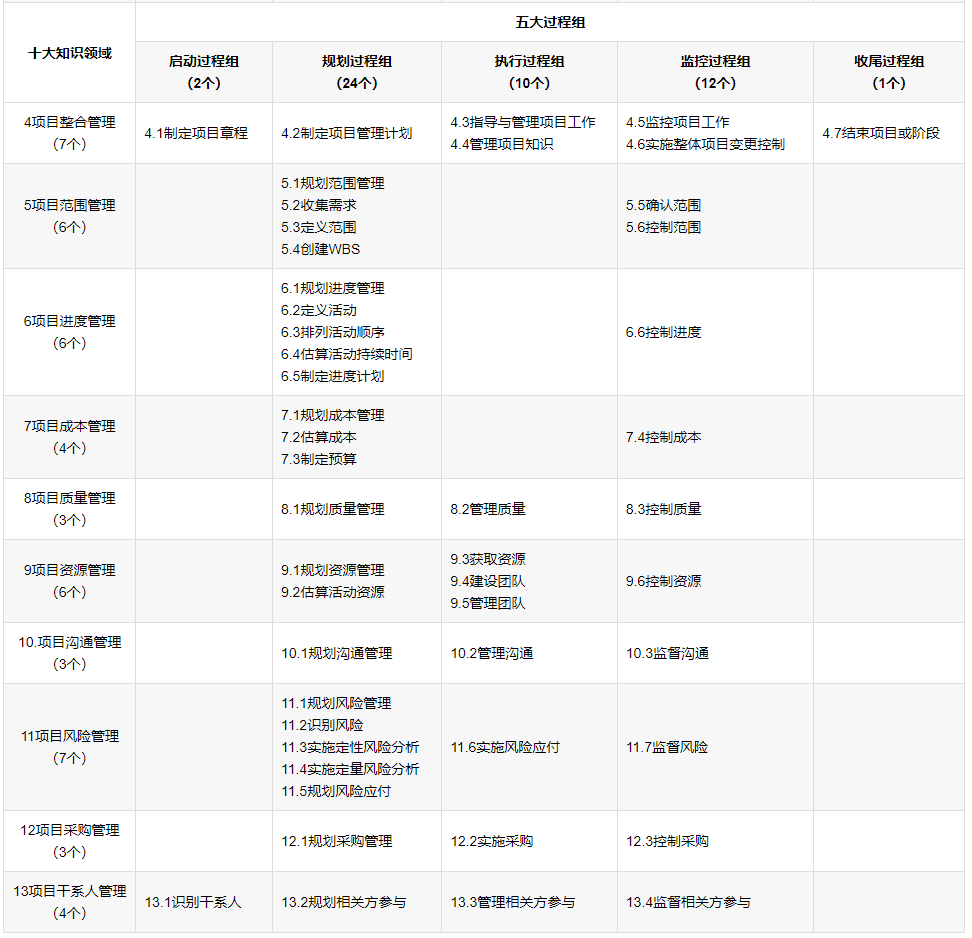
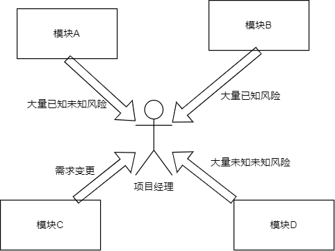
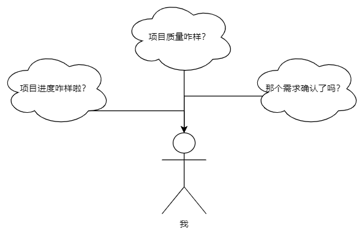
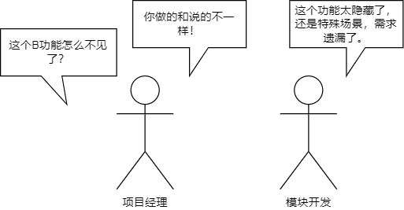
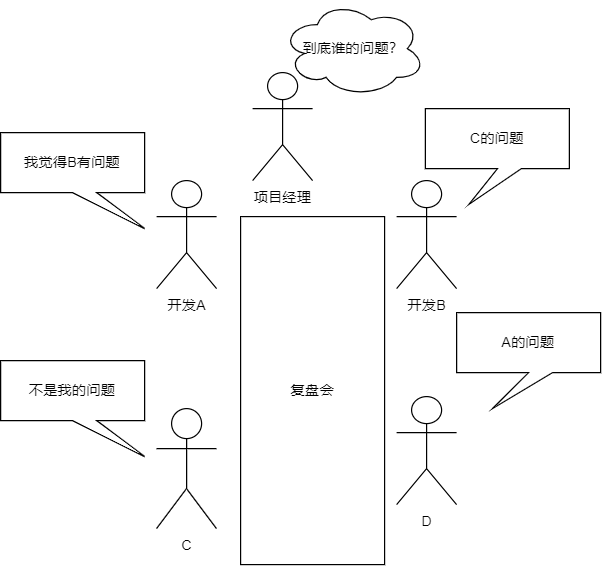
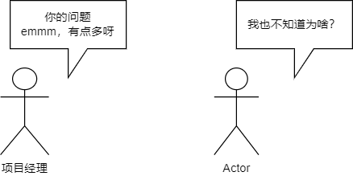

# 项目重构竟然还能这样，PMP告诉你了这些（一）

## 什么是五大过程组和十大知识领域
总所周知，pmi 将项目管理分为了五大过程组和十大知识领域，一共 49 个基本过程
其中五大过程组是启动、规划、执行、监控和收尾
十大知识领域是整合、范围、进度、成本、质量、资源、沟通、风险、采购、相关方
49 个基本过程中，pmi 认为规划和监控尤为重要，指导项目经理的过程也最多



对于像重构这种项目来说，规划范围管理、规划进度管理、规划风险管理和整个监控过程组才是前端项目经理经常需要关注的。

1. 需求范围可能会因为各种各样的历史原因而无法确定，而你接手这个项目的时候，你和你的团队最头疼的就来自于此。
2. 风险管理也是各个项目的基本操作，其中包括我们的**已知未知风险和未知未知风险**，但需求不确定的重构要面对的更多是未知未知风险。



这个时候大量的风险涌来就会对我们的进度规划带来**毁灭性**的冲击，不断变更、不断处理风险会消耗项目经理很大的精力。

那么我们如何才能做的更好呢？我以我浅薄的知识和大家分享一下我在重构项目中的几个故事。

## 需求背景

1. 正好存在一个时间超长的预测型（瀑布型）项目
2. 当前项目架构过于老旧（10+年未更新架构）
3. 新框架项目中高技术难点问题已经完成预研和确认
4. 新框架项目基本架构已经确认
5. 团队成员有足够的技术能力
6. 后端团队存在 1+位成员长期技术支持重构问题
7. 产线对前端团队有足够的信任并愿意将此当作一个亮点

在基于以上的条件下，我们大胆的迈出了第一步，重构一个 08 年维护至今的前端老架构

## 顺其发展的现状
项目前中期，没有专业的项目经理，我发现团队正在做一个三无产品：**无需求、无进度、无质量**。



### 需求无人跟进，全靠开发读代码逻辑

每当问起如何做好一个产品时，**第一要素就是要明白需求是什么？**但是重构很特殊，它的需求如果在一开始没有保存下来，那经历十几年的风雨后，需求早已经被历史掩埋，于是便发生了以下场景：

```plain
开发前：
项目经理：A模块需求梳理好了吗？
模块开发：梳理好了。

开发完成后：
项目经理：原来这个B功能怎么不见了？
模块开发：啊，这个功能太隐藏了，还是特殊场景，需求遗漏了。
```


在重构过程中，我们还会对不合理的流程进行一些小的改动。在这个过程中，遇见更多的是面对测试的质疑，听的最多的也是：`它原来是这样的，为什么重构之后不一样，A模块和B模块表现形式也不一致呢？`

面对内部客户（测试）的质疑，我也会怀疑自己当初同意改动交互方式是否合理。


### 模块进度延期严重，总项目经理质疑进度和里程碑是否能够达成

>在需求只能靠自己来确定时，往往工作量评估就是一个薛定谔的工作量，它也许准也许不准，但大多数的时候是不准的。

比如在重构 A 模块（核心、需求迭代过 10+年）时
```plain
模块开发：按照梳理出来的功能，通过三点估算，我需要一个月到一个半月的时间完成。

…
于是两个月后，功能基本达到交付标准
…

在模块复盘时，模块开发是这么说的：功能太多了，细节超出想象，很多功能的评估时间不合理，还有大量历史遗留的问题和特殊场景需要花精力去看，去对比。

开发B说：我们的组件库只支持最基础的功能，大量的hooks和业务组件需要重新写，花费了大量的额外时间。

公共业务组件的开发说：业务组件梳理出来之后，我已经完成了基本功能，剩下的扩展需要大家在模块中自行解决。

开发C说：你的组件是写完了，但类型没补全，自测也没有，还有很多bug。

公共业务组件的开发反驳：我后续还有自己的模块，功能已经提供了，你补一下就好，时间短任务重没办法。
```


大家说的都对，也都为项目做出了一定的努力，但是实际结果却不尽人意。面对当前的情况，如果要达成里程碑，将面临巨大风险。于是团队就有了下面的决策：**增加资源但是适当控制成本**，寻找一些需要历练的开发人员。（*增加资源是以最小成本来压缩工期的技术*，与之同级的还有赶工和快速根据，将在后续详细描述）


### 团队质量脱节，花费大量时间修复问题
>在新的成员来到团队之后，由于很多规范化的东西需要了解，如果不能快速熟悉，而项目经理错误的将其投入新模块，那结果将是该模块的质量将会存在较大问题。

例如：

我们如何判断一个开发能接手一个新模块呢？

**在新成员能够在一周到两周的时间内，能修复一定数量的 bug 并不产生改动引发。**

此时一位新来的团队成员开发**能力很强**，修复 bug 的能力也相当迅速，**能够快速找到问题的原因**。前端项目经理认为其能够接手一个模块，于是安排了一个模块给他。

当其开发完成之后，进行代码质量评估，第一遍审核发现 30 个问题，第二遍审核发现 30 个问题，在完成修复之后，大家陆续发现还有编码风格和不合理的地方。

这个现象当时很让人费解，为什么会出现这么多的问题。


后来发现，从项目初期开始编码的开发对一些规范烂熟于心，知道什么时候用什么公共方法来实现，但新人不熟悉，所以在我们看来就会出现很多不合理的地方。（后续落实了一些组织过程资产，一定程度解决了这个问题，后面会聊到这里的方法）

## 在需求层面，我们做过什么措施
### 需求反讲（专家判断、数据分析）
>由于整体模块不需要设计，只需要将逻辑重写到新框架上，所以整理并理解老代码及其重要。

操作步骤：
1. 模块开发整理需求并画出函数功能的流程图
2. 邀请其他开发评审
3. 现场按照流程演示功能并讲解每一个函数的具体意义
   
目的：
1. 模块开发充分理解功能需求
2. 多人看逻辑，能够发现一些需求遗漏问题、重点需要注意的地方，方便后续加强测试。
3. 列出自测用例
   
参与人员：
1. 模块开发
2. 对老平台非常熟悉的开发

劣势：
1. 前期较为耗时，需要预留时间。
2. 属于工具中的专家判断，听需求反讲的开发需要足够了解需求才不容易被糊弄。

### 多问多看多对比（标杆对照、访谈、系统交互图）
> 在你开发你不熟悉的模块，最快最简洁的方法就是问问题，看原来的功能是什么流程，对比你现在的实际情况。

操作步骤：
1. 如果有不懂的步骤或者逻辑，马上询问需求分析师、系统规划人员和测试人员，他们往往接触产品功能比你多，多问问总是没错的。
2. 如果没有谁了解，那就需要你根据代码逻辑和实际步骤来看结果，这个时候搭建一个可用的环境是必要条件。
3. 将你开发完成的功能用实际数据测试，如果返回结果和原来模块的返回结果一致，那这个功能大部分场景都已经没有问题。
4. 使用 mock 数据构造异常场景，补全该功能可能发生的情况
5. 邀请其他开发体验该模块（功能）

目的：
1. 模块在转测前如果能发现问题，那将大大减少后续的代价。例如：修改问题、重新审核逻辑所浪费的时间
2. 所有场景都覆盖了，那这个功能理所当然就是完成的。
3. 自己的模块大部分时候自己看不出问题（代码也是一样），别人更容易发现你的问题
4. 补充自测用例